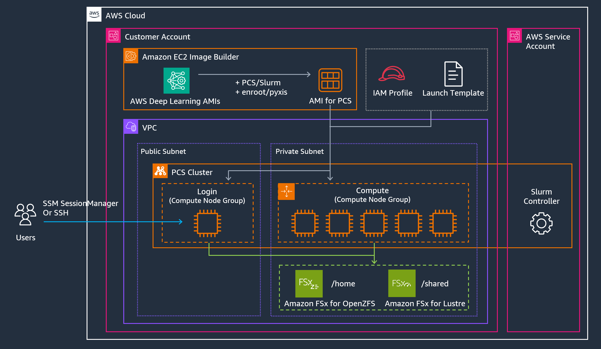

# AWS Parallel Computing Service Distributed Training Reference Architecture

This README provides a "vanilla" reference architectures and deployment guide for setting up distributed training clusters using [AWS Parallel Computing Service](https://aws.amazon.com/pcs/). These architectures are optimized for machine learning workloads and include configurations for high-performance computing instances (P and Trn EC2 families) with shared filesystems (FSx for Lustre and OpenZFS). Key features are including:

- Pre-configured for distributed training workloads
- Integrated with FSx for Lustre for high-performance storage and OpenZFS for home directory
- Support for On-Demand Capacity Reservations (ODCR) and Capacity Blocks (CB)
- Optimized networking with Elastic Fabric Adapter (EFA)

## Architecture

## Deploy the reference cluster

[AI/ML for AWS Parallel Computing Service Workshop](https://catalog.workshops.aws/ml-on-pcs/)
