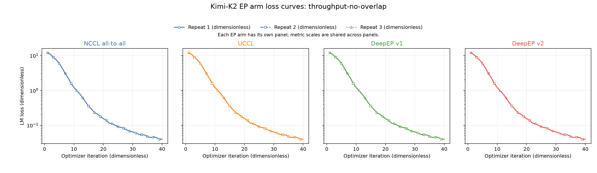
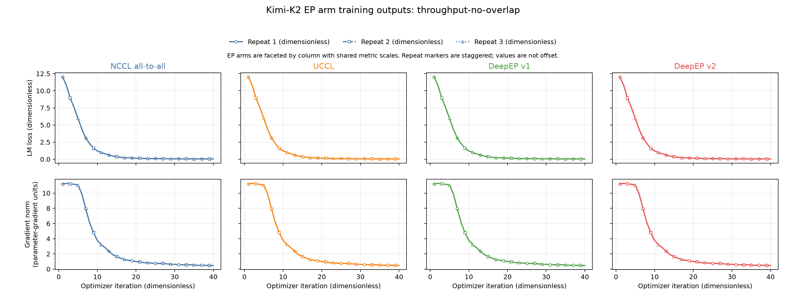
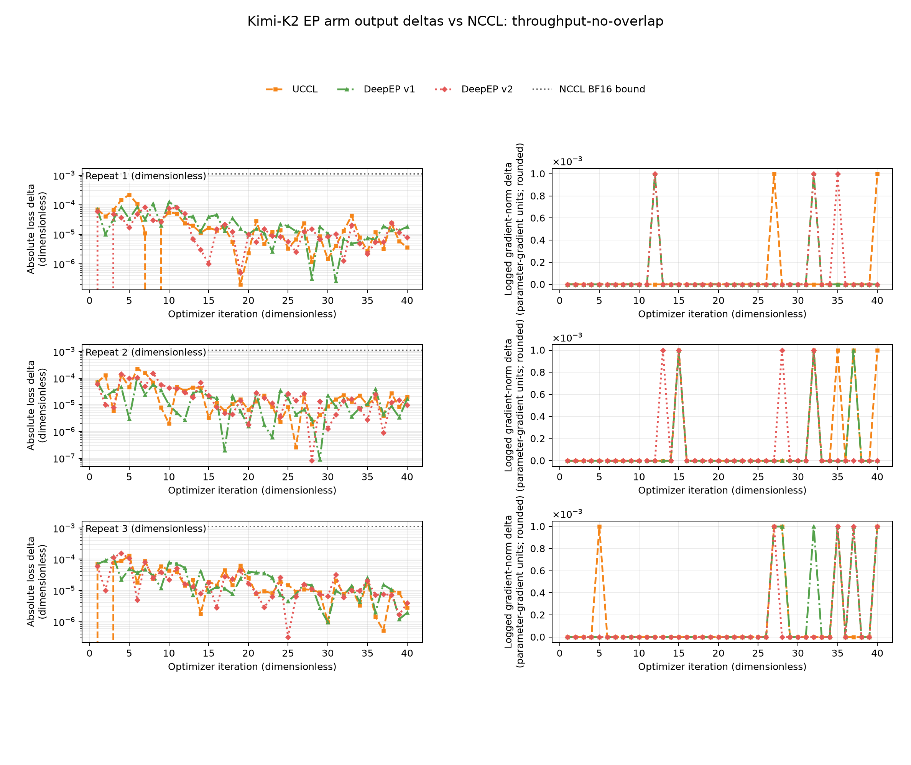
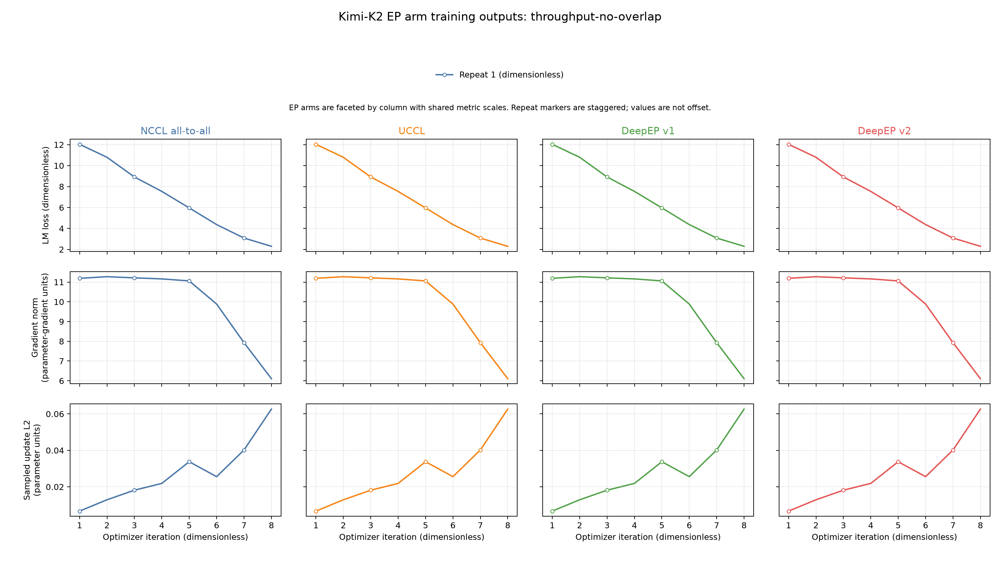
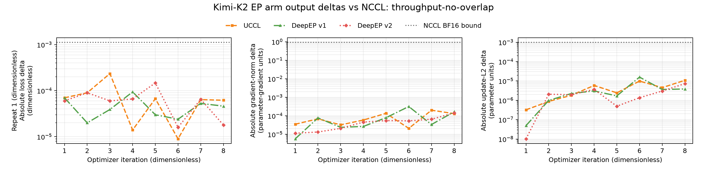

# Kimi-K2 Megatron-Bridge EP results, NeMo 26.08

Primary scored campaign ID: `20260827T010936Z-k2-b200-scored-loss-gated-3r-r1`

Scored output analysis ID: `20260827T041022Z-k2-b200-scored-output-analysis-r1`

Short training correctness campaign ID: `20260826T235808Z-k2-b200-loss-gate-r2`

NCCL training self-repeat campaign ID: `20260827T004700Z-k2-b200-loss-nccl-r2`

Superseded performance campaign ID: `20260825T111800Z-k2-b200-scored-clean-3r-r3`

Expanded overlap source campaign ID: `20260825T210749Z-k2-b200-expanded-3c-3r-r5`

DeepEP v2 overlap completion campaign ID: `20260826T215100Z-k2-b200-v2-completion-r1`

Foundational correctness qualification campaign ID: `20260824T030931Z-kimi-k2-megatron-ep-b200-256g`

Accepted primary performance date: `2026-08-27 UTC`

The requested 256-GPU B300 headline remains `NOT_RUN_INSUFFICIENT_CAPACITY`. At `2026-08-27T01:11:13Z`, the ap-south-1 cluster had 0 available B300 nodes, below the requirement of 32 B300 nodes. The accepted primary scored milestone ran on 32 `p6-b200.48xlarge` instances and 256 B200 GPUs from the same Capacity Block.

## Topology

One Kimi-K2 training replica is 64 GPUs: tensor parallelism uses 8 ranks and pipeline parallelism uses 8 stages. The 256-GPU deployment contains 4 data-parallel replicas, each with expert parallelism across 32 ranks and expert tensor parallelism of 1 rank.

| Property | Scored value |
|---|---|
| Hardware | 32 `p6-b200.48xlarge` nodes, 8 B200 GPUs per node, 256 B200 GPUs total |
| Model | Literal Kimi-K2 architecture, random initialization, mock data |
| Architecture | 61 layers, hidden size 7,168 dimensions, 384 experts, top-k 8 routing choices |
| Precision | BF16 |
| Parallelism | TP 8 ranks, PP 8 stages, EP 32 ranks, ETP 1 rank, DP 4 replicas |
| Batch | Global batch 256 samples, microbatch 4 samples |
| Sequence | 4,096 tokens per sample |
| Communication cell | Expert-parallel overlap off, CUDA graphs off, forced load balancing on |
| Network | 8 EFA devices per node, EFA kernel module `3.3.0g` |
| Job length | 40 optimizer iterations per job, with 8 warmup iterations discarded and 32 steady iterations scored |
| Replication | 3 independent fresh job starts per arm |
| Random seed | 1,234 dimensionless |
| Learning rate | Constant 0.000005 dimensionless for all 40 optimizer iterations |

All 12 accepted jobs used the same 32-node list, whose file has SHA-256 `3ea6a80a08a0f87cad83c2749d21c90af57b98d651029481a90b3591debd2c5e`. The campaign selected these 32 free B200 nodes only after the concurrent vLLM campaign moved out of ap-south-1. Four foreign tenant nodes remained explicitly protected and were never selected.

## B300 headline

| Arm | Throughput result, MB4, 256 B300 GPUs | Capacity evidence |
|---|---:|---|
| `nccl-alltoall` | `NOT_RUN_INSUFFICIENT_CAPACITY` | 0 available B300 nodes; 32 B300 nodes required |
| `uccl` | `NOT_RUN_INSUFFICIENT_CAPACITY` | 0 available B300 nodes; 32 B300 nodes required |
| `deepep-v1-nvshmem` | `NOT_RUN_INSUFFICIENT_CAPACITY` | 0 available B300 nodes; 32 B300 nodes required |
| `deepep-v2-gin-gda` | `NOT_RUN_INSUFFICIENT_CAPACITY` | 0 available B300 nodes; 32 B300 nodes required |

No result from another GPU type, release, or topology is copied into the B300 table.

## B200 primary scored cell

Each job contributes the median of its 32 steady iteration times. The per-arm latency, throughput, and TFLOPS/GPU values below are medians across 3 independent job starts. Run-to-run CV is the sample standard deviation of the 3 run medians divided by their mean. Iteration-time reduction is paired by repeat against `nccl-alltoall` and uses `(baseline_ms - arm_ms) / baseline_ms * 100%`. The interval is a paired repeat-level bootstrap with 10,000 resamples, a 1,234 dimensionless seed, and a 95% percentile interval.

| Arm | Repeat 1 median, ms | Repeat 2 median, ms | Repeat 3 median, ms | Median of run medians, ms | Median throughput, tokens/s | Median performance, TFLOPS/GPU | Run-to-run CV, % | Paired time reduction vs NCCL, mean [95% CI] |
|---|---:|---:|---:|---:|---:|---:|---:|---:|
| `nccl-alltoall` | 7,518.80 | 7,520.35 | 7,513.50 | 7,518.80 | 139,461 | 106.513 | 0.048 | Reference |
| `uccl` | 6,239.15 | 6,214.00 | 6,215.65 | 6,215.65 | 168,699 | 128.228 | 0.226 | 17.22% [17.02%, 17.37%] |
| `deepep-v1-nvshmem` | 6,818.55 | 6,793.75 | 6,813.85 | 6,813.85 | 153,889 | 117.306 | 0.193 | 9.43% [9.31%, 9.66%] |
| `deepep-v2-gin-gda` | 5,861.70 | 5,873.20 | 5,861.10 | 5,861.70 | 178,886 | 135.666 | 0.116 | 21.98% [21.90%, 22.04%] |

`nccl-alltoall` is the end-to-end legacy dispatcher baseline, not a transport-only control. The three flex-dispatcher arms provide the native EP implementation comparison:

| Treatment relative to flex-arm reference | Paired mean iteration-time reduction, % | Bootstrap 95% CI, % |
|---|---:|---:|
| `deepep-v2-gin-gda` relative to `uccl` | 5.75 | [5.48, 6.05] |
| `deepep-v2-gin-gda` relative to `deepep-v1-nvshmem` | 13.86 | [13.55, 14.03] |
| `uccl` relative to `deepep-v1-nvshmem` | 8.60 | [8.50, 8.78] |

All run-to-run CV values are at most 0.226%, below the 5% interpretation threshold, and every paired repeat favors the same arm as its aggregate interval. `deepep-v2-gin-gda` is the winner for this B200, MB4, overlap-off cell. This is not a B300 result and does not establish a winner for overlap-on or MB1 cells. With only 3 independent starts per arm, the bootstrap intervals describe this campaign rather than a broad population.

### Training-output validation

Each non-NCCL arm was compared point by point with `nccl-alltoall` from the same repeat. The absolute loss bound, 0.001114845276 dimensionless, was fixed before the scored campaign from the preserved NCCL BF16 self-repeat envelope. It was not fitted to these results.

| Arm | Repeat 1 maximum loss delta, dimensionless | Repeat 2 maximum loss delta, dimensionless | Repeat 3 maximum loss delta, dimensionless | Maximum across repeats, dimensionless | Route hashes vs same-repeat NCCL |
|---|---:|---:|---:|---:|---|
| `nccl-alltoall` | Reference | Reference | Reference | Reference | Reference |
| `uccl` | 0.000217 | 0.000223 | 0.000129 | 0.000223 | Exact on 32 ranks in every repeat |
| `deepep-v1-nvshmem` | 0.000125 | 0.000106 | 0.000122 | 0.000125 | Exact on 32 ranks in every repeat |
| `deepep-v2-gin-gda` | 0.000082 | 0.000153 | 0.000154 | 0.000154 | Exact on 32 ranks in every repeat |

All 12 jobs have 40 of 40 loss records, a constant 0.000005 dimensionless learning rate, finite loss and gradient norm, 0 skipped iterations, 0 NaN iterations, and 0 dropped token selections. The scored logs report gradient norms rounded to 0.001 parameter-gradient units, so their curves are a diagnostic and are not used as a full-precision numeric gate. The preceding 8-iteration correctness campaign records full-precision gradient norms and sampled optimizer update L2 norms and passes those gates against the same NCCL-derived envelope.

Because the absolute trajectories are nearly coincident at this scale, the figure facets the four EP arms into separate columns. Each metric uses a shared y-axis across the arm columns. Repeat markers are staggered for visibility, but neither metric values nor optimizer iterations are offset. The companion delta figure retains the point-by-point comparison against same-repeat NCCL.

### First iteration

The first measured optimizer step is reported separately because it can include cold runtime and JIT work. No first-iteration value contributes to the steady-state score.

| Arm | Repeat 1 first iteration, s | Repeat 2 first iteration, s | Repeat 3 first iteration, s |
|---|---:|---:|---:|
| `nccl-alltoall` | 270.655 | 269.112 | 270.406 |
| `uccl` | 248.560 | 248.421 | 248.534 |
| `deepep-v1-nvshmem` | 274.903 | 274.464 | 275.941 |
| `deepep-v2-gin-gda` | 531.235 | 533.546 | 533.620 |

### Acceptance and exclusion

The accepted dataset contains exactly 1 `PASS` result for each `(cell, repeat, arm)` key, totaling 12 accepted jobs without retries. All required runtime validity gates pass. The accepted jobs preserve 384 trainer logs, 384 runtime manifests, 384 route summaries, 384 node custody files, and 384 custody verification logs. Every accepted DeepEP v2 job additionally proves `_DeepepV2Manager`, `ElasticBuffer`, `NCCL_GIN_TYPE=5`, and a GDAKI context at runtime.

Campaign `20260825T111800Z-k2-b200-scored-clean-3r-r3` and its UCCL retry are superseded and excluded from every performance ranking above. Their resolved optimizer configuration unintentionally used a warmup schedule: the repeat 1 NCCL learning rate rose from 0.000007500732 dimensionless at optimizer iteration 1 to 0.0002925286 dimensionless at optimizer iteration 39, then changed to 0.00003 dimensionless at optimizer iteration 40. Its NCCL loss reached 65.16264 dimensionless at optimizer iteration 39 after diverging beyond optimizer iteration 14. Finite metrics alone did not establish comparable training output. The replacement campaign enforces and independently validates the same constant 0.000005 dimensionless learning rate for all arms and all optimizer iterations before accepting its performance results.

## DeepEP v2 overlap completion

DeepEP v2 now has 3 accepted fresh job starts for each overlap-on cell. Repeats 1 and 2 come from the expanded overlap source campaign, and repeat 3 comes from the DeepEP v2 completion campaign. Both campaigns used the same 32 B200 nodes, immutable image digest, training entrypoint SHA-256, model topology, batch configuration, 1,234 dimensionless random seed, and timing protocol. Each job completed 40 optimizer iterations; the first 8 iterations were discarded and the remaining 32 steady iterations were scored.

| Cell | Microbatch, samples | Repeat 1 median, ms | Repeat 2 median, ms | Repeat 3 median, ms | Median of run medians, ms | Median throughput, tokens/s | Median performance, TFLOPS/GPU | Run-to-run CV, % |
|---|---:|---:|---:|---:|---:|---:|---:|---:|
| `throughput-overlap` | 4 | 3,451.55 | 3,469.55 | 3,450.85 | 3,451.55 | 303,799 | 226.866 | 0.307 |
| `small-message-overlap` | 1 | 9,730.80 | 9,748.15 | 9,694.60 | 9,730.80 | 107,758 | 83.066 | 0.281 |

All 6 DeepEP v2 jobs are `PASS`. Each job passes all 14 required validity gates, including `_DeepepV2Manager`, `ElasticBuffer`, `NCCL_GIN_TYPE=5`, a GDAKI context, EFA, finite loss and gradient norm, 0 dropped token selections, and exactly 1 loaded NCCL library. Each job preserves 32 trainer logs, 32 runtime manifests, 32 route summaries, and 32 node custody files. Cross-arm ranking is not reported for these cells until the remaining arm and repeat keys have accepted results under the same conditions.

## Final image quartet

| Arm | Immutable ap-south-1 image digest |
|---|---|
| `nccl-alltoall` | `sha256:40b21d15e109f3cde56abb8f5feed304535a95d5ae9d041cd233c0077019c076` |
| `uccl` | `sha256:28eded57acffce6b8551fcd05507732f3ff37fe795095e5a0a3fe52a458082d5` |
| `deepep-v1-nvshmem` | `sha256:8645ad603b0ad60afceccea414d34404bfa46c722ff92fd179829894341d1138` |
| `deepep-v2-gin-gda` | `sha256:c42ab1921a66a007b782e8712ec73649dff8969a8a2c00aafc6655f9c1b0c9d7` |

The common stack is Bridge `0.6.0` at commit `c93251151adeeadbae3ff2a2bf5ee7a1c34cff01`, MCore `0.19.0` at commit `16ad357ee7973af32916fc1ca39d71065e5f03d4`, Torch `2.13.0a0+8145d630e8.nv26.06`, CUDA `13.3`, TransformerEngine `2.17.1+4329ff84`, aws-ofi-nccl `1.21.1`, libfabric `2.6.0amzn1.0`, EFA installer `1.50.0`, and GDRCopy `v2.5.2`. Torch's NCCL build version and `ncclGetVersion()` both report NCCL `2.31.2`. Runtime manifests resolve exactly 1 loaded NCCL library, `/opt/nccl/build/lib/libnccl.so.2.31.2`, with SHA-256 `0edb3fea9939b3dc8e91e295e9f89fb3b2bb2404a93eb280e60099fcfe8c5975`.

The backend source pins are UCCL commit `a8c94e485da302b7cc963d2f74edb5b4e9115748`, DeepEP v1 commit `567632dd59810d77b3cc05553df953cc0f779799`, and DeepEP v2 synthetic commit `0ff264eb08d196621f49c7d011270c62f8716996` with tree `ab43791defa8961b88fdee1a63e8877e317da9af`.

## Correctness gates

| Gate | Real GPU scope | Outcome |
|---|---|---|
| Gate A, ElasticBuffer contract | 16 ranks, 512 tokens per rank, hidden size 7,168 dimensions, 384 experts, top-k 8 choices | `PASS` for synchronous and asynchronous dispatch/combine, distinct cached handles, 65,536 expected selections, and 0 dropped selections |
| Gate B, Router Replay against NCCL | 2 ranks and 16 ranks, each at 512 tokens per rank and 2,048 tokens per rank | `PASS` for record, forward replay, replay backward, exact global expert counts, 0 dropped selections, and all numeric errors inside independent NCCL BF16 self-repeat envelopes |
| Gate C, pipeline and overlap lifetime | 32 nodes and 256 GPUs | `PASS` with TP 8 ranks, PP 8 stages, EP 32 ranks, 16 microbatches, full recomputation with overlap off, and virtual pipeline size 2 stages with overlap on |
| Gate D, short Kimi-K2 training | 32 nodes and 256 GPUs, 8 optimizer iterations for each of 4 arms, plus an independent NCCL self-repeat | `PASS` for the complete loss trajectory, full-precision gradient norm, sampled update L2 norm, exact route hashes, finite metrics, and 0 dropped selections |

The accepted overlap-off Gate D campaign used a constant 0.000005 dimensionless learning rate and the same initialized model, data, seed, topology, and 32-node set for all 4 arms. All 32 route hashes per arm are byte-identical to NCCL. Each arm recorded 57,344 route records, 939,524,096 valid selections, and 0 dropped selections across the 32 node ranks.

| Arm | Maximum loss delta vs NCCL, dimensionless | Maximum full-precision gradient-norm delta, parameter-gradient units | Maximum sampled update-L2 delta, parameter units | Output gate |
|---|---:|---:|---:|---|
| `nccl-alltoall` | Reference | Reference | Reference | Reference |
| `uccl` | 0.000235 | 0.000200272 | 0.0000108663 | `PASS` |
| `deepep-v1-nvshmem` | 0.000094 | 0.000317574 | 0.0000158528 | `PASS` |
| `deepep-v2-gin-gda` | 0.000147 | 0.000143528 | 0.00000727363 | `PASS` |

The independent NCCL training self-repeat produced maximum differences of 0.000085 dimensionless for loss, 0.000181198 parameter-gradient units for gradient norm, and 0.00000749533 parameter units for sampled update L2. The preserved bounds are 0.001114845276 dimensionless, 0.9165039062 parameter-gradient units, and 0.0009765625 parameter units, respectively. Every arm remains within each bound.

The final overlap-on DeepEP v2 correctness run completed on all 32 nodes with trainer exit code 0 dimensionless. It recorded 30,720 route records, 503,316,480 valid selections, and 0 dropped selections under the virtual-pipeline schedule. Its fourth gradient norm was 0.9374347925 parameter-gradient units and its sampled update L2 norm was 0.8425297391 parameter units. Runtime inspection found 7 MoE layers, 7 `MoEFlexTokenDispatcher` instances, 7 `_DeepepV2Manager` instances with 32-rank process groups, and 1 shared `ElasticBuffer` workspace. NCCL loaded the `Libfabric_GDAKI` GIN plugin version 14, selected EFA Direct across 8 NICs per node, and reported GPU Direct RDMA enabled on all 8 HCAs sampled on node rank 0.

Earlier overlap attempts are excluded. They exposed that MCore's fine-grained schedule preserved dispatch inputs and restored per-schedule-node probability state only for backend `deepep`, not backend `deepep_v2`. The accepted patch applies the same lifetime rules to `deepep_v2`; the final overlap-on run and the dedicated overlap regression both pass.

## PR 5 scale gate

The PR 5 scale matrix remains `NOT_RUN_INSUFFICIENT_CAPACITY` because the cluster had 0 B300 physical domains, below the required cells of 22 domains, 23 domains, and 32 domains. No PR 5 scale verdict is inferred from the normal Kimi topology.

## Raw provenance and custody

The correctness qualification artifacts are under:

`/mnt/fsx/ubuntu/workspace/artifacts/adai-kimi-k2-megatron-ep/20260824T030931Z-kimi-k2-megatron-ep-b200-256g`

Its root `SHA256SUMS` file has SHA-256 `350f6d6d6cc96f82ce6cf622cbd9ffc317db310ea86c123431de453a12a3b70d`.

The accepted 4-arm short training artifacts are under:

`/mnt/fsx/ubuntu/workspace/artifacts/adai-kimi-k2-megatron-ep/20260826T235808Z-k2-b200-loss-gate-r2`

Its root `SHA256SUMS` file has SHA-256 `88a8e0a1088cf87046ff01dfae8fd26d79ec88786496a87ae866bd04cc71f31b`.

The independent NCCL training self-repeat artifacts are under:

`/mnt/fsx/ubuntu/workspace/artifacts/adai-kimi-k2-megatron-ep/20260827T004700Z-k2-b200-loss-nccl-r2`

Its root `SHA256SUMS` file has SHA-256 `4b298a6bb4a9271b8d456bfee5776834ca2c2610861ab24fc7214e67937ade95`.

The accepted primary scored artifacts are under:

`/mnt/fsx/ubuntu/workspace/artifacts/adai-kimi-k2-megatron-ep/20260827T010936Z-k2-b200-scored-loss-gated-3r-r1`

Its root `SHA256SUMS` file has SHA-256 `c6a2d04489a01be67cb3cc2225579ed12b76b1ecb76c31f2bf84643b057d1c56`, and `results/index.json` has SHA-256 `4117edf39968f22c2702d137255338db3cfdbbe14669caeeeef97408940a1941`. Independent root verification reports all 8,213 files `OK`.

The scored training-output analysis is under:

`/mnt/fsx/ubuntu/workspace/artifacts/adai-kimi-k2-megatron-ep/20260827T041022Z-k2-b200-scored-output-analysis-r1`

Its `SHA256SUMS` file has SHA-256 `b68f0a3c3bcdf372bec01e82d6a8cae0c43d3d60f78e99c9eb5beef126b9d98b`. It preserves the machine-readable comparison, combined iteration metrics, performance summary, loss and gradient figures, and post-release teardown verification. The checked-in correctness and scored result bundles have `SHA256SUMS` file hashes `5d69263c3186c4f1130617ce82fe149442c188192760cec2f6d473c782faca00` and `290b5521cd9e7875c440a242b245c631efc427301d924cca47f25d781ff86f51`, respectively.

The superseded scored campaign and UCCL retry remain preserved only as excluded diagnostic evidence under `20260825T111800Z-k2-b200-scored-clean-3r-r3` and `20260825T142107Z-k2-b200-r3-uccl-retry-r1`. Neither contributes to a table, ranking, interval, or conclusion in this report.

The expanded overlap source artifacts are under:

`/mnt/fsx/ubuntu/workspace/artifacts/adai-kimi-k2-megatron-ep/20260825T210749Z-k2-b200-expanded-3c-3r-r5`

Its root `SHA256SUMS` file has SHA-256 `591d53da34a3f672c219a161315d960565823f0e4d329e53493b0f6d3013f940`, and `results/index.json` has SHA-256 `5d4566e2ea1a830f91deb7e5815b557e1ec5e68144874160af62a166c06902c8`.

The DeepEP v2 overlap completion artifacts are under:

`/mnt/fsx/ubuntu/workspace/artifacts/adai-kimi-k2-megatron-ep/20260826T215100Z-k2-b200-v2-completion-r1`

Its root `SHA256SUMS` file has SHA-256 `68e0017f0bf577c031fc7fef42613689d698a5cf0c8595fd08e7cf07af2e8a37`, and `results/index.json` has SHA-256 `a1026bb415090284a66a4dc65b14c9561248e68e08fa78ddc6b6bdf459a63566`. Full root checksum verification passes.

## Teardown

The accepted primary controller deleted only its owned Kubernetes resources and recorded controller, parser, census, and teardown exit codes of 0 dimensionless. An independent live verification at `2026-08-27T04:13:16Z` found namespace `adai-kimi-k2-megatron-ep-ff41f209fefae3bf` absent, 0 owned pods, 0 requested GPUs, and shared Lease `default/adai-ap-south-1-gpu-campaign-lock` with an empty holder and a 1-second duration. The Capacity Block, EC2 instances, EKS nodes, and foreign workload objects were preserved. The short correctness and NCCL self-repeat controllers also recorded all 4 finalization exit codes as 0 dimensionless and removed only their owned resources.

The DeepEP v2 overlap completion controller also recorded controller, parser, census, and teardown exit codes of 0 dimensionless. Its terminal live census found the owned namespace absent, 0 owned pods, 0 active GPU pods, 0 requested GPUs, and an empty Lease holder with a 1-second lease duration.
