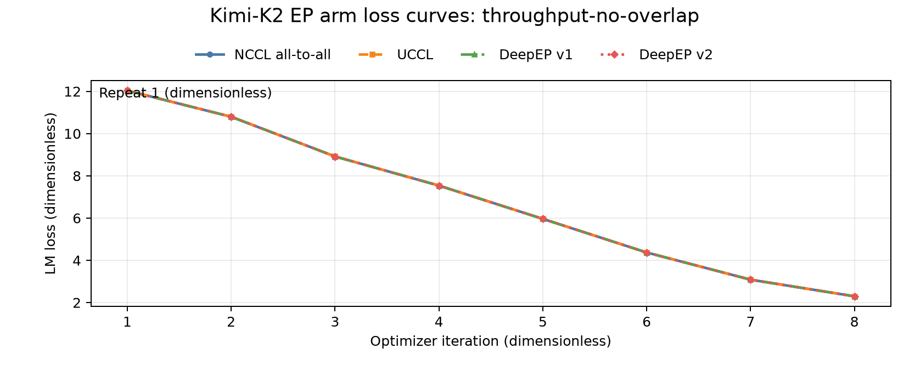

# Kimi-K2 EP arm training-output comparison

Overall status: `PASS`.

The absolute loss tolerance is 0.001114845276 dimensionless and comes from the preserved NCCL BF16 self-repeat envelope.
Gradient-norm and sampled update-L2 bounds are derived without a fitted multiplier as `elementwise NCCL BF16 tolerance * sqrt(sampled elements)`.

## NCCL training self-repeat

Self-repeat status: `PASS`.

| Metric | Maximum absolute delta | NCCL BF16-derived bound | Gate |
|---|---:|---:|---|
| LM loss, dimensionless | 8.5e-05 | 0.001114845276 | PASS |
| Gradient norm, parameter-gradient units | 0.0001811981201 | 0.9165039062 | PASS |
| Sampled optimizer update L2, parameter units | 7.495326239e-06 | 0.0009765625 | PASS |

## throughput-no-overlap, repeat 1 (dimensionless)

Group status: `PASS`.

| Arm | Iterations, dimensionless | First loss, dimensionless | Last loss, dimensionless | Maximum absolute loss delta vs NCCL, dimensionless | Maximum gradient-norm delta / bound, parameter-gradient units | Maximum sampled update-L2 delta / bound, parameter units | Loss gate | Gradient gate | Update gate | Route hash gate |
|---|---:|---:|---:|---:|---:|---:|---|---|---|---|
| `nccl-alltoall` | 8 | 12.03574 | 2.296535 | Reference | Reference | Reference | Reference | Reference | Reference | Reference |
| `uccl` | 8 | 12.03581 | 2.296473 | 0.000235 | 0.0002002716064 / 0.9165039062 | 1.086630814e-05 / 0.0009765625 | PASS | PASS | PASS | PASS |
| `deepep-v1-nvshmem` | 8 | 12.03581 | 2.296489 | 9.4e-05 | 0.0003175735474 / 0.9165039062 | 1.585276867e-05 / 0.0009765625 | PASS | PASS | PASS | PASS |
| `deepep-v2-gin-gda` | 8 | 12.0358 | 2.296517 | 0.000147 | 0.0001435279846 / 0.9165039062 | 7.273626716e-06 / 0.0009765625 | PASS | PASS | PASS | PASS |

