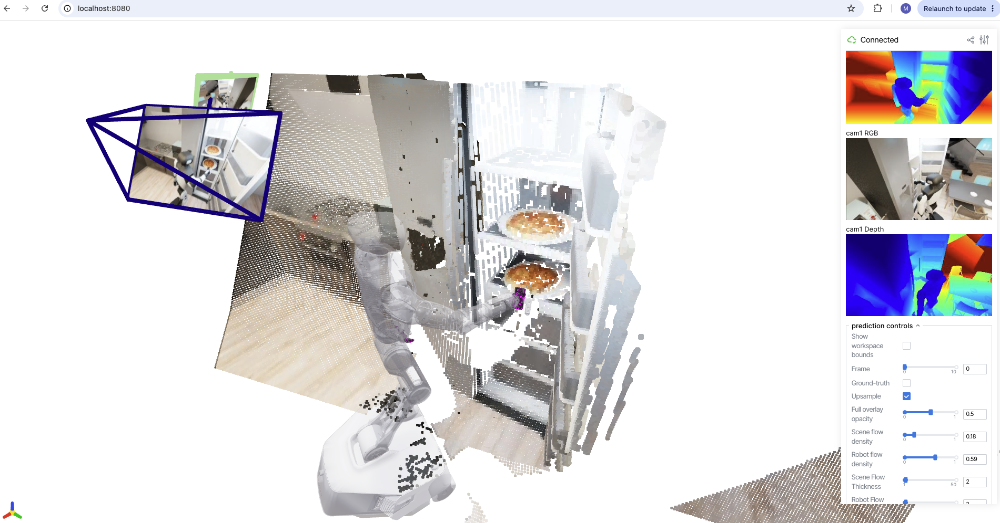

<!-- Copyright Amazon.com, Inc. or its affiliates. All Rights Reserved. -->
<!-- SPDX-License-Identifier: MIT-0 -->

# PointWorld: Distributed 3D World Model Pre-training

This test case demonstrates distributed pre-training and evaluation of
[PointWorld](https://github.com/NVlabs/PointWorld) (NVIDIA + Stanford) on AWS GPU
clusters orchestrated by Amazon EKS / SageMaker HyperPod EKS.

PointWorld is a large pre-trained **3D world model** for robotic manipulation. It
forecasts full-scene 3D **point flow** (per-point 3D displacements over ~1 second)
from one or a few RGB-D images plus a sequence of robot actions. Crucially, the
robot action is itself represented as 3D point flow rather than an
embodiment-specific action space (e.g. joint angles), so a single model can learn
jointly across embodiments (a single-arm Franka and a bimanual humanoid) and
condition directly on physical geometry.

We pre-train the **large PTv3** variant on the **BEHAVIOR** domain using PyTorch
DDP, then evaluate the resulting checkpoint with PointWorld's point-flow metrics.
The committed defaults are a small **2 x p5en.48xlarge** (16 x NVIDIA H200) smoke
run over a BEHAVIOR subset, so the full data → train → evaluate → visualize loop
runs end to end on a modest footprint; `env_vars` knobs scale it up to more nodes
and the full dataset. (Upstream PointWorld pre-trains the released checkpoint on
the multi-domain **DROID + BEHAVIOR** corpus across 8 nodes / 64 H200; DROID is
multi-terabyte and out of scope for this test case — see [Section 4](#4-stage-data-and-weights-onto-fsx-in-cluster).)



For more information on 3d World Models, please watch:
> [https://www.youtube.com/watch?v=0vfgm8LshmY](https://www.youtube.com/watch?v=0vfgm8LshmY)


| | |
|---|---|
| **Model** | PointWorld (PTv3 backbone + DINOv3 scene featurizer) |
| **Framework** | PyTorch + DDP (`torchrun`, `init_method="env://"`) |
| **Precision** | BF16 (AMP) |
| **Data** | BEHAVIOR (sim), WebDataset shards (DROID full-scale, out of scope) |
| **Paper** | [arXiv:2601.03782](https://arxiv.org/abs/2601.03782) (CVPR 2026 Highlight) |
| **Code** | [NVlabs/PointWorld](https://github.com/NVlabs/PointWorld) (Apache-2.0) |
| **Datasets** | [PointWorld-DROID](https://huggingface.co/datasets/nvidia/PointWorld-DROID), [PointWorld-BEHAVIOR](https://huggingface.co/datasets/nvidia/PointWorld-BEHAVIOR) |
| **Checkpoints** | [nvidia/PointWorld_models](https://huggingface.co/nvidia/PointWorld_models) |

## Agenda: pre-train, then evaluate

PointWorld's thesis is **"pre-train once, no post-training."** A single
pre-trained checkpoint drives a real robot via model-predictive control (MPC)
with no demonstrations or task-specific fine-tuning. Accordingly, this test case
covers the two stages that run on a training cluster:

1. **Pre-train** the 3D world model (multi-node DDP) on BEHAVIOR.
2. **Evaluate** the resulting checkpoint (point-flow L2 metrics; viser viz optional).

There is **no fine-tuning stage** — it is intentionally absent from the model
design. Real-robot MPC deployment happens off-cluster on physical hardware and is
out of scope for this repository.

> [!info] Kubernetes-only
> This test case targets **Amazon EKS / SageMaker HyperPod EKS**. There is no
> Slurm variant.

> [!note] Kubeflow Trainer v2 is the validated default; PyTorchJob v1 is an alternative
> Pre-training was validated end-to-end on **Kubeflow Trainer v2**
> (`trainer.kubeflow.org` — `TrainJob`/`ClusterTrainingRuntime`); the manifests live
> in [`kubernetes/trainer-v2/`](./kubernetes/trainer-v2/). Use that path if your
> cluster runs Trainer v2.
>
> A classic **PyTorchJob v1** manifest (`kubeflow.org/v1`,
> [`kubernetes/pointworld-pretrain.yaml`](./kubernetes/pointworld-pretrain.yaml)) is
> also provided for clusters that still run the Training Operator. It carries the
> `elasticPolicy` required for correct multi-node `torchrun` rendezvous, but it has
> **not been validated multi-node on a live cluster** — verify rendezvous before
> relying on it at scale.

## Prerequisites

- An EKS or SageMaker HyperPod EKS cluster with p5en.48xlarge (H200) nodes — the
  default smoke run uses **2** (16 x H200); scale up via `NUM_NODES`
- [Kubeflow Training Operator](https://www.kubeflow.org/docs/components/training/)
  (provides the `PyTorchJob` CRD)
- [NVIDIA device plugin](https://github.com/NVIDIA/k8s-device-plugin) and
  [EFA device plugin](https://github.com/aws-samples/aws-efa-eks)
- [FSx for Lustre](https://docs.aws.amazon.com/fsx/latest/LustreGuide/what-is.html)
  PVC named `fsx-claim` mounted at `/fsx`
- Docker + Amazon ECR for building and hosting the container image
- `kubectl`, the AWS CLI, and `envsubst` (from GNU `gettext`) on your workstation
- **Architecture:** the container targets **`linux/amd64`**. Build it on x86_64
  (the on-cluster Kaniko build in Section 3, or an x86_64 host) — not natively on
  Apple Silicon / arm64.
- **DINOv3 access** (gated — see below)

## 1. Clone this repository

```bash
git clone https://github.com/awslabs/awsome-distributed-ai.git
cd awsome-distributed-ai/3.test_cases/pytorch/pointworld
```

## 2. Configure (`env_vars`)

This test case follows the repo convention of a single `env_vars` file plus
`envsubst`: you fill in your region, account, cluster, and run parameters once,
then [`kubernetes/deploy.sh`](./kubernetes/deploy.sh) renders the manifests for
you. No hand-editing of `<ACCOUNT_ID>`/`<REGION>` in each YAML.

```bash
cp env_vars.template env_vars
vim env_vars        # AWS_REGION/ACCOUNT_ID auto-detect; set NAMESPACE, FSX_PVC_NAME,
                    # node counts, DINOV3_URL, BEHAVIOR_TASKS, MODEL_PATH, etc.
source env_vars
```

`deploy.sh` substitutes **only** an explicit allowlist of variables, so the
in-container shell/python references inside the manifests (`$RANK`,
`$LOCAL_DATASET_DIR`, the data-prep Job's `$BEHAVIOR_TASKS`/`os.environ[...]`,
etc.) are left untouched for runtime. `env_vars` is git-ignored — never commit it.

> [!note] What is and isn't rendered
> The gated `DINOV3_URL` and the data-prep knobs `BEHAVIOR_TASKS`/`MAX_CLIPS` are
> read by the data-prep container at runtime, so they are **not** rendered into
> the manifest — set them in `pointworld-data-prep.yaml` (or inject `DINOV3_URL`
> at apply time; see Section 4).

## 3. Build and push the container

The pre-training, evaluation, **and** data-staging jobs all run inside this image,
so build and push it to Amazon ECR before anything else.

> [!warning] The image is `linux/amd64` only
> The NGC base image, the PyG `torch-scatter==…+pt25cu124` wheels, and
> p5en.48xlarge nodes are all **x86_64**. You cannot build this image natively on
> an arm64 / Apple Silicon workstation (the `torch-scatter` wheel doesn't exist
> for arm64, and `docker build` would default to `linux/arm64`). Use the
> on-cluster build below, or cross-build with `buildx --platform linux/amd64`.

### Option A — build on the cluster (recommended)

[`kubernetes/build-image.sh`](./kubernetes/build-image.sh) runs a
[Kaniko](https://github.com/GoogleContainerTools/kaniko) build on an x86_64 CPU
node and pushes straight to ECR — no local Docker, correct architecture
regardless of your workstation. It creates the ECR repo if needed, stages the
Dockerfile, runs the build, and cleans up after itself.

```bash
source env_vars
./kubernetes/build-image.sh
```

### Option B — cross-build locally with buildx

Requires Docker with Buildx. On Apple Silicon this uses QEMU emulation and is
**slow** (the torch/CUDA install can take 30–60+ min); prefer Option A.

```bash
source env_vars
aws ecr create-repository --repository-name "${IMAGE_URI#*/}" --region ${AWS_REGION} 2>/dev/null || true
aws ecr get-login-password --region ${AWS_REGION} \
  | docker login --username AWS --password-stdin ${REGISTRY}

docker buildx build --platform linux/amd64 \
  -t ${IMAGE_URI} -f pointworld.Dockerfile --push .
```

The image tag (`IMAGE_TAG`) matches `POINTWORLD_COMMIT` in the Dockerfile so the
running image is traceable to an exact upstream commit.

## 4. Stage data and weights onto FSx (in-cluster)


> FSx for Lustre is a VPC-internal filesystem. The `/fsx` paths in this test case
> only exist **inside the cluster**, so all downloading, restoring, and WDS
> conversion runs in a Kubernetes Job that mounts the `fsx-claim` PVC — not from
> your local terminal. The `scripts/*` in this repo are the same steps expressed
> as standalone helpers; the Job runs them where `/fsx` actually exists.

PointWorld needs two things staged onto FSx before training:

1. **DINOv3 ViT-L/16 weights** (gated by Meta) — the scene featurizer backbone.
   Request access at <https://github.com/facebookresearch/dinov3>, then copy the
   `dinov3_vitl16` pre-train checkpoint URL from the access email. The weights are
   **never baked into the image**; the training/eval manifests symlink them from
   FSx at pod start.
2. **WebDataset (WDS) shards** — PointWorld ships datasets as packaged Hugging
   Face archives that you download, restore (`recover_dataset_from_parts.sh`), and
   convert to WDS.

[`kubernetes/pointworld-data-prep.yaml`](./kubernetes/pointworld-data-prep.yaml)
does all of this in one Job. Then set the data knobs directly
in the manifest (they are read by the container at runtime, so `deploy.sh` does
not render them):

- `DINOV3_URL` — your gated DINOv3 URL (treat as a secret; do not commit). You can
  inject it at apply time instead, so it never lands in a file (see below).
- `BEHAVIOR_TASKS` / `MAX_CLIPS` — the defaults stage a small BEHAVIOR subset for a
  quick smoke run; use `BEHAVIOR_TASKS=all` and `MAX_CLIPS=-1` for the full dataset.

`deploy.sh` renders the structural fields (`IMAGE_URI`, `NAMESPACE`,
`FSX_PVC_NAME`) from `env_vars` and applies the Job:

```bash
source env_vars
# Option A: DINOV3_URL already pasted into the manifest
./kubernetes/deploy.sh kubernetes/pointworld-data-prep.yaml

# Option B: keep the gated URL out of any file — inject it at apply time.
# Replace ONLY the env `value:` line so the in-script placeholder guard stays intact.
./kubernetes/deploy.sh --dry-run kubernetes/pointworld-data-prep.yaml \
  | sed "s|value: \"<DINOV3_DOWNLOAD_URL>\"|value: \"$DINOV3_URL\"|" | kubectl apply -f -

kubectl logs -f job/pointworld-data-prep -n ${NAMESPACE}
```

The Job writes the DINOv3 weights and WDS shards into the layout the
training/eval manifests expect on the shared filesystem:

```text
/fsx/pointworld/
├── dataset/
│   └── behavior/wds/{train,test}/...          # from the data-prep Job
│       └── metadata_rank0.json                # written by convert_wds on completion
├── dinov3/checkpoints/
│   └── dinov3_vitl16_pretrain_lvd1689m-8aa4cbdd.pth   # gated; canonical name required
├── train_logs/                                # written during pre-training
└── checkpoints/                               # written during pre-training
```

The pre-training pod mounts the WDS root at `/dataset` via
`subPath: pointworld/dataset`, so PointWorld's `LOCAL_DATASET_DIR=/dataset`
resolves `/dataset/behavior/wds`.

> [!note] DROID is out of scope for this test case
> PointWorld has two domains: **BEHAVIOR** (simulation, sharded per task at
> ~1.6–14 GB/task) and **DROID** (real-world, a single ~3.9 TB split archive).
> This test case stages **BEHAVIOR only** — it subsets cleanly, fits a modest
> FSx, and exercises the full distributed pipeline. DROID is multi-terabyte and
> is **not** staged by the data-prep Job. If you want to train on DROID yourself,
> [`scripts/0.download_dataset.py`](./scripts/0.download_dataset.py) downloads
> either package, and upstream PointWorld documents the restore → convert steps;
> note DROID also needs the released expert-confidence artifact
> (`droid/confidence/expert_confidence-seed=42.h5`) copied into the WDS test split
> for filtered metrics. Sizing FSx for DROID is your responsibility.

### Running the staging steps by hand

If you prefer to stage manually (for example, from a HyperPod login pod or any
pod that mounts `fsx-claim`), the `scripts/` helpers are the equivalent steps:
`scripts/2.download_dinov3.sh` for the weights, and
`scripts/0.download_dataset.py` → `recover_dataset_from_parts.sh` →
`scripts/1.convert_wds.py` for the data. They take the same `/fsx/...` paths and
must run inside a pod with FSx mounted.

> [!note] data-prep Job vs `0.download_dataset.py`
> The in-cluster [`pointworld-data-prep.yaml`](./kubernetes/pointworld-data-prep.yaml)
> Job **inlines** its own `huggingface_hub.snapshot_download` for the BEHAVIOR
> package rather than calling `scripts/0.download_dataset.py`, so the Job is
> self-contained (no script mount). `0.download_dataset.py` is the documented
> manual/standalone equivalent (and the only path that fetches DROID). Keep the two
> in sync if you change download logic.

## 5. Pre-train (Kubernetes)

Pre-training runs as a multi-node, data-parallel `torchrun` job: `NUM_NODES`
worker pods (one per node), each running `GPU_PER_NODE` processes (one per H200).
The training flags (large PTv3, BEHAVIOR) come from the training-flag section of
`env_vars` and are rendered into the manifest by `deploy.sh`.

### 5a. Trainer v2 (validated default)

This is the path validated end-to-end on EKS (p5en/H200). On a Kubeflow Trainer v2
cluster (`trainer.kubeflow.org`), apply the runtime once, then submit the TrainJob —
same image, flags, and FSx layout, expressed as a `ClusterTrainingRuntime` +
`TrainJob`:

```bash
source env_vars
./kubernetes/deploy.sh kubernetes/trainer-v2/pointworld-runtime.yaml    # apply once
./kubernetes/deploy.sh kubernetes/trainer-v2/pointworld-trainjob.yaml
kubectl get pods -n ${NAMESPACE} -l trainer.kubeflow.org/trainjob-name=pointworld-pretrain
```

Trainer v2's torch plugin sets `numNodes`/`numProcPerNode` and injects the
`torchrun` rendezvous (`PET_*`) env so the run gang-schedules across all nodes as a
single job. PointWorld's `Trainer` initializes the process group with
`init_method="env://"` and reads `LOCAL_RANK` directly, so no extra launcher is
needed.

### 5b. PyTorchJob v1 (classic Training Operator — alternative, not validated multi-node)

```bash
source env_vars
./kubernetes/deploy.sh kubernetes/pointworld-pretrain.yaml
kubectl logs -f pointworld-pretrain-worker-0 -n ${NAMESPACE}
```

The v1 manifest sets `elasticPolicy` (`rdzvBackend: c10d`), which puts the Training
Operator in elastic/`torchrun` mode so it injects the `PET_*` rendezvous env (plus
`MASTER_ADDR`/`MASTER_PORT`). Without `elasticPolicy` the operator runs in classic
mode and a multi-node run splits into independent single-node jobs.

> [!warning] v1 multi-node path is unvalidated
> Only the Trainer v2 path above was exercised on a live cluster. The v1
> manifest carries the correct `elasticPolicy` but has **not** been validated
> multi-node. Before relying on it at scale, confirm a single rendezvous group —
> e.g. on a worker pod, `env | grep -E 'PET_|WORLD_SIZE'` should show
> `WORLD_SIZE` = `NUM_NODES` × `GPU_PER_NODE` (16 for the 2-node default), and NCCL
> init should report all ranks across all nodes (not `WORLD_SIZE=8` twice).

### Controlling duration

Two `env_vars` knobs bound the run:

- `NUM_EPOCHS` (smoke default 10; upstream full-scale target is 200) — note
  `train.py` tracks progress as a **fractional**
  `epoch_count = samples_seen / train_total_samples`, so on a small dataset it
  reaches `NUM_EPOCHS` quickly. Raise it for full-scale training.
- `MAX_TRAIN_STEPS` (default `-1` = disabled) — stops after N optimizer steps,
  independent of dataset size. Set this `> 0` for a **deterministic smoke run**.

> [!warning] Smoke runs and checkpoints
> The `MAX_TRAIN_STEPS` exit does **not** force a final checkpoint (only the
> `NUM_EPOCHS` cutoff does). Checkpoints are otherwise written every `SAVE_FREQ`
> **batches**. So for a `MAX_TRAIN_STEPS`-bounded smoke run, set
> `SAVE_FREQ <= MAX_TRAIN_STEPS` or nothing is saved (e.g. `MAX_TRAIN_STEPS=50`,
> `SAVE_FREQ=20`).

> [!note] Where the checkpoint lands
> PointWorld derives the run directory from the **W&B run name**. With
> `WANDB_MODE=disabled`, W&B ignores `EXP_NAME` and generates a random name, so
> the checkpoint is written to:
> ```text
> ${LOG_DIR}/<wandb-run-name>/model-last.pt      # e.g. .../dummy-5b5pxh8p/model-last.pt
> ```
> Read the run's `Saving to:` log line for the actual directory, and point eval's
> `MODEL_PATH` at that `.../model-last.pt`. (The released checkpoint is
> `model-best.pt`; a training run writes `model-last.pt`.) Each run adds a new
> directory under `${LOG_DIR}`.

### Launch-pattern detail

The container `command` is a small `bash -c` wrapper that:

1. Symlinks the gated DINOv3 weights from `/fsx/pointworld/dinov3/checkpoints`
   into `/pointworld/third_party/dinov3/checkpoints` (keeping gated weights out of
   the image), then
2. `exec`s `torchrun ... train.py` with the BEHAVIOR training flags.

Doing the symlink in the main container (rather than an initContainer) ensures it
lives in the same filesystem namespace as the training process. Both the Trainer v2
runtime and the v1 PyTorchJob use the same wrapper.

## 6. Evaluate (Kubernetes Job)

```bash
# Set MODEL_PATH in env_vars to your trained checkpoint (or a released checkpoint
# from nvidia/PointWorld_models), then:
source env_vars
./kubernetes/deploy.sh kubernetes/pointworld-eval.yaml
kubectl logs -f job/pointworld-eval -n ${NAMESPACE}
```

- **DROID** (annotation-aware): the main metric is
  `full_eval/test/filtered_l2_moved/mean`, which uses the expert-confidence
  artifact to focus on reliable moving-point regions.
- **BEHAVIOR** (simulation): unfiltered metrics (data is noiseless). Set
  `--domains=behavior`, `--data_dirs=/dataset/behavior/wds`, and drop
  `--confidence_thres`.

For a quick smoke test, set `EVAL_NUM_BATCHES` to e.g. `100` instead of `-1`.

## 7. Parse throughput

After capturing **pre-training** logs, compute steady-state throughput:

```bash
# Trainer v1 (PyTorchJob):
kubectl logs pointworld-pretrain-worker-0 -n ${NAMESPACE} > run.log

# Trainer v2 (TrainJob):
kubectl logs -n ${NAMESPACE} \
  $(kubectl get pods -n ${NAMESPACE} --no-headers \
    -o custom-columns=NAME:.metadata.name \
    | grep '^pointworld-pretrain-node-0-0-') > run.log

python scripts/parse_benchmark.py \
    --log_file run.log \
    --warmup_steps 20 \
    --global_batch_size 352 \
    --num_gpus 16 \
    --gpu_type h200
```

> `--global_batch_size` is `per_gpu_batch_size * num_gpus` — for the default
> 2-node smoke run that is `22 * 16 = 352` (at full scale on 8 nodes it would be
> `22 * 64 = 1408`). The step/loss/time regexes are configurable; adjust them if
> your build's log format differs from the release default.

## 8. Visualize (interactive 3D viewer)

PointWorld ships an **interactive** [`viser`](https://github.com/nerfstudio-project/viser)
3D viewer that renders predicted vs. ground-truth scene point-flow for a trained
checkpoint. It is enabled at evaluation time with `--eval_viz_num > 0` and serves
a live web UI on port `8080`.

Because the viewer is a **live web server** *and* pauses on an **interactive TTY
prompt** between samples (`Press ENTER to continue ... type q to quit`), it
cannot run as a fire-and-forget `Job` — it needs `stdin`/`tty` and a port you can
reach. This test case therefore provides a dedicated **Pod**
([`kubernetes/pointworld-viz.yaml`](./kubernetes/pointworld-viz.yaml)) with
`stdin: true` / `tty: true` and a `containerPort: 8080`.

> [!note] Image must include the visualization extras
> The viewer needs `viser`, `open3d`, and `matplotlib`
> (pinned to upstream `environments/train_eval_viz.yml`:
> `viser==1.0.10`, `open3d==0.16.0`, `matplotlib==3.10.6`). These are baked into
> `pointworld.Dockerfile`, so the image built in [Section 3](#3-build-and-push-the-container)
> already supports visualization.

```bash
# Point MODEL_PATH at a trained checkpoint (see Section 5 for the dummy-<run> dir)
# and set EVAL_VIZ_NUM (# samples to visualize), then launch the viz Pod:
source env_vars
./kubernetes/deploy.sh kubernetes/pointworld-viz.yaml

# 1) Terminal A — forward the viser port to your workstation:
kubectl port-forward pod/pointworld-viz 8080:8080 -n ${NAMESPACE}

# 2) Terminal B — attach to drive the ENTER / q prompt:
kubectl attach -it pointworld-viz -n ${NAMESPACE}

# 3) Open http://localhost:8080 in your browser. Press ENTER in terminal B to
#    step to the next sample; type q to quit. The Pod exits when viz finishes.

# Tear down:
./kubernetes/deploy.sh --delete kubernetes/pointworld-viz.yaml
```

### How to read the viewer

PointWorld's task is **3D scene-flow prediction**: given the current scene, predict
how each 3D point will move over the next frames. For every clip the viewer holds
two parallel timelines — the **ground-truth** flow (what actually happens in the
simulation) and your **model's predicted** flow (from the loaded checkpoint).

The controls (in the **"prediction controls"** GUI panel) map to this:

- **`Ground-truth`** — the key toggle. ON shows the ground-truth motion (the
  "answer key"); OFF shows your model's prediction for the same clip. Flip it
  back and forth on a fixed frame and watch how much the flow vectors change:
  small change = the prediction is close to reality; large divergence = the model
  is off.
- **`Frame`** — step through the temporal sequence. Errors typically grow over the
  horizon (frame 1 is easy, frame 10 is hard), so compare GT vs. prediction at a
  *mid/late* frame, not frame 0.
- **`Scene flow` / `Robot flow` density + thickness** — how many / how thick the
  motion vectors are (scene = environment points, robot = the arm's body points).
- **`Upsample`** — coarse vs. dense point rendering. **`Point size`**,
  **`Full overlay opacity`**, **`Show workspace bounds`** — display only.

> [!note] What the viewer does — and does not — tell you about a run
> The viewer is a **qualitative** sanity check on **one sample**: it confirms the
> model produces *structured, plausible* motion (not noise) and that the whole
> data → train → checkpoint → load → predict → render path works. It does **not**
> quantify model quality — that comes from `eval.py` metrics (L2 flow error on the
> test split) and the training loss curve ([`scripts/parse_benchmark.py`](./scripts/parse_benchmark.py)).
> A short or early-stopped run (loss still decreasing) will look directionally
> right but **fuzzy/imprecise**, which is expected, not a defect. Also note which
> checkpoint you loaded: a freshly trained `model-last.pt` is typically
> under-trained relative to the released `model-best.pt`.

> [!warning] The prompt requires a real TTY
> `eval.py` reads the continue/quit prompt from an attached terminal (it falls
> back to `/dev/tty` and errors if stdin is redirected/captured). Always drive it
> with `kubectl attach -it` (or `kubectl exec -it` into a shell), not a piped
> command. `--viewer_host` is **not** a CLI flag; the server binds `0.0.0.0`
> automatically, which is what makes `port-forward` work.

## Tuning notes
All of these are exposed as variables in `env_vars` (rendered by `deploy.sh`):

- **Batch size**: `BATCH_SIZE=22` is the upstream default. H200 has 141 GB HBM;
  raise it if memory allows, and update `--global_batch_size` accordingly when
  parsing throughput with [`scripts/parse_benchmark.py`](./scripts/parse_benchmark.py).
- **EFA**: `EFA_PER_NODE=16` matches a dedicated p5en.48xlarge (16 EFA NICs per
  node; `32` for p5.48xlarge). On a **shared/contended cluster** you may not get
  nodes with all 16 free — lower it (e.g. `3`) so the job schedules; NCCL still
  runs over EFA at reduced bandwidth. Use 16 on dedicated capacity for full
  inter-node bandwidth.
- **Nodes / GPUs**: `NUM_NODES` (default 2) and `GPU_PER_NODE` drive
  replicas/`numNodes` and `--nproc_per_node` across both the v1 and v2 manifests;
  raise `NUM_NODES` to scale out (e.g. 8 for the upstream 64-GPU footprint).
- **Shared memory**: the `shmem` `emptyDir` backs the PyTorch DataLoader workers;
  reduce its `sizeLimit` in the manifest for smaller instances.
- **B200**: this image targets H200. B200 EFA networking needs NCCL >= 2.29 — see
  "Known limitations" below.

## Directory structure

```text
pointworld/
├── README.md                          # this file (single source of truth)
├── env_vars.template                  # copy to env_vars; source before deploy.sh
├── pointworld.Dockerfile              # CUDA 12.4; clones PointWorld @ pinned commit
├── .gitignore
├── scripts/
│   ├── 0.download_dataset.py          # download DROID + BEHAVIOR HF packages
│   ├── 1.convert_wds.py               # restore/H5 -> WDS (wraps upstream data branch)
│   ├── 2.download_dinov3.sh           # fetch gated DINOv3 weights
│   └── parse_benchmark.py             # throughput / loss from logs
└── kubernetes/
    ├── README.md                      # manifest index (points back here)
    ├── build-image.sh                   # on-cluster Kaniko build -> ECR (linux/amd64)
    ├── build-image.yaml                 # Kaniko build Pod (rendered by build-image.sh)
    ├── deploy.sh                       # render (envsubst) + apply a manifest
    ├── pointworld-data-prep.yaml       # Job: stage DINOv3 + WDS onto FSx (in-cluster)
    ├── pointworld-pretrain.yaml        # PyTorchJob: multi-node DDP pre-training
    ├── pointworld-eval.yaml            # Job: single-GPU evaluation
    ├── pointworld-viz.yaml             # Pod: interactive viser 3D viewer (stdin/tty + :8080)
    └── trainer-v2/                     # Kubeflow Trainer v2 variants (TrainJob)
```

## Known limitations

- **Non-deterministic GPU eval**: small run-to-run variation is expected even
  with fixed seeds (upstream behavior).
- **Partial-batch eval sensitivity**: `--eval_num_batches < full dataset` is
  sensitive to `num_workers` / `eval_num_workers`; match these settings when
  comparing runs.
- **B200**: the container targets H200 (p5en.48xlarge). B200 EFA networking needs
  NCCL >= 2.29, which the base image predates; use a NeMo container with NCCL
  >= 2.29 for B200.
- **Gated DINOv3**: training and evaluation cannot run until the gated DINOv3
  weights are present on FSx (Section 3).

## Validation status

This test case was exercised end-to-end on Amazon EKS (Kubeflow Trainer v2.0.0)
with p5en.48xlarge (H200) nodes:

- **Container**: built from `pointworld.Dockerfile` and imported cleanly on an
  H200 (torch 2.5.1+cu124, flash-attn 2.7.4.post1, PTv3, DINOv3).
- **Pre-training**: validated at two scales on p5en.48xlarge / H200 (Kubeflow
  Trainer v2, EFA `efa-direct`):
  - a 1-node / 8-GPU smoke run (BEHAVIOR, `--ptv3_size=large`, bounded by
    `--max_train_steps`), and
  - a **2-node / 16-GPU** run over a larger BEHAVIOR subset (4000 train /
    1000 test clips, `--num_epochs=10`) that initialized distributed training,
    loaded the DINOv3 backbone, streamed the WebDataset dataloader, ran
    forward/backward with a decreasing loss, and wrote `model-last.pt` on the
    epoch cutoff.
- **Evaluation**: `eval.py` loaded a trained checkpoint and produced metrics on
  the BEHAVIOR test split (also verified against a released checkpoint,
  `nvidia/PointWorld_models` `large-droid+behavior`).
- **Visualization**: the interactive `viser` viewer
  ([`kubernetes/pointworld-viz.yaml`](./kubernetes/pointworld-viz.yaml)) loaded a
  trained checkpoint, served the live 3D UI on port `8080`, and paused at the
  per-sample TTY prompt.

> [!note] Small-scale data
> DROID is distributed as a single ~3.9 TB split archive that does not subset
> cleanly. For small-scale validation, BEHAVIOR is sharded by task
> (~1.6-14 GB/task) and restores independently, making it the practical choice
> for smoke tests on a modest filesystem.

## References and attribution

- **Paper**: [PointWorld: Scaling 3D World Models for In-The-Wild Robotic
  Manipulation](https://arxiv.org/abs/2601.03782) (CVPR 2026 Highlight)
- **Project site**: <https://point-world.github.io/>
- **Code**: [github.com/NVlabs/PointWorld](https://github.com/NVlabs/PointWorld)
  (Apache-2.0)

PointWorld and its datasets/checkpoints are released by NVIDIA under their
respective licenses. DINOv3 weights are gated by Meta under the DINOv3 license.
The scripts and manifests in this directory are authored by AWS and licensed
MIT-0. If you use PointWorld in research, please cite:

```bibtex
@article{huang2026pointworld,
  title={PointWorld: Scaling 3D World Models for In-The-Wild Robotic Manipulation},
  author={Huang, Wenlong and Chao, Yu-Wei and Mousavian, Arsalan and Liu, Ming-Yu
          and Fox, Dieter and Mo, Kaichun and Li, Fei-Fei},
  journal={arXiv preprint arXiv:2601.03782},
  year={2026}
}
```
