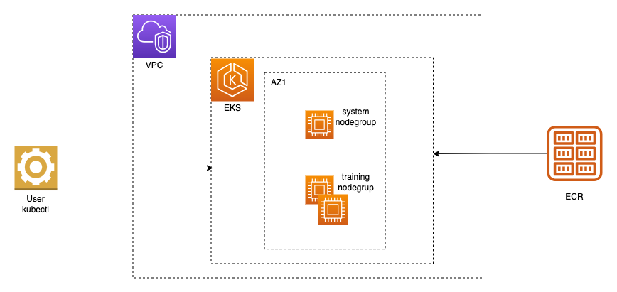

# Amazon EKS GPU cluster architecture

This directory provides a CloudFormation template that creates an Amazon EKS cluster with an EFA-enabled GPU node group for distributed training and inference, and the eksctl manifests that preceded it.

- [`assets/eks-gpu-cluster.yaml`](./assets/eks-gpu-cluster.yaml): one-click CloudFormation stack (VPC, EKS cluster, system node group, GPU node group, device plugins).
- [`eksctl/`](./eksctl/): eksctl cluster manifests for the same topology, kept for users who manage clusters with eksctl. See [section 5](#5-eksctl-manifests).

## 1. Architecture



The stack creates a VPC with a public subnet, a private subnet for the nodes, and a second private subnet in another Availability Zone for the EKS control plane. The EKS cluster runs two managed node groups: `system` (2 x `SystemInstanceType`, default `m6i.xlarge`) for CoreDNS and other cluster services, and `gpu` (`GpuNodeCount` x `GpuInstanceType`) for the workload. The GPU nodes launch from a launch template that places them in a cluster placement group, attaches one EFA interface per network card, targets a capacity reservation when one is given, and assembles the local NVMe drives as a RAID0 volume. A CodeBuild project runs after the node groups exist; it installs the NVIDIA and EFA Kubernetes device plugins with Helm, waits until every GPU node advertises `nvidia.com/gpu` and `vpc.amazonaws.com/efa`, and optionally pulls a container image onto every GPU node.

## 2. Quick start

[](https://console.aws.amazon.com/cloudformation/home#/stacks/quickcreate?templateUrl=https://awsome-distributed-ai.s3.amazonaws.com/templates/amazon-eks/eks-gpu-cluster.yaml&stackName=eks-gpu-cluster)

Or from the CLI:

```bash
aws cloudformation deploy \
  --stack-name eks-gpu-cluster \
  --template-file assets/eks-gpu-cluster.yaml \
  --capabilities CAPABILITY_IAM \
  --parameter-overrides \
    PrimarySubnetAZ=us-east-1a \
    SecondarySubnetAZ=us-east-1b \
    GpuInstanceType=p5.48xlarge \
    GpuNodeCount=2 \
    CapacityReservationId=cr-0123456789abcdef0 \
    CapacityReservationType=targeted-odcr
```

`PrimarySubnetAZ` has to be the Availability Zone of the capacity reservation: EFA traffic and the placement group stay within one AZ. Cluster creation takes 15 to 20 minutes; the CodeBuild bootstrap adds a few minutes plus the image pull time when `PrePullImage` is set.

After the stack completes:

```bash
aws eks update-kubeconfig --name eks-gpu-cluster --region us-east-1
kubectl get nodes -l role=gpu -o custom-columns='NAME:.metadata.name,TYPE:.metadata.labels.node\.kubernetes\.io/instance-type,GPU:.status.allocatable.nvidia\.com/gpu,EFA:.status.allocatable.vpc\.amazonaws\.com/efa'
```

The `KubeconfigCommand` stack output contains the first command with the stack's cluster name and region.

## 3. GPU instance types

`GpuInstanceType` selects the instance type; the template derives the network interface layout from the `NicLayout` mapping, which records the network card count and whether card 0 supports EFA for each type (`describe-instance-types`, `NetworkInfo.NetworkCards` and `EfaInfo`). Card 0 is device index 0; it receives `InterfaceType: efa` when the type supports EFA on card 0 and omits the property otherwise. Every other card is device index 1 with `InterfaceType: efa`.

| Instance type | GPUs | Network cards | EFA interfaces |
|---|---|---|---|
| `g7e.12xlarge` | 2 | 1 | 1 |
| `g7e.24xlarge` | 4 | 2 | 2 |
| `g7e.48xlarge` | 8 | 4 | 4 |
| `p4d.24xlarge` | 8 | 4 | 4 |
| `p4de.24xlarge` | 8 | 4 | 4 |
| `p5.48xlarge` | 8 | 32 | 32 |
| `p5en.48xlarge` | 8 | 16 | 16 |
| `p6-b200.48xlarge` | 8 | 8 | 8 |
| `p6-b300.48xlarge` | 8 | 17 | 16 (card 0 is ENA only) |

To add a type, append a `NicLayout` entry with `Cards` and `PrimaryType` and the type to `GpuInstanceType.AllowedValues`.

## 4. Parameters

| Parameter | Default | Description |
|---|---|---|
| `PrimarySubnetAZ` | (required) | AZ of the public and node subnets; the AZ of the capacity reservation |
| `SecondarySubnetAZ` | (required) | Second AZ for the EKS control plane subnet |
| `GpuInstanceType` | `p5.48xlarge` | GPU instance type (see section 3) |
| `GpuNodeCount` | `2` | GPU nodes, min = desired = max. `0` creates the cluster and device plugins without GPU nodes |
| `CapacityReservationId` | empty | Targeted ODCR or Capacity Block ID. Empty launches On-Demand and consumes an open ODCR with matching attributes |
| `CapacityReservationType` | `targeted-odcr` | `targeted-odcr` keeps the placement group and On-Demand billing against the reservation; `capacity-block` sets `MarketType=capacity-block` and omits the placement group |
| `KubernetesVersion` | `1.34` | EKS version; the GPU node group uses the `AL2023_x86_64_NVIDIA` AMI for that version |
| `SystemInstanceType` | `m6i.xlarge` | Instance type of the 2-node system node group |
| `PrePullImage` | empty | Image pulled onto every GPU node by a DaemonSet after the device plugins are ready |
| `AdminRoleArn` | empty | Additional IAM principal that receives `AmazonEKSClusterAdminPolicy`; the stack creator always has it |
| `VpcCidr` | `10.0.0.0/16` | VPC CIDR, split into three /20 subnets |

Outputs: `ClusterName`, `ClusterArn`, `VPCId`, `GpuNodeGroup`, `GpuInstanceType`, `Region`, `KubeconfigCommand`.

## 5. eksctl manifests

The manifests under [`eksctl/`](./eksctl/) create the same two-node-group topology with [eksctl](https://eksctl.io). Each file names its instance type and capacity source; replace the `PLACEHOLDER_*` values (region, AZs, VPC and subnet IDs, capacity reservation ID) before use.

| Manifest | Nodes | Capacity |
|---|---|---|
| `eks-g4dn.yaml` | 2 x g4dn.8xlarge, new VPC | On-Demand |
| `eks-g4dn-vpc.yaml` | 2 x g4dn.8xlarge, existing VPC | On-Demand |
| `eks-p4de-odcr.yaml` | 2 x p4de.24xlarge, new VPC | ODCR |
| `eks-p4de-odcr-vpc.yaml` | 2 x p4de.24xlarge, existing VPC | ODCR |
| `eks-p5-odcr-vpc.yaml` | 1 x p5.48xlarge, existing VPC | ODCR |
| `eks-p5-capacity-block.yaml` | 1 x p5.48xlarge, existing VPC | Capacity Block |
| `eks-g5-node-autorepair.yaml` | 2 x g5.8xlarge with node auto repair and the CloudWatch observability add-on | On-Demand |

```bash
eksctl create cluster -f eksctl/eks-p4de-odcr-vpc.yaml
eksctl delete cluster -f eksctl/eks-p4de-odcr-vpc.yaml
```

The eksctl path installs the device plugins through `efaEnabled: true`; the CloudFormation path installs them from the CodeBuild bootstrap.

## 6. Cleanup

```bash
aws cloudformation delete-stack --stack-name eks-gpu-cluster
```

Delete any LoadBalancer services and persistent volumes created inside the cluster first, because the stack does not own them. In accounts with Amazon GuardDuty Runtime Monitoring enabled, GuardDuty creates a managed `guardduty-data` interface VPC endpoint and `GuardDutyManagedSecurityGroup-*` after the VPC appears. Those resources are outside the stack. The endpoint keeps the subnets in use; after it is deleted, the managed security group keeps the VPC in use. If the stack reaches `DELETE_FAILED`, delete the endpoint and managed security group, then retry stack deletion.

## 7. Updating the GPU instance type

A managed node group cannot update its launch-template version and its instance type in the same operation; EKS returns `Version and release version updates cannot be combined with other updates`. Choose `GpuInstanceType` when creating the stack. To change it later, replace the `GpuNodeGroup` (or create a second node group) rather than updating the parameter in place.

## 8. Testing changes before they are published

The quick-create link and the `Launch` button read the template from the public bucket, which holds the version on `main`. To test a change, deploy the local file with `--template-file` as in section 2; the template has no nested stacks and needs no bucket. `GpuNodeCount=0` exercises the VPC, cluster, system node group, device plugin installation and the launch template without GPU capacity. The generated launch template can be read back with `aws ec2 describe-launch-template-versions` to check the interface list for a given `GpuInstanceType`.

## 9. References

- [Amazon EKS user guide](https://docs.aws.amazon.com/eks/latest/userguide/)
- [Elastic Fabric Adapter on EKS](https://docs.aws.amazon.com/eks/latest/userguide/node-efa.html)
- [NVIDIA device plugin for Kubernetes](https://github.com/NVIDIA/k8s-device-plugin)
- [aws-efa-k8s-device-plugin](https://github.com/aws/eks-charts/tree/master/stable/aws-efa-k8s-device-plugin)
- [aws-do-eks](https://github.com/aws-samples/aws-do-eks)
