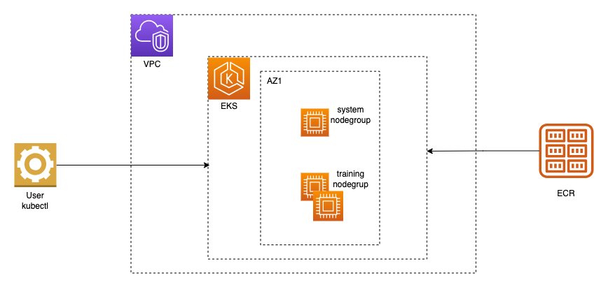

# Amazon EKS GPU cluster architecture

This directory provides CloudFormation templates that create an Amazon EKS cluster with an EFA-enabled GPU node group for distributed training and inference, and the eksctl manifests that preceded them.

- [`assets/eks-gpu-cluster-deploy-all.yaml`](./assets/eks-gpu-cluster-deploy-all.yaml): one-click CloudFormation stack (VPC, EKS cluster, system node group, GPU node group, device plugins, optional node AMI and FSx for Lustre). It creates the four templates below as nested stacks.
- [`assets/eks-cluster-prerequisites.yaml`](./assets/eks-cluster-prerequisites.yaml), [`assets/eks-cluster.yaml`](./assets/eks-cluster.yaml), [`assets/eks-add-gpu-nodegroup.yaml`](./assets/eks-add-gpu-nodegroup.yaml), [`assets/eks-gpu-node-ami.yaml`](./assets/eks-gpu-node-ami.yaml): the same deploy split by concern, each also useful on its own. See [section 10](#10-deploying-a-single-template).
- [`eksctl/`](./eksctl/): eksctl cluster manifests for the same topology, kept for users who manage clusters with eksctl. See [section 5](#5-eksctl-manifests).

## 1. Architecture



The stack creates a VPC with a public subnet, a private subnet for the nodes, and a second private subnet in another Availability Zone for the EKS control plane. It also creates an S3 gateway endpoint and ECR interface endpoints, so a pull from the Region's private ECR does not cross the NAT gateway. The EKS cluster runs two managed node groups: `system` (`SystemNodeCount` x `SystemInstanceType`, default 2 x `m7i.xlarge`) for CoreDNS and other cluster services, and `gpu` (`GpuNodeCount` x `GpuInstanceType`) for the workload. The GPU nodes launch from a launch template that places them in a cluster placement group, or targets a capacity reservation instead when one is given, attaches one EFA interface per network card, and assembles the local NVMe drives as a RAID0 volume. A CodeBuild project runs after the node groups exist; it installs the NVIDIA and EFA Kubernetes device plugins with Helm at pinned chart versions, waits until every GPU node advertises `nvidia.com/gpu` and `vpc.amazonaws.com/efa` in the counts its instance type carries, and optionally pulls a container image onto every GPU node. It does not report success before that wait ends, so a stack that reaches `CREATE_COMPLETE` has GPU nodes the scheduler can place work on rather than only the charts that are supposed to make them so.

Two parts of that are optional. `DeployFsxLustre=true` adds an FSx for Lustre filesystem and its CSI driver for model weights. The `NodeImage` inputs add an EC2 Image Builder build that produces the node AMI, for the case where the AMI EKS resolves does not carry what the nodes need; [section 3](#3-gpu-instance-types) covers it.

The GPU nodes carry the label `role=gpu` and the taint `nvidia.com/gpu=true:NoSchedule`, which is what the inference examples in this repository already expect: a pod from `examples/inference/` tolerates that taint as written, and the step in those instructions that installs the two device plugins is already done on a cluster from here. An example written for SageMaker HyperPod EKS is the exception, because it selects nodes by a HyperPod label this cluster does not carry; replace those selectors with `role=gpu` or `node.kubernetes.io/instance-type`.

## 2. Quick start

A deploy needs three things from the account. The principal that creates the stack has to be allowed to create the IAM roles the templates define, which is why the commands pass `CAPABILITY_IAM`, and `iam:CreateServiceLinkedRole`, because EKS, EKS managed node groups, Auto Scaling, and FSx for Lustre and EC2 Image Builder when used, create their service-linked roles on first use in an account. The Region needs GPU capacity for `GpuNodeCount` x `GpuInstanceType` in `PrimarySubnetAZ`: a capacity reservation, or enough On-Demand vCPU quota for the instance family (*Running On-Demand G and VT instances* or *Running On-Demand P instances*), since a node group that cannot launch fails the deploy. The CLI path below needs the AWS CLI, and using the cluster afterwards needs `kubectl`.

[](https://console.aws.amazon.com/cloudformation/home#/stacks/quickcreate?templateUrl=https://awsome-distributed-ai.s3.amazonaws.com/templates/amazon-eks/eks-gpu-cluster-deploy-all.yaml&stackName=eks-gpu-cluster)

Or from the CLI:

```bash
aws cloudformation create-stack \
  --stack-name eks-gpu-cluster \
  --template-url https://awsome-distributed-ai.s3.amazonaws.com/templates/amazon-eks/eks-gpu-cluster-deploy-all.yaml \
  --capabilities CAPABILITY_IAM \
  --region us-east-1 \
  --parameters \
    ParameterKey=PrimarySubnetAZ,ParameterValue=us-east-1a \
    ParameterKey=SecondarySubnetAZ,ParameterValue=us-east-1b \
    ParameterKey=GpuInstanceType,ParameterValue=g7e.12xlarge \
    ParameterKey=GpuNodeCount,ParameterValue=2 \
    ParameterKey=CapacityReservationId,ParameterValue=cr-0123456789abcdef0 \
    ParameterKey=CapacityReservationType,ParameterValue=targeted-odcr
```

The root template is fetched by URL rather than deployed from the local file, because it creates the other four as nested stacks and CloudFormation fetches those by URL too. [Section 8](#8-testing-changes-before-they-are-published) covers deploying a copy that is not published yet.

`PrimarySubnetAZ` has to be the Availability Zone of the capacity reservation: EFA traffic stays within one AZ. With a reservation the stack creates no placement group, because the reserved capacity is not inside a group the stack creates, and requiring one refuses instances the reservation still holds with `InsufficientInstanceCapacity`. The stack name becomes the cluster name. Expect 20 to 25 minutes; the CodeBuild bootstrap adds a few minutes plus the image pull time when `PrePullImage` is set, and a node image build runs alongside the cluster rather than after it, so it adds the difference between its own time and the cluster's.

After the stack completes:

```bash
aws eks update-kubeconfig --name eks-gpu-cluster --region us-east-1
kubectl get nodes -l role=gpu -o custom-columns='NAME:.metadata.name,TYPE:.metadata.labels.node\.kubernetes\.io/instance-type,GPU:.status.allocatable.nvidia\.com/gpu,EFA:.status.allocatable.vpc\.amazonaws\.com/efa'
```

The `KubeconfigCommand` stack output contains the first command with the stack's cluster name and region. With `DeployFsxLustre=true`, the `FsxFileSystemId`, `FsxDnsName` and `FsxMountName` outputs are what a static `PersistentVolume` binds to; [`pv-fsx-lustre-static.yaml`](../../examples/use-cases/openvla-oft/kubernetes/libero/pv-fsx-lustre-static.yaml) is one that does. Without it, the node's local NVMe under `/mnt/k8s-disks/0` is the shortest path to a model cache, and it disappears with the node.

## 3. GPU instance types

`GpuInstanceType` selects the instance type; the template derives the network interface layout from the `NicLayout` mapping, which records the network card count, how many cards carry EFA, whether card 0 supports EFA, and the device index used on the other cards for each type (`describe-instance-types`, `NetworkInfo.MaximumNetworkCards` and `NetworkInfo.EfaInfo`). Card 0 is device index 0; it receives `InterfaceType: efa` when the type supports EFA on card 0 and omits the property otherwise. Every other card takes the type's `SecondaryDeviceIndex` with `InterfaceType: efa`.

| Instance type | GPUs | Network cards | EFA interfaces |
|---|---|---|---|
| `g7.12xlarge` | 2 | 1 | 1 |
| `g7.24xlarge` | 4 | 1 | 1 |
| `g7.48xlarge` | 8 | 2 | 2 |
| `g7e.12xlarge` | 2 | 1 | 1 |
| `g7e.24xlarge` | 4 | 2 | 2 |
| `g7e.48xlarge` | 8 | 4 | 4 |
| `g6e.12xlarge` | 4 | 1 | 1 |
| `g6e.48xlarge` | 8 | 4 | 4 |
| `g5.12xlarge` | 4 | 1 | 1 |
| `g4dn.8xlarge` | 1 | 1 | 1 |
| `p4d.24xlarge` | 8 | 4 | 4 |
| `p4de.24xlarge` | 8 | 4 | 4 |
| `p5.48xlarge` | 8 | 32 | 32 |
| `p5en.48xlarge` | 8 | 16 | 16 |
| `p6-b200.48xlarge` | 8 | 8 | 8 |
| `p6-b300.48xlarge` | 8 | 17 | 16 (card 0 is ENA only) |

To add a type, append a `NicLayout` entry with `Cards`, `EfaInterfaces`, `PrimaryEfa` and `SecondaryDeviceIndex`, a `GpuCount` entry, and the type to `GpuInstanceType.AllowedValues`. `tests/lint-templates.sh` checks the card and EFA counts against `ec2:DescribeInstanceTypes` and refuses a type that has a row in one mapping and not the other; the per-card interface blocks are emitted by `tests/render-nic-block.py` rather than edited by hand.

### The node AMI

The GPU nodes boot from the AMI EKS resolves for `AmiType` unless you say otherwise. Build one when that AMI does not carry what the nodes need — a driver newer than the one it ships, a monitoring agent, a filesystem client. Whatever its source, a node AMI has to carry `nodeadm`, so EKS can bootstrap it against the `NodeConfig` the launch template passes; a driver that enumerates the GPUs of the instance type it will run on; and the NVIDIA container toolkit, whose runtime the `NodeConfig` makes containerd's default, so a node without it starts no pods and never becomes `Ready`.

Three ways, and setting more than one is refused before any resource is created. `NodeAmiId` boots the nodes from an image that already exists, from any tool or pipeline. `NodeImagePackages` names packages to install into a recipe the stack composes. `NodeImageRecipeArn` builds an EC2 Image Builder recipe you already maintain.

Naming packages covers the common case. Those values are comma-separated, which the CLI's shorthand syntax splits into a list unless the value is quoted (`ParameterValue='a,b'`), so they read better in a parameters file. `--parameters` takes either a file or shorthand, not both, so the file carries every other parameter of the deploy too; the entries below are the ones added to it.

```json
[
  {"ParameterKey": "NodeImageRepoPackages", "ParameterValue": "nvidia-release"},
  {"ParameterKey": "NodeImagePackages",
   "ParameterValue": "nvidia-open-595.91.07-1.amzn2023,nvidia-container-toolkit-1.19.1-1"},
  {"ParameterKey": "NodeImageAssertPaths",
   "ParameterValue": "/usr/bin/nvidia-container-runtime,/usr/bin/kubelet,/usr/bin/nodeadm"}
]
```

`NodeImageRepoPackages` are installed first and one at a time, because a package can be how a repository arrives and a name from a repository cannot resolve before the repository exists; both packages above come from the repository `nvidia-release` brings, which is why `NodeImageRepoFiles` and `NodeImageRepoKeys` are absent here. `NodeImageAssertPaths` is required alongside the packages, because a build with nothing to assert publishes an image whose contents were never checked.

The AMI EKS resolves for `AmiType`, and the NVIDIA variant the recipe example below builds on, already carry NVIDIA Fabric Manager. An image built from the standard parent with the packages above does not, and on instance types whose GPUs are joined by NVSwitch, such as `p5en.48xlarge`, it needs Fabric Manager at the driver's version: add `nvidia-fabricmanager-595.91.07-1.amzn2023` to `NodeImagePackages` and `/usr/bin/nv-fabricmanager` to `NodeImageAssertPaths`, and the package enables its service. Without it the nodes still advertise their GPUs and pass the stack's verification, and CUDA then fails with `system not yet initialized`.

Bringing a recipe covers the rest: a payload built from source, a file laid down at a path, anything `dnf` cannot express. The recipe's parent image needs the Systems Manager agent, which Image Builder uses to reach the build instance. The image it produces needs the three things above; the example below builds on the EKS-optimized AL2023 NVIDIA image, which carries all of them and the agent.

```yaml
Parameters:
  PayloadUrl:
    Type: String
    Description: Archive the build unpacks into /opt.

Resources:
  PayloadComponent:
    Type: AWS::ImageBuilder::Component
    Properties:
      Name: node-payload
      Platform: Linux
      Version: 1.0.0
      SupportedOsVersions: ["Amazon Linux 2023"]
      Data: |
        name: node-payload
        schemaVersion: 1.0
        parameters:
          - PayloadUrl:
              type: string
              description: Archive the build unpacks into /opt.
        phases:
          - name: build
            steps:
              - name: InstallFromSource
                action: ExecuteBash
                inputs:
                  commands:
                    - |
                      set -euo pipefail
                      curl -fsSL -o /tmp/payload.tar.gz '{{ PayloadUrl }}'
                      tar -C /opt -xzf /tmp/payload.tar.gz
              - name: RebootAfterInstall
                action: Reboot
          - name: test
            steps:
              - name: RequirePayload
                action: ExecuteBash
                inputs:
                  commands:
                    - |
                      set -euo pipefail
                      test -x /opt/payload/bin/agent

  Recipe:
    Type: AWS::ImageBuilder::ImageRecipe
    Properties:
      Name: node-with-payload
      Version: 1.0.0
      ParentImage: !Sub "{{resolve:ssm:/aws/service/eks/optimized-ami/1.36/amazon-linux-2023/x86_64/nvidia/recommended/image_id}}"
      Components:
        - ComponentArn: !Ref PayloadComponent
          Parameters:
            - Name: PayloadUrl
              Value: [!Ref PayloadUrl]
      BlockDeviceMappings:
        - DeviceName: /dev/xvda
          Ebs: {VolumeSize: 100, VolumeType: gp3, DeleteOnTermination: true}
```

Put the assertions in the `test` phase rather than in `build`: `test` runs on an instance launched from the produced image, so it asserts what the build publishes rather than the state of the build host. The example checks reboot-dependent state there, after the build phase and its reboot have finished. Image Builder resources are immutable per semantic version: editing the component document needs the component version raised, and changing which component a recipe carries or what it passes the component needs the recipe version raised.

Pass the recipe's ARN as `NodeImageRecipeArn`. The stack then creates no component and no recipe of its own, and contributes the build environment: the security group, the subnet it is passed, the instance profile unless one is supplied, and the wait. That build runs with an instance profile whose role carries `EC2InstanceProfileForImageBuilder` and `AmazonSSMManagedInstanceCore`, and a payload from a public repository needs no more than that. A payload the build has to authenticate for, from a private bucket or registry, needs permissions no template here can know: supply the profile by name with `NodeImageBuildInstanceProfile`, whose role grants what Image Builder, Systems Manager and the payload source require. Where the payload is in another account and its resource policy names the role, create the role first — the one this stack would create has a generated name that does not exist until the stack does, so the grant cannot be written ahead of the build.

A build from a recipe you maintain logs under the log group Image Builder names after that recipe, which this stack does not own and does not delete, and it is not held to the assertion requirement the packages path enforces, because a recipe you maintain is responsible for its own `test` phase, which is why the example above has one.

## 4. Parameters

The parameters below decide a deploy. [`docs/PARAMETERS.md`](./docs/PARAMETERS.md) is the full reference: every parameter of all five templates, with its default and what it affects.

| Parameter | Default | Description |
|---|---|---|
| `PrimarySubnetAZ` | (required) | AZ of the public and node subnets; the AZ of the capacity reservation |
| `SecondarySubnetAZ` | (required) | Second AZ for the EKS control plane subnet. Must differ from the first |
| `GpuInstanceType` | `g7e.12xlarge` | GPU instance type (see section 3) |
| `GpuNodeCount` | `2` | GPU nodes, min = desired = max. `0` creates the cluster and device plugins without GPU nodes |
| `CapacityReservationId` | empty | Targeted ODCR or Capacity Block ID. Empty launches On-Demand and consumes an open ODCR with matching attributes |
| `CapacityReservationType` | `targeted-odcr` | `targeted-odcr` targets the reservation with On-Demand billing against it; `capacity-block` sets `MarketType=capacity-block` and `CapacityType=CAPACITY_BLOCK`. Neither creates a placement group |
| `KubernetesVersion` | `1.36` | EKS version. Selects the AL2023 NVIDIA AMI release. The `kubectl` the bootstrap downloads is `KubectlVersion`, which has to stay within one minor of this |
| `SystemInstanceType` | `m7i.xlarge` | Instance type of the 2-node system node group. The default is the newest generation offered in every Region the GPU types appear in |
| `NodeAmiId` | empty | Node AMI for the GPU nodes, from any source. Leave the `NodeImage` inputs empty when using it (see section 3) |
| `NodeImagePackages`, `NodeImageRecipeArn` | empty | Build the node AMI in the stack, from packages or from a recipe you maintain (see section 3) |
| `AmiType` | `AL2023_x86_64_NVIDIA` | EKS AMI type for the GPU nodes, used when no image input is given. Validated by the EKS API rather than enumerated here |
| `PrePullImage` | empty | Image pulled onto every GPU node by a DaemonSet after the device plugins are ready |
| `AdminRoleArn` | empty | Additional IAM principal that receives `AmazonEKSClusterAdminPolicy`; the stack creator always has it |
| `VpcCidr` | `10.0.0.0/16` | VPC CIDR, split into three /20 subnets |
| `ServiceIpv4Cidr` | `172.20.0.0/16` | CIDR the cluster allocates Service addresses from. Must not overlap `VpcCidr` |
| `DeployFsxLustre` | `false` | `true` creates an FSx for Lustre filesystem and its CSI driver for model weights |
| `GpuRootVolumeSize` | `300` | Root EBS volume in GiB. Inference images are large, and they land on the root volume unless containerd is pointed at the NVMe volume |

Outputs: `ClusterName`, `ClusterArn`, `VpcId`, `PrivateSubnetId`, `GpuNodeGroupName`, `GpuInstanceType`, `Region`, `KubeconfigCommand`, `BootstrapLogGroup`, `NodeAmiId`, and with FSx, `FsxFileSystemId`, `FsxDnsName`, `FsxMountName`.

Combinations that cannot work are refused before any resource is created: two identical Availability Zones, a Capacity Block with no reservation id, a `PrePullImage` with `GpuNodeCount=0`, two image sources at once, and a package-build input alongside a source that ignores it.

## 5. eksctl manifests

The manifests under [`eksctl/`](./eksctl/) create the same two-node-group topology with [eksctl](https://eksctl.io). Each file names its instance type and capacity source; replace the `PLACEHOLDER_*` values (region, AZs, VPC and subnet IDs, capacity reservation ID) before use. They pin older Kubernetes versions and are not maintained alongside the CloudFormation path.

| Manifest | Nodes | Capacity |
|---|---|---|
| `eks-g4dn.yaml` | 2 x g4dn.8xlarge, new VPC | On-Demand |
| `eks-g4dn-vpc.yaml` | 2 x g4dn.8xlarge, existing VPC | On-Demand |
| `eks-p4de-odcr.yaml` | 2 x p4de.24xlarge, new VPC | ODCR |
| `eks-p4de-odcr-vpc.yaml` | 2 x p4de.24xlarge, existing VPC | ODCR |
| `eks-p5-odcr-vpc.yaml` | 1 x p5.48xlarge, existing VPC | ODCR |
| `eks-p5-capacity-block.yaml` | 1 x p5.48xlarge, existing VPC | Capacity Block |
| `eks-g5-node-autorepair.yaml` | 2 x g5.8xlarge with node auto repair and the CloudWatch observability add-on | On-Demand |

```bash
eksctl create cluster -f eksctl/eks-p4de-odcr-vpc.yaml
eksctl delete cluster -f eksctl/eks-p4de-odcr-vpc.yaml
```

The eksctl path installs the EFA device plugin through `efaEnabled: true` and leaves the NVIDIA device plugin as a separate step; the CloudFormation path installs both from the CodeBuild bootstrap and verifies them.

## 6. Cleanup

```bash
aws cloudformation delete-stack --stack-name eks-gpu-cluster
```

Nested stacks are deleted with the root. Delete any LoadBalancer services and persistent volumes created inside the cluster first, because the stack does not own them. In accounts with Amazon GuardDuty Runtime Monitoring enabled, GuardDuty creates a managed `guardduty-data` interface VPC endpoint and `GuardDutyManagedSecurityGroup-*` after the VPC appears. Those resources are outside the stack. The endpoint keeps the subnets in use; after it is deleted, the managed security group keeps the VPC in use. If the stack reaches `DELETE_FAILED`, delete the endpoint and managed security group, then retry stack deletion.

Two log groups also outlive a deletion, because neither belongs to the stack: `/aws/eks/<cluster>/cluster`, which EKS creates when cluster logging is on, and `/aws/lambda/<stack>-BootstrapTrigger-*`, which Lambda creates on its first invocation. An AMI a node image build produced outlives the stack too and has to be deregistered separately. With `STACK` set to the stack name, this lists the log groups:

```bash
aws logs describe-log-groups --query \
  "logGroups[?contains(logGroupName,'$STACK')].logGroupName" --output text
```


## 7. Updating the GPU instance type

A managed node group cannot update its launch-template version and its instance type in the same operation; EKS returns `Version and release version updates cannot be combined with other updates`. Choose `GpuInstanceType` when creating the stack. To change it later, replace the GPU node group stack, or deploy a second one with a different `NodeGroupName` as in section 10, rather than updating the parameter in place.

Moving between the AMI EKS resolves and a node AMI of your own is the same kind of change. Setting or clearing `NodeAmiId` or the `NodeImage` inputs switches the node group's `AmiType` to or from `CUSTOM`, which replaces the node group, and EKS refuses the replacement while the old node group still holds its name (`NodeGroup already exists`). On an `eks-add-gpu-nodegroup.yaml` stack, change `NodeGroupName` in the same update; the root always names its group `gpu`, so there it means deleting and recreating the stack. Moving from one node AMI of your own to another is an ordinary update that replaces the nodes and verifies them again.

A Capacity Block node group adds one more constraint: EKS refuses to change its launch template while it has nodes (`Upgrade of the node group is not allowed when the current capacity of the Auto Scaling group is not zero and the capacity type is set to CAPACITY_BLOCK`), and one update cannot both scale it and change its AMI. Change the AMI in three updates: `GpuNodeCount=0`, with `PrePullImage` cleared because it needs a node to run on; the new `NodeAmiId` at a count of 0; then the count and `PrePullImage` back. An AMI update that fails and rolls back leaves the launch template one version ahead of the node group, after which the next update fails with `Version and release version updates cannot be combined with other updates`; scale the node group to zero first with `aws eks update-nodegroup-config --scaling-config minSize=0,maxSize=1,desiredSize=0`, and the AMI update at a count of 0 then goes through.

## 8. Testing changes before they are published

The quick-create link and the `Launch` button read the templates from the public bucket, which holds the version on `main`. The root creates its children by URL, so testing a change means publishing the set somewhere first and pointing the root at it with `S3BucketName` and `S3KeyPrefix`:

```bash
aws s3 sync assets/ "s3://$BUCKET/templates/amazon-eks/" --exclude '*' --include '*.yaml'
aws cloudformation create-stack --stack-name "$STACK" \
  --template-url "https://$BUCKET.s3.amazonaws.com/templates/amazon-eks/eks-gpu-cluster-deploy-all.yaml" \
  --capabilities CAPABILITY_IAM --parameters \
    ParameterKey=S3BucketName,ParameterValue=$BUCKET \
    ParameterKey=S3KeyPrefix,ParameterValue=templates/amazon-eks/ \
    ParameterKey=PrimarySubnetAZ,ParameterValue=$AZ_A \
    ParameterKey=SecondarySubnetAZ,ParameterValue=$AZ_B
```

`GpuNodeCount=0` exercises the VPC, cluster, system node group, device plugin installation and the launch template without GPU capacity. The generated launch template can be read back with `aws ec2 describe-launch-template-versions` to check the interface list for a given `GpuInstanceType`.

`bash tests/lint-templates.sh` runs eleven mechanical checks before a deploy, nine of which need no AWS account; most of them read the templates with PyYAML (`python3 -m pip install pyyaml`): that the mappings cover the same instance types with every key present, that the committed interface block is what `tests/render-nic-block.py` produces, that every parameter has a row in `docs/PARAMETERS.md`, that every template the root fetches is published where the root looks for it, that the templates agree on the default and the validation of `KubernetesVersion` and that `KubectlVersion` is within one minor of it, that the FSx and node security groups carry the rules FSx for Lustre requires, that every relative link resolves, and that nothing installs an unpinned version. With an account it adds `validate-template` on each template and checks `NicLayout` against `ec2:DescribeInstanceTypes`. [`tests/gpu-efa-test.md`](./tests/gpu-efa-test.md) is the hardware procedure for the GPU and EFA claims the API cannot answer.

Known limits: the GPU instance type is fixed when the node group is created (section 7); a Capacity Block stack asks for its nodes at once, and until the block starts the launches fail with `Capacity Reservation ... is not yet active` and are retried, so create it after the block is active or within minutes of its start; `GpuNodeCount` sets minimum, desired and maximum to the same value, so a partly available reservation fails the deploy rather than delivering fewer nodes; the verification counts the GPUs and EFA devices each node advertises and does not run CUDA, so a node image that advertises GPUs it cannot run work on, such as one built without Fabric Manager for an NVSwitch type, passes it; updating `GpuNodeCount` on a live stack re-runs the verification, which waits until the node group has exactly the new count; and each root or prerequisites deploy takes one NAT gateway and one Elastic IP.

## 9. References

- [Amazon EKS user guide](https://docs.aws.amazon.com/eks/latest/userguide/)
- [Elastic Fabric Adapter on EKS](https://docs.aws.amazon.com/eks/latest/userguide/node-efa.html)
- [NVIDIA device plugin for Kubernetes](https://github.com/NVIDIA/k8s-device-plugin)
- [aws-efa-k8s-device-plugin](https://github.com/aws/eks-charts/tree/master/stable/aws-efa-k8s-device-plugin)
- [EC2 Image Builder](https://docs.aws.amazon.com/imagebuilder/latest/userguide/)
- [aws-do-eks](https://github.com/aws-samples/aws-do-eks)

## 10. Deploying a single template

Each of the four child templates deploys on its own. The one that stands alone most usefully is [`assets/eks-add-gpu-nodegroup.yaml`](./assets/eks-add-gpu-nodegroup.yaml): it adds a GPU node group, its device plugins and their verification to a cluster that already exists, in a VPC with an EFA-capable security group. Pass `KubectlVersion` within one minor of the cluster's version, because the bootstrap downloads that `kubectl`; the node AMI follows the cluster's version whatever `KubernetesVersion` says. `HelmVersion`, `NvidiaDevicePluginChartVersion` and `EfaDevicePluginChartVersion` are parameters too, with the versions this architecture was tested with as their defaults.

```bash
CLUSTER=my-cluster
aws cloudformation create-stack \
  --stack-name my-cluster-gpu \
  --region "$AWS_REGION" \
  --template-body file://assets/eks-add-gpu-nodegroup.yaml \
  --capabilities CAPABILITY_IAM \
  --parameters \
    ParameterKey=ClusterName,ParameterValue=$CLUSTER \
    ParameterKey=PrivateSubnetId,ParameterValue=subnet-0123456789abcdef0 \
    ParameterKey=NodeSecurityGroupId,ParameterValue=sg-0123456789abcdef0 \
    ParameterKey=ClusterSecurityGroupId,ParameterValue=$(aws eks describe-cluster --name $CLUSTER \
      --region "$AWS_REGION" --query cluster.resourcesVpcConfig.clusterSecurityGroupId --output text) \
    ParameterKey=GpuInstanceType,ParameterValue=g7e.12xlarge \
    ParameterKey=GpuNodeCount,ParameterValue=2
```

`ClusterSecurityGroupId` is not optional: as soon as a launch template specifies security groups, EKS stops attaching the cluster security group, and nodes that do not carry it never join. The existing cluster also needs an `AuthenticationMode` of `API` or `API_AND_CONFIG_MAP`, because the stack grants the bootstrap access with an `AWS::EKS::AccessEntry` that a `CONFIG_MAP`-only cluster rejects, and an API endpoint CodeBuild can reach, because CodeBuild runs outside your VPC. On a cluster with private endpoint access only, CodeBuild cannot reach the API and the stack fails. No parameter covers that: `BootstrapProject` needs a `VpcConfig` added, in subnets that reach both the endpoint and the internet the build downloads its tools from.

Deploying it more than once against the same cluster, under different `NodeGroupName` values, is how a cluster gets GPU node groups of different instance types or from different reservations. The device plugins are a constraint on that: one release of each serves the whole cluster, and the versions it runs have to match the versions the stack being deployed pins. A stack that pins a different version fails rather than moving the release under the node groups already using it. To move to a new version, upgrade the releases with Helm first, keeping their values, then update every stack on the cluster to pin the same versions; each then finds the releases matching and leaves them alone. With `NVDP_VERSION` and `EFA_VERSION` set to the new chart versions:

```bash
helm repo add nvdp https://nvidia.github.io/k8s-device-plugin
helm repo add eks https://aws.github.io/eks-charts
helm repo update
helm upgrade nvdp nvdp/nvidia-device-plugin -n nvidia-device-plugin --version "$NVDP_VERSION" --reuse-values
helm upgrade aws-efa-k8s-device-plugin eks/aws-efa-k8s-device-plugin -n kube-system --version "$EFA_VERSION" --reuse-values
```

A device plugin installed another way, by the GPU Operator or under another release name, makes the stack fail rather than install a second copy.

Deleting one of these stacks while the cluster stays leaves three things on the cluster: the two Helm releases, which the other node groups keep using; the `prepull-` DaemonSet in `kube-system` named after the node group when `PrePullImage` was set, now matching no node; and the access entry EKS created for the node role, which EKS does not remove with the node group and whose role, named after the stack, no longer exists. `aws eks list-access-entries --cluster-name "$CLUSTER"` lists it, and `aws eks delete-access-entry` removes it. Delete these stacks before the cluster itself: the tool that created the cluster deletes only the node groups it created, and EKS refuses to delete a cluster that still has one (`Cluster has nodegroups attached`).
