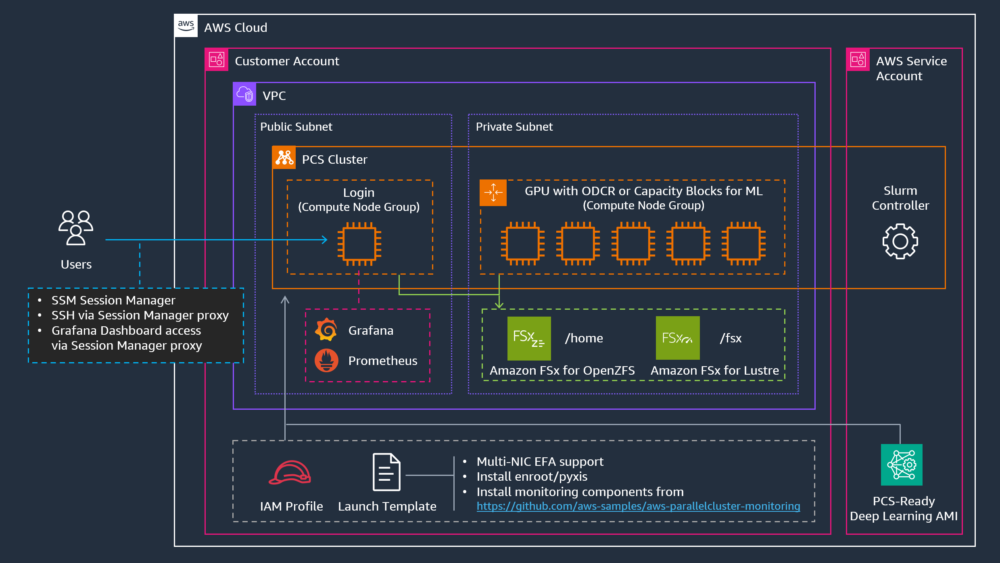

# AWS Parallel Computing Service Distributed Training Reference Architecture

This repository provides reference architectures and deployment templates for setting up distributed training clusters using [AWS Parallel Computing Service (PCS)](https://aws.amazon.com/pcs/). AWS Parallel Computing Service is a fully managed service that makes it easy to run and scale HPC workloads using Slurm scheduler. These architectures are optimized for machine learning workloads and include configurations for high-performance computing instances (P and Trn EC2 families) with shared filesystems (FSx for Lustre and OpenZFS).

> **Upstream Repository**: These templates are based on [aws-samples/aws-hpc-recipes](https://github.com/aws-samples/aws-hpc-recipes/tree/main/recipes/pcs), customized for ML workloads with container support (Enroot/Pyxis), simplified AMI building using PCS-ready base images, and updated Slurm versions (25.05/25.11). The templates in this repository are maintained independently and may diverge from the upstream recipes.

## Key Features

- **Pre-configured for ML workloads**: Optimized for distributed training with Slurm scheduler
- **High-performance storage**: FSx for Lustre (high-throughput shared) and OpenZFS (home directories)
- **Flexible compute options**: Support for On-Demand, On-Demand Capacity Reservations (ODCR), and Capacity Blocks for ML
- **Advanced networking**: Elastic Fabric Adapter (EFA) support for multi-node training
- **Custom AMI building**: Automated DLAMI creation with PCS agent, Slurm, Enroot, and Pyxis
- **Modular deployment**: Deploy complete clusters or individual components via nested CloudFormation stacks

## Architecture



The architecture includes:
- VPC with public/private subnets
- FSx for Lustre for high-performance shared storage
- FSx for OpenZFS for home directories
- PCS cluster with Slurm scheduler (25.05 or 25.11)
- Login node group (public subnet)
- Compute node groups (private subnet)
- Optional custom DLAMI with ML frameworks and container runtime

## Deployment Options

### Option 1: Complete Cluster (Recommended)

Deploy the complete PCS ML cluster with a single nested CloudFormation stack:

[](https://console.aws.amazon.com/cloudformation/home#/stacks/quickcreate?templateUrl=https://awsome-distributed-ai.s3.amazonaws.com/templates/pcs-ml-cluster-deploy-all.yaml&stackName=pcs-ml-cluster)

**What gets deployed:**
- ✅ VPC with public/private subnets, NAT gateway, S3 endpoint
- ✅ FSx for Lustre (high-throughput shared storage)
- ✅ FSx for OpenZFS (home directories)
- ✅ Custom DLAMI with PCS agent and Slurm (optional, enabled by default)
  - **Note**: AMI build takes ~30 minutes via EC2 Image Builder; cluster creation blocks until complete
- ✅ AWS PCS cluster with Slurm scheduler
- ✅ Login node group (m6i.4xlarge)
- ✅ CPU compute node group - cpu1 queue (c6i.4xlarge, enabled by default)
- ⚙️ Additional P-series compute node group with ODCR or Capacity Blocks for ML (optional, e.g., p5.48xlarge)

**Key Parameters:**
- `PrimarySubnetAZ`: Availability Zone for deployment (required)
- `BuildAMI`: Build custom DLAMI with Enroot/Pyxis pre-installed (`true`/`false`, default: `false`)
- `PostInstallScriptUrl`: URL of a post-install script run on every node at first boot — the PCS equivalent of ParallelCluster's `OnNodeConfigured` custom action. Defaults to the Enroot/Pyxis installer (`install-enroot-pyxis.sh`), which is the most common setup. Set to an empty string to skip, or to another HTTP(S) URL to run a custom script.
- `PostInstallScriptArgs`: Space-separated arguments passed to the post-install script (default: empty)
- `DeployMonitoring`: Deploy Prometheus/Grafana monitoring on the login node (`true`/`false`, default: `true`)
- `DeployOnDemandCNG`: Deploy cpu1 compute queue (`true`/`false`, default: `true`)
- `OnDemandInstanceType`: Instance type for cpu1 queue (default: `c6i.4xlarge`)
- `DeployPseriesCNG`: Deploy P-series queue with ODCR or Capacity Blocks for ML (`true`/`false`, default: `false`)
- `CapacityReservationId`: Capacity Reservation ID (required if deploying in Capacity Blocks for ML)

> **Container support (Enroot/Pyxis)** can be provided two ways, which are independent and can be combined: pre-bake it into a custom AMI (`BuildAMI=true`), or install it at first boot via `PostInstallScriptUrl` (default). The default configuration — `BuildAMI=false` + `PostInstallScriptUrl=<install-enroot-pyxis.sh>` + `DeployMonitoring=true` — is the most common production setup.

**Example deployment (minimal parameters):**
```bash
aws cloudformation create-stack \
  --stack-name my-pcs-cluster \
  --template-url https://awsome-distributed-ai.s3.amazonaws.com/templates/pcs-ml-cluster-deploy-all.yaml \
  --parameters \
    ParameterKey=PrimarySubnetAZ,ParameterValue=us-east-1a \
  --capabilities CAPABILITY_IAM CAPABILITY_NAMED_IAM
```

This creates a cluster with:
- 1 login node (m6i.4xlarge)
- cpu1 queue with c6i.4xlarge instances (0-4 instances, dynamic scaling)

### Option 2: Individual Components

Deploy components separately for more control:

| Component | Description | Deploy | When to Use |
|-----------|-------------|--------|-------------|
| **Prerequisites** | VPC, subnets, security groups, FSx filesystems | [<kbd>Deploy 🚀</kbd>](https://console.aws.amazon.com/cloudformation/home#/stacks/quickcreate?templateUrl=https://awsome-distributed-ai.s3.amazonaws.com/templates/ml-cluster-prerequisites.yaml&stackName=pcs-prerequisites) | Use existing VPC or customize networking |
| **PCS-ready DLAMI with Enroot/Pyxis** | Adds Enroot/Pyxis to PCS-ready DLAMI | [<kbd>Deploy 🚀</kbd>](https://console.aws.amazon.com/cloudformation/home#/stacks/quickcreate?templateUrl=https://awsome-distributed-ai.s3.amazonaws.com/templates/pcs-ready-dlami-with-enroot-pyxis.yaml&stackName=pcs-dlami) | Build custom AMI with container support |
| **PCS Cluster** | Main PCS cluster (without compute nodes) | [<kbd>Deploy 🚀</kbd>](https://console.aws.amazon.com/cloudformation/home#/stacks/quickcreate?templateUrl=https://awsome-distributed-ai.s3.amazonaws.com/templates/cluster.yaml&stackName=pcs-cluster) | Deploy cluster to existing VPC/FSx (requires add-cng.yaml for nodes) |
| **Add CNG (Single NIC)** | Compute node groups with single network interface | [<kbd>Deploy 🚀</kbd>](https://console.aws.amazon.com/cloudformation/home#/stacks/quickcreate?templateUrl=https://awsome-distributed-ai.s3.amazonaws.com/templates/add-cng.yaml&stackName=pcs-add-cng) | Add login nodes, CPU/GPU queues (C6i, G5, G6 etc.) |
| **Add CNG (Multi NIC)** | P5/P6 nodes with 16/32 network interfaces (On-Demand or Capacity Blocks for ML) | [<kbd>Deploy 🚀</kbd>](https://console.aws.amazon.com/cloudformation/home#/stacks/quickcreate?templateUrl=https://awsome-distributed-ai.s3.amazonaws.com/templates/add-cng-p5.yaml&stackName=pcs-add-cng-p5) | Add P-series (P5/P5e/P5en, P6-B200 instances) |

### Option 3: Manual Step-by-Step

For detailed step-by-step deployment instructions, see the [AI/ML for AWS Parallel Computing Service Workshop](https://catalog.workshops.aws/ml-on-pcs/).

---

## CloudFormation Templates

### Main Templates

| Template | Purpose | Nested Stacks |
|----------|---------|---------------|
| [`pcs-ml-cluster-deploy-all.yaml`](./assets/pcs-ml-cluster-deploy-all.yaml) | All-in-one nested stack deployment | Prerequisites + DLAMI + Cluster + Login/Compute CNGs |
| [`ml-cluster-prerequisites.yaml`](./assets/ml-cluster-prerequisites.yaml) | VPC, subnets, FSx for Lustre/OpenZFS | Standalone |
| [`pcs-ready-dlami-with-enroot-pyxis.yaml`](./assets/pcs-ready-dlami-with-enroot-pyxis.yaml) | EC2 Image Builder for PCS AMI with Enroot/Pyxis | Standalone |
| [`cluster.yaml`](./assets/cluster.yaml) | PCS cluster core (scheduler only, no nodes) | Standalone |

### Add-on Templates

| Template | Purpose | Network Interface | Queue Creation | Prerequisites |
|----------|---------|-------------------|----------------|---------------|
| [`add-cng.yaml`](./assets/add-cng.yaml) | Add compute node group for login/CPU/GPU nodes | Single | Optional (specify QueueName or leave empty for login nodes) | Existing PCS cluster |
| [`add-cng-p5.yaml`](./assets/add-cng-p5.yaml) | Add P5/P6 compute nodes (On-Demand or Capacity Block) | Multi (16/32 EFA) | Optional (specify QueueName or leave empty) | Existing PCS cluster (+ Capacity Reservation for CB) |

---

## Supported Compute Options

### 1. Single Network Interface Instances (use `add-cng.yaml`)
Standard instances with single network interface. Suitable for:
- Development and testing
- Workloads with unpredictable demand
- Short-duration training jobs
- Small to medium scale distributed training

**Recommended instance types:**
- **CPU**: `c6i.32xlarge`, `c7i.48xlarge`, `c7a.48xlarge`
- **GPU (Single NIC)**: `g5.12xlarge`, `g6.12xlarge`

### 2. Multi Network Interface Instances (use `add-cng-p5.yaml`)
High-performance instances with 16 or 32 EFA network interfaces. Required for:
- Large-scale distributed training (hundreds to thousands of GPUs)
- Maximum inter-node bandwidth and low latency
- Multi-node workloads requiring NVLink/NVSwitch

**Instance Types (P-Series):**
- `p5.48xlarge`: 8x NVIDIA H100 GPUs (32 EFA interfaces, 3.2 Tbps aggregate network bandwidth)
- `p5e.48xlarge`: 8x NVIDIA H200 GPUs (32 EFA interfaces, 3.2 Tbps aggregate network bandwidth)
- `p5en.48xlarge`: 8x NVIDIA H200 GPUs with NVSwitch (16 EFA interfaces, 3.2 Tbps aggregate network bandwidth)
- `p6-b200.48xlarge`: 8x NVIDIA B200 GPUs (32 EFA interfaces)

**Purchase Options:**
- On-Demand Capacity Reservations (ODCR): Reserved capacity with on-demand flexibility:
  - Guaranteed capacity in specific AZ
  - No long-term commitment
  - Pay on-demand rates when using reserved capacity
- Capacity Blocks for ML: Time-bound GPU capacity reservations for P5/P6 instances:
  - Ideal for scheduled large-scale training
  - Requires advance purchase
  - Use `add-cng-p5.yaml` with `CapacityReservationId` parameter

---

## Custom DLAMI Components

The custom DLAMI built by `pcs-ready-dlami-with-enroot-pyxis.yaml` adds container runtime support to PCS-ready DLAMI:

| Component | Version | Purpose |
|-----------|---------|---------|
| **Base Image** | PCS-ready DLAMI (Ubuntu 24.04 x86_64) | Pre-installed NVIDIA drivers, CUDA, PCS Agent, and Slurm |
| **Enroot** | 3.5.0 | Unprivileged container runtime |
| **Pyxis** | 0.20.0 | Slurm plugin for container jobs |

> **Alternative without an AMI build:** the same Enroot/Pyxis setup can be applied at first boot via the `PostInstallScriptUrl` post-install hook (which runs [`scripts/install-enroot-pyxis.sh`](./scripts/install-enroot-pyxis.sh)), avoiding the ~30 min ImageBuilder step at the cost of a longer node boot (~8–12 min). Pre-baking into a custom AMI (`BuildAMI=true`) is recommended for production / frequent scaling; the post-install hook is recommended for testing and infrequent deployments.

**What's already included in PCS-ready DLAMI:**
- AWS PCS Agent for node lifecycle management
- Slurm 25.05 and 25.11 (both versions available at `/opt/aws/pcs/scheduler/slurm-*`)
- NVIDIA drivers and CUDA toolkit
- SSM Agent for remote management

---

## Usage Examples

### Example 1: Basic CPU Cluster (Default)

```bash
# Set your availability zone
AZ_ID=us-east-1a

aws cloudformation create-stack \
  --stack-name cpu-cluster \
  --template-url https://awsome-distributed-ai.s3.amazonaws.com/templates/pcs-ml-cluster-deploy-all.yaml \
  --parameters \
    ParameterKey=PrimarySubnetAZ,ParameterValue=${AZ_ID} \
  --capabilities CAPABILITY_IAM CAPABILITY_NAMED_IAM
```

This deploys:
- 1 login node (m6i.4xlarge)
- cpu1 queue with c6i.4xlarge instances (0-4 instances, dynamic scaling)

### Example 2: GPU Cluster with G6 Instances (Single NIC)

```bash
# Set your availability zone
AZ_ID=us-east-1a

aws cloudformation create-stack \
  --stack-name gpu-cluster \
  --template-url https://awsome-distributed-ai.s3.amazonaws.com/templates/pcs-ml-cluster-deploy-all.yaml \
  --parameters \
    ParameterKey=PrimarySubnetAZ,ParameterValue=${AZ_ID} \
    ParameterKey=OnDemandCngName,ParameterValue=gpu-g6 \
    ParameterKey=OnDemandQueueName,ParameterValue=gpu-g6 \
    ParameterKey=OnDemandInstanceType,ParameterValue=g6.12xlarge \
    ParameterKey=OnDemandMaxCount,ParameterValue=8 \
  --capabilities CAPABILITY_IAM CAPABILITY_NAMED_IAM
```

This replaces the default cpu1 queue with a GPU queue (gpu-g6) using g6.12xlarge instances.

### Example 3: P5 On-Demand Capacity Reservation (ODCR) Cluster (Multi NIC, Static)

```bash
# Set your availability zone
AZ_ID=us-east-1a

aws cloudformation create-stack \
  --stack-name p5-odcr-cluster \
  --template-url https://awsome-distributed-ai.s3.amazonaws.com/templates/pcs-ml-cluster-deploy-all.yaml \
  --parameters \
    ParameterKey=PrimarySubnetAZ,ParameterValue=${AZ_ID} \
    ParameterKey=DeployPseriesCNG,ParameterValue=true \
    ParameterKey=PseriesCngName,ParameterValue=p5-odcr \
    ParameterKey=PseriesQueueName,ParameterValue=p5-odcr \
    ParameterKey=PseriesInstanceType,ParameterValue=p5.48xlarge \
    ParameterKey=NetworkInterfaceCount,ParameterValue=32 \
    ParameterKey=PseriesMinCount,ParameterValue=4 \
    ParameterKey=PseriesMaxCount,ParameterValue=4 \
  --capabilities CAPABILITY_IAM CAPABILITY_NAMED_IAM
```

### Example 4: P5 Cluster with Capacity Blocks for ML (Multi NIC, Static)

```bash
# Set your availability zone and capacity reservation ID
AZ_ID=us-east-1a
CAPACITY_RESERVATION_ID="cr-0a1b2c3d4e5f6g7h8"

aws cloudformation create-stack \
  --stack-name p5-cb-cluster \
  --template-url https://awsome-distributed-ai.s3.amazonaws.com/templates/pcs-ml-cluster-deploy-all.yaml \
  --parameters \
    ParameterKey=PrimarySubnetAZ,ParameterValue=${AZ_ID} \
    ParameterKey=DeployPseriesCNG,ParameterValue=true \
    ParameterKey=PseriesCngName,ParameterValue=p5-cb \
    ParameterKey=PseriesQueueName,ParameterValue=p5-cb \
    ParameterKey=PseriesInstanceType,ParameterValue=p5.48xlarge \
    ParameterKey=NetworkInterfaceCount,ParameterValue=32 \
    ParameterKey=PseriesMinCount,ParameterValue=4 \
    ParameterKey=PseriesMaxCount,ParameterValue=4 \
    ParameterKey=CapacityReservationId,ParameterValue=${CAPACITY_RESERVATION_ID} \
  --capabilities CAPABILITY_IAM CAPABILITY_NAMED_IAM
```

---

## Accessing the Cluster

After deployment completes, connect to the login node using AWS Systems Manager Session Manager.

### Connect via Session Manager

1. **Navigate to EC2 Console** and filter instances by tag:
   - Go to the [EC2 Console](https://console.aws.amazon.com/ec2/home#Instances:)
   - Filter by tag: `aws:pcs:compute-node-group-name` = `login`
   - Or use CLI to get PCS Console URL:
     ```bash
     aws cloudformation describe-stacks \
       --stack-name pcs-ml-cluster \
       --query 'Stacks[0].Outputs[?OutputKey==`PcsConsoleUrl`].OutputValue' \
       --output text
     ```

2. **Select the login node instance** in the EC2 console.

3. **Connect via Session Manager**:
   - Click **Connect** button
   - Choose **Session Manager** tab
   - Click **Connect**

4. **Switch to the default user** (ubuntu for Ubuntu 24.04 AMI):
   ```bash
   sudo su - ubuntu
   ```

5. **Verify cluster access**:
   ```bash
   sinfo                    # View cluster partitions and nodes
   squeue                   # View job queue
   scontrol show nodes      # Show detailed node information
   ```

### Alternative: AWS CLI

Connect directly using the AWS CLI:

**Note**: This method requires IAM permissions for `ec2:DescribeInstances` and `ssm:StartSession`. Alternatively, use AWS CloudShell which has these permissions pre-configured.

```bash
# Get the instance ID of the login node
INSTANCE_ID=$(aws ec2 describe-instances \
  --filters "Name=tag:aws:pcs:compute-node-group-name,Values=login" \
            "Name=instance-state-name,Values=running" \
  --query 'Reservations[0].Instances[0].InstanceId' \
  --output text)

# Start a Session Manager session
aws ssm start-session --target $INSTANCE_ID
```

For more details, see the [Connect to Cluster](https://catalog.workshops.aws/ml-on-pcs/en-US/03-cluster/02-connect-cluster) section in the workshop.

---

## Monitoring

AWS PCS clusters can be deployed with an integrated monitoring stack based on [aws-parallelcluster-monitoring](https://github.com/aws-samples/aws-parallelcluster-monitoring). The monitoring stack provides comprehensive observability for cluster health, job metrics, and GPU utilization.

### What Gets Deployed

When monitoring is enabled, the following components are installed:

**On Login Node:**
- **Prometheus**: Metrics collection and storage
- **Grafana**: Visualization dashboards (accessible via HTTPS on port 443)
- **Nginx**: Reverse proxy for Grafana
- **Node Exporter**: System-level metrics
- **Pushgateway**: Metrics push endpoint
- **CloudWatch Exporter**: AWS CloudWatch metrics integration

**On Compute Nodes:**
- **DCGM Exporter**: NVIDIA GPU metrics (on GPU nodes only)
- **Node Exporter**: System-level metrics

**Slurm Scheduler:**
- **OpenMetrics Endpoint**: Native Slurm metrics (jobs, nodes, partitions, scheduler stats) exposed on port 6817

### Enabling Monitoring

Add the following parameters when deploying a cluster:

```bash
aws cloudformation create-stack \
  --stack-name my-cluster-with-monitoring \
  --template-url https://awsome-distributed-ai.s3.amazonaws.com/templates/pcs-ml-cluster-deploy-all.yaml \
  --parameters \
    ParameterKey=PrimarySubnetAZ,ParameterValue=us-east-1a \
    ParameterKey=DeployMonitoring,ParameterValue=true \
    ParameterKey=MonitoringVersion,ParameterValue=v2.6.2 \
  --capabilities CAPABILITY_IAM CAPABILITY_NAMED_IAM
```

**Key Parameters:**
- `DeployMonitoring`: Set to `true` to enable monitoring stack (default: `true`)
- `MonitoringVersion`: [aws-parallelcluster-monitoring](https://github.com/aws-samples/aws-parallelcluster-monitoring) release tag to install (default: `v2.6.2`). The templates use this value both to fetch `post-install.sh` from the matching tag and as the version argument passed to it.

> **Pinned for stability:** `MonitoringVersion` is pinned to a release tag rather than `latest`/`main` so that upstream changes cannot break deployments without warning. Update the default only after validating a newer release.

### Accessing Grafana

Grafana runs on the login node and is accessible via AWS Systems Manager Session Manager port forwarding (no public internet access required).

**Step 1: Get the login node instance ID**

```bash
INSTANCE_ID=$(aws ec2 describe-instances \
  --filters "Name=tag:aws:pcs:compute-node-group-name,Values=login" \
            "Name=instance-state-name,Values=running" \
  --query 'Reservations[0].Instances[0].InstanceId' \
  --output text)
```

**Step 2: Install Session Manager plugin** (if not already installed)

Follow the [AWS documentation](https://docs.aws.amazon.com/systems-manager/latest/userguide/session-manager-working-with-install-plugin.html) to install the plugin for your platform.

**Step 3: Start port forwarding**

```bash
aws ssm start-session \
  --target $INSTANCE_ID \
  --document-name AWS-StartPortForwardingSession \
  --parameters '{"portNumber":["443"],"localPortNumber":["8443"]}'
```

**Step 4: Retrieve Grafana admin password**

```bash
# Get cluster ID
CLUSTER_ID=$(aws cloudformation describe-stacks \
  --stack-name my-cluster-with-monitoring \
  --query 'Stacks[0].Outputs[?OutputKey==`ClusterId`].OutputValue' \
  --output text)

# Retrieve password from SSM Parameter Store
aws ssm get-parameter \
  --name "/pcs/${CLUSTER_ID}/grafana/admin-password" \
  --with-decryption \
  --query 'Parameter.Value' \
  --output text
```

**Step 5: Access Grafana**

Open your browser and navigate to:
```
https://localhost:8443/grafana/
```

Login with:
- **Username**: `admin`
- **Password**: (retrieved from SSM Parameter Store in Step 4)

### Available Metrics

The monitoring stack collects the following metrics:

**Slurm OpenMetrics (port 6817):**
- `/metrics/jobs` - Job statistics (running, pending, completed)
- `/metrics/nodes` - Node state and resource allocation
- `/metrics/partitions` - Partition/queue statistics
- `/metrics/scheduler` - Scheduler performance metrics

**DCGM Exporter (GPU nodes):**
- GPU utilization, memory usage, temperature
- SM clock, memory clock
- Power consumption
- ECC errors
- NVLink statistics

**Node Exporter:**
- CPU, memory, disk, network I/O
- Filesystem usage
- System load

**CloudWatch Metrics:**
- EC2 instance metrics
- FSx filesystem metrics
- PCS cluster metrics

### Validation and Troubleshooting

For detailed monitoring stack validation steps, see [tests/monitoring-stack-test.md](tests/monitoring-stack-test.md).

**Common checks:**

```bash
# SSH into login node via Session Manager
sudo su - ubuntu

# Check Docker containers
docker ps

# Check Prometheus targets
curl -s http://localhost:9090/api/v1/targets | jq '.data.activeTargets[] | {job: .labels.job, health: .health}'

# Check Slurm OpenMetrics endpoints
curl -s http://<slurmctld-ip>:6817/metrics/jobs
```

### Known Issues and Workarounds

**Ubuntu 24.04 Compatibility**: aws-parallelcluster-monitoring expects `ec2-user` but Ubuntu uses `ubuntu`. The templates automatically create an `ec2-user` symlink during deployment.

**Upstream Bug Fix**: Version 2.6.2 of aws-parallelcluster-monitoring has a shell script bug (`local` variable outside function). The templates automatically apply a fix during installation.

---

## User Management

### LDAP User Management

For centralized user management across the cluster, see:
- [LDAP Server Setup Guide](../6.ldap_server/README.md) - Deploy and configure OpenLDAP for cluster-wide user authentication

### Additional Resources

For more monitoring and observability options, see:
- [Prometheus & Grafana Setup](../../4.validation_and_observability/4.prometheus-grafana/README.md) - Alternative monitoring stack deployment
- [AWS ParallelCluster Monitoring](https://github.com/aws-samples/aws-parallelcluster-monitoring) - Upstream monitoring solution documentation

---

## Cleanup

To delete the entire cluster:

```bash
aws cloudformation delete-stack --stack-name pcs-ml-cluster
```

**Note**: Nested stacks will be deleted automatically. Manual backups of data in FSx filesystems are recommended before deletion.

---

## Testing and Validation

This architecture has been tested with the following configurations:

**Infrastructure Templates:**
- `ml-cluster-prerequisites.yaml`: Deployed and validated in multiple regions (us-east-1, us-west-2, us-east-2)
- `cluster.yaml`: Creates PCS cluster core with Slurm scheduler (validated with 25.05 and 25.11)
- `add-cng.yaml`: Validated with login nodes (m6i.4xlarge), CPU nodes (c6i.4xlarge), and GPU nodes (g6.xlarge, g6.12xlarge)
- `add-cng-p5.yaml`: Tested with P5 instances (p5.48xlarge, p5en.48xlarge) using both On-Demand Capacity Reservations and Capacity Blocks for ML
- `pcs-ml-cluster-deploy-all.yaml`: Orchestrates all components via nested stacks, tested with default cpu1 queue and optional P-series queues

**AMI Builder:**
- `pcs-ready-dlami-with-enroot-pyxis.yaml`: Successfully built Ubuntu 24.04 x86_64 AMIs with Enroot 3.5.0 and Pyxis 0.20.0
- Base image: PCS-ready DLAMI (`/aws/service/pcs/ami/dlami-base-ubuntu2404/x86_64/latest/ami-id`)
- Enroot/Pyxis container runtime validated with PyTorch and CUDA containers

**Workloads:**
- Multi-node distributed training jobs tested on P5 instances
- Container-based jobs verified using Slurm's Pyxis plugin
- FSx for Lustre shared storage validated across compute nodes

---

## Additional Resources

- [AWS Parallel Computing Service Documentation](https://docs.aws.amazon.com/pcs/)
- [AI/ML for AWS PCS Workshop](https://catalog.workshops.aws/ml-on-pcs/)
- [Slurm Documentation](https://slurm.schedmd.com/documentation.html)
- [Enroot Documentation](https://github.com/NVIDIA/enroot)
- [Pyxis Documentation](https://github.com/NVIDIA/pyxis)
- [Capacity Blocks for ML](https://docs.aws.amazon.com/AWSEC2/latest/UserGuide/ec2-capacity-blocks.html)
