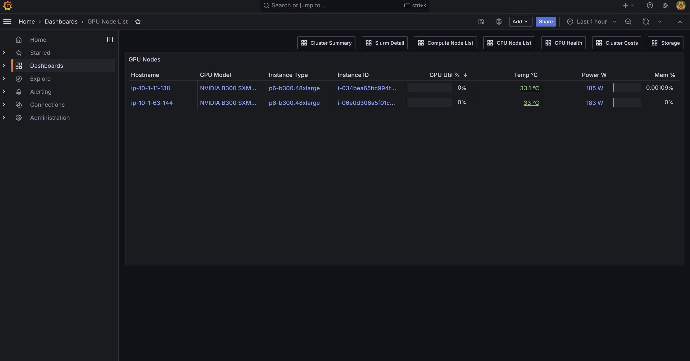

# AWS Parallel Computing Service Distributed Training Reference Architecture

This repository provides reference architectures and deployment templates for setting up distributed training clusters using [AWS Parallel Computing Service (PCS)](https://aws.amazon.com/pcs/). AWS Parallel Computing Service is a fully managed service that makes it easy to run and scale HPC workloads using Slurm scheduler. These architectures are optimized for machine learning workloads and ship dedicated multi-NIC EFA launch templates for the **P5 / P5e / P5en / P6-B200 / P6-B300** GPU families with shared filesystems (FSx for Lustre and OpenZFS).

> **Upstream Repository**: These templates are based on [aws-samples/aws-hpc-recipes](https://github.com/aws-samples/aws-hpc-recipes/tree/main/recipes/pcs), customized for ML workloads: container support (Enroot/Pyxis) installable at first boot without an AMI build, built-in monitoring, updated Slurm versions (25.05/25.11), and dedicated P5/P6 multi-NIC EFA templates. The templates in this repository are maintained independently and may diverge from the upstream recipes.

## 1. Key Features

- **One click to an ML-training-ready cluster**: a single CloudFormation stack gives you a complete, ready-to-train environment — Slurm scheduler, GPU compute with EFA, shared FSx storage, the Enroot/Pyxis container runtime, and monitoring — with only the Availability Zone to choose. Submit distributed training jobs minutes after launch.
- **Container runtime included**: Enroot/Pyxis is set up automatically, so `srun --container-image=...` works out of the box for containerized training.
- **Monitoring built in**: Grafana + Prometheus run on the login node, with DCGM Exporter on GPU compute nodes feeding the pre-built GPU dashboards (`MonitoringStack=Prometheus-LoginNode`, on by default). Reach Grafana privately via SSM port-forward, or open it to a trusted CIDR with `GrafanaAccessCidr`.
- **GPU-ready, multi-NIC EFA**: dedicated launch templates for the P5 and P6 families, selected automatically by instance type, for high-bandwidth multi-node training.
- **Broad capacity-purchase support**: covers the full range of EC2 capacity options out of the box — On-Demand, On-Demand Capacity Reservations (ODCR), and Capacity Blocks for ML — selected per node group.
- **High-performance storage**: FSx for Lustre (shared scratch, `/fsx`) and FSx for OpenZFS (home directories, `/home`).
- **Modular components**: compose individual stacks (network/storage prerequisites, cluster scheduler, per-family compute node groups) instead of the all-in-one nested stack when you want to reuse infrastructure across clusters or iterate on one piece at a time.

> Built on the AWS-managed **PCS-Ready DLAMI** (NVIDIA driver, CUDA, PCS agent, and
> Slurm 25.05/25.11 pre-installed), so no custom AMI build is required by default —
> the cluster comes up without an Image Builder step. For frequent scaling, you can
> pre-bake Enroot/Pyxis into a custom DLAMI with the standalone
> [`pcs-ready-dlami-with-enroot-pyxis.yaml`](#82-pre-baking-enrootpyxis-into-a-custom-ami)
> template and pass the result as `AmiId`.

## 2. Architecture


A default deployment (`pcs-ml-cluster-deploy-all.yaml`) provisions:
- VPC with public/private subnets, NAT gateway, and S3 endpoint
- FSx for Lustre (`/fsx`, high-performance shared scratch) and FSx for OpenZFS (`/home`)
- PCS cluster with the Slurm scheduler (25.05 or 25.11), on the PCS-Ready DLAMI
- Login node group (public subnet) with the monitoring stack (Prometheus + Grafana + Nginx)
- CPU compute node group (private subnet); EFA can be enabled for HPC/MPI workloads
- Optional GPU (P5/P6) node group with multi-NIC EFA, plus DCGM Exporter for the GPU dashboards
- Enroot/Pyxis container runtime installed at first boot via `PostInstallScriptUrl` (or pre-baked into a custom AMI you build separately and pass as `AmiId`)

---

## 3. Quick Start

Deploy a complete cluster with one nested CloudFormation stack:

[](https://console.aws.amazon.com/cloudformation/home#/stacks/quickcreate?templateUrl=https://awsome-distributed-ai.s3.amazonaws.com/templates/pcs-ml-cluster-deploy-all.yaml&stackName=pcs-ml-cluster)

**The only decision you must make is which Availability Zone to deploy into**
(`PrimarySubnetAZ`) — everything else has a sensible default. The minimal CLI
equivalent (set your AZ in the first line):

```bash
AZ_ID=us-east-1a   # <-- the one required choice: your target Availability Zone

aws cloudformation create-stack \
  --stack-name pcs-ml-cluster \
  --template-url https://awsome-distributed-ai.s3.amazonaws.com/templates/pcs-ml-cluster-deploy-all.yaml \
  --parameters ParameterKey=PrimarySubnetAZ,ParameterValue=${AZ_ID} \
  --capabilities CAPABILITY_IAM CAPABILITY_NAMED_IAM
```

This brings up (≈25–30 min, mostly VPC/FSx): 1 login node (m6i.4xlarge) with monitoring,
a `cpu1` queue (c6i.4xlarge, 0–4 nodes, dynamic scaling), and Enroot/Pyxis on every node.
Add a GPU queue and tune storage/monitoring via the parameters below.

Once it's up:
- **Connect** to the login node via SSM Session Manager — see [Accessing the Cluster](#6-accessing-the-cluster).
- **Open the Grafana dashboards** (deployed by default) via SSM port forwarding — see [Accessing Grafana](#accessing-grafana).
- **Want to reach Grafana directly in a browser** (no port forwarding)? Set `GrafanaAccessCidr` to a trusted CIDR at deploy time — see [Option B — Direct public access](#option-b--direct-public-access-opt-in-via-grafanaaccesscidr).

Prefer step-by-step instructions? See the [AI/ML for AWS PCS Workshop](https://catalog.workshops.aws/ml-on-pcs/).

**Clean up.** When you're done, delete the stack — either from the **CloudFormation
Management Console** (select the stack → **Delete**) or via the CLI:

```bash
aws cloudformation delete-stack --stack-name pcs-ml-cluster
```

Nested stacks are deleted automatically. Back up any FSx data first — the filesystems
are deleted with the stack.

---

## 4. Configuration

Defaults give the most common production setup — Enroot/Pyxis installed at first
boot via `PostInstallScriptUrl` + `MonitoringStack=Prometheus-LoginNode` — so a default deploy
only needs the Availability Zone (`PrimarySubnetAZ`). The most-used parameters:

| Parameter | Default | Purpose |
|---|---|---|
| `PrimarySubnetAZ` | *(required)* | Availability Zone to deploy into — the one required parameter |
| `SlurmVersion` | `25.11` | Slurm version (`25.05` or `25.11`); 25.11 is needed for the Slurm OpenMetrics dashboards. Drives Pyxis build version too. See [OPERATIONS.md §1](./docs/OPERATIONS.md#1-slurm-version-selection) |
| `AmiId` | *(empty → SSM auto)* | Empty auto-resolves to the latest **PCS-Ready Deep Learning AMI** (Ubuntu 24.04) from SSM. Pin to a specific `ami-xxx` for production, or pass an AMI built by [`pcs-ready-dlami-with-enroot-pyxis.yaml`](#82-pre-baking-enrootpyxis-into-a-custom-ami) |
| `MonitoringStack` | `Prometheus-LoginNode` | Deploy Prometheus + Grafana on the login node, plus DCGM Exporter on GPU compute nodes. Set to `none` to disable monitoring |
| `DeployOnDemandCNG` | `true` | Deploy the `cpu1` CPU queue (`OnDemandInstanceType`, default `c6i.4xlarge`) |
| `OnDemandEnableEfa` | `false` | Set `true` for HPC/MPI workloads on EFA-capable CPU types (hpc6a/hpc7a/hpc6id/hpc8a, c7i.metal, etc.). Auto-creates a cluster placement group. See [EFA on CPU HPC instances](#efa-on-cpu-hpc-instances-ondemandenableefa) |
| `DeployPseriesCNG` | `false` | Deploy a GPU (P5/P6) queue — see [GPU compute](#gpu-compute-p5p6) |
| `PseriesInstanceType` | `p5.48xlarge` | GPU instance type; auto-selects the multi-NIC template + EFA count |
| `CapacityReservationId` | *(empty)* | Capacity **Block** ID for the GPU queue; empty for On-Demand/ODCR |

**See [PARAMETERS.md](./docs/PARAMETERS.md) for the complete parameter reference** (all 7
console parameter groups, with every default). The concept guides below cover the
choices that need the most thought.

### AMI and container runtime

`AmiId` is shared by every node group. Empty (default) auto-resolves the latest
**PCS-Ready DLAMI** (Ubuntu 24.04 x86_64) from SSM
(`/aws/service/pcs/ami/dlami-base-ubuntu2404/x86_64/latest/ami-id`) — no AMI choice
needed. Enroot 3.5.0 + Pyxis 0.20.0 are layered on at first boot via
[`assets/scripts/install-enroot-pyxis.sh`](./assets/scripts/install-enroot-pyxis.sh)
(~8–12 min boot). For **frequent scaling**, pre-bake Enroot/Pyxis into a custom DLAMI
once with [§8.2](#82-pre-baking-enrootpyxis-into-a-custom-ami) and pass that
`ami-xxx` as `AmiId` (~3 min boot, deterministic state). The post-install hook is
idempotent — it no-ops on a pre-baked AMI.

> **Production tip — pin the AMI.** CloudFormation re-resolves SSM `/latest/`
> parameters on every stack update, so a later scale-out can drift onto a newer AMI.
> Resolve once and pass the literal `ami-xxx` as `AmiId`. Details:
> [OPERATIONS.md §4](./docs/OPERATIONS.md#4-ami-selection-amiid--pin-in-production).

### GPU compute (P5/P6)

Different P-series instances expose different numbers of EFA interfaces, so each family
has its own launch template with the right interface layout. With deploy-all you just
set `PseriesInstanceType` and the matching template (and interface count) is selected
automatically.

| Instance type | GPUs | EFA interfaces | Template |
|---|---|---|---|
| `p5.48xlarge` | 8× H100 | 32 | `add-cng-p5.yaml` |
| `p5e.48xlarge` | 8× H200 | 32 | `add-cng-p5.yaml` |
| `p5en.48xlarge` | 8× H200 | 16 | `add-cng-p5.yaml` |
| `p6-b200.48xlarge` | 8× B200 | 8 | `add-cng-p6-b200.yaml` |
| `p6-b300.48xlarge` | 8× B300 | 16 (of 17 interfaces; the primary is ENA-only) | `add-cng-p6-b300.yaml` |

**Capacity options:**
- **On-Demand**: leave `CapacityReservationId` empty.
- **On-Demand Capacity Reservation (ODCR)**: also leave `CapacityReservationId` **empty** — create the ODCR with **"open"** instance matching and it is consumed automatically by the node group's On-Demand launches. (Do **not** put the ODCR ID in `CapacityReservationId`; that parameter forces Capacity-Block mode.)
- **Capacity Blocks for ML**: set `CapacityReservationId` to the Capacity Block ID. The template then launches with `MarketType=capacity-block` against it.

> **Capacity Block billing:** a block bills for its whole reserved window once it
> starts and cannot be stopped early. When the block is active, run the GPU node
> group at `PseriesMinCount = PseriesMaxCount = <reserved count>` so the reserved
> nodes launch immediately, rather than scaling from 0.

### EFA on CPU HPC instances (`OnDemandEnableEfa`)

For tightly-coupled HPC / MPI workloads on CPU-only HPC instances, set
`OnDemandEnableEfa=true` (deploy-all) or `EnableEfa=true` (modular `add-cng.yaml`).
The CPU compute node group then launches with EFA `NetworkInterfaces` and a cluster
placement group is auto-created. GPU CNGs (P5/P6) are unaffected — they use their
own dedicated multi-NIC EFA wiring per-family.

| Instance type | EFA interfaces | Aggregate spec | Set `OnDemandEfaInterfaceCount` to |
|---|---:|---:|---:|
| `hpc6a.48xlarge` | 1 | 100 Gbps | **1** |
| `hpc7a.96xlarge` (and 12/24/48) | 2 | 300 Gbps | **2** |
| `hpc6id.32xlarge` | 2 | 200 Gbps | **2** |
| `hpc8a.96xlarge` | 2 | 300 Gbps | **2** |
| `c7i.metal-48xl` etc. | 1 | varies | **1** |

(Mismatching `OnDemandEfaInterfaceCount` with the instance type's actual
`MaximumEfaInterfaces` fails at launch.)

**Placement group:** auto-created per-CNG by the template. Override with
`OnDemandPlacementGroupName=<existing-pg-name>` to share one PG across multiple
CNGs (e.g. heterogeneous tightly-coupled jobs that span CPU + GPU).

**Multi-NIC bandwidth needs multiple MPI pairs.** A single MPI pair uses one
libfabric endpoint and only one NIC. Use `osu_mbw_mr -np 32 -N 16` (or your
application's natural multi-pair pattern) to actually exercise both NICs on
hpc7a/hpc8a. See [tests/README.md Test 9](./tests/README.md#test-9-efa-on-cpu-hpc-instances-hpc6a--hpc7a--hpc8a)
for the full benchmark setup and validated bandwidth numbers.

### Storage: FSx deployment types (Region availability)

**FSx deployment types are not available in every Region.** Defaults match the most
capable type; switch to a more widely available one if your Region needs it.

| Filesystem | Parameter | Default | Other values | Notes |
|---|---|---|---|---|
| Lustre (`/fsx`) | `LustreDeploymentType` | `PERSISTENT_2` | `PERSISTENT_1` | `PERSISTENT_2` (throughput 125/250/500/1000, metadata config) isn't in every Region; `PERSISTENT_1` (50/100/200) is in more Regions |
| Lustre (`/fsx`) | `PerUnitStorageThroughput` | `250` | any valid number | Must be valid for the type: P2 = 125/250/500/1000, P1 = 50/100/200 |
| Lustre (`/fsx`) | `FSxLustreEnableEfa` | `false` | `true` | Enable EFA on the Lustre filesystem. **The headline feature is GPUDirect Storage (GDS) for P5 / P5e / P5en / P6-B200 GPU CNGs**, which DMAs file data straight into GPU memory (requires the NVIDIA `nvidia-fs` / cuFile stack on the client — see [`docs/ROADMAP.md`](./docs/ROADMAP.md#client-side-lustre-on-efa--gds-support)). EFA-capable CPU CNGs (`OnDemandEnableEfa=true`) get the EFA *transport* path to storage as a secondary benefit, useful when a single client is pushing past ~10 GBps. **PERSISTENT_2 SSD only** (a CFN Rule fails the stack at create time on PERSISTENT_1). **Requires a much higher minimum `Capacity`**: at `PerUnitStorageThroughput=250` the minimum is **19200 GiB** (16× the 1200 GiB default). Set `Capacity` accordingly when enabling this |
| OpenZFS (`/home`) | `OpenZFSDeploymentType` | `SINGLE_AZ_HA_2` | `SINGLE_AZ_HA_1`, `SINGLE_AZ_2`, `SINGLE_AZ_1` | `SINGLE_AZ_1` is in all Regions; HA/2 variants vary. `MULTI_AZ` excluded (needs a second subnet) |
| OpenZFS (`/home`) | `HomeThroughput` | `320` | any valid number | Throughput (MB/s). Valid values depend on the deployment type: `SINGLE_AZ_2`/`SINGLE_AZ_HA_2` = 160/320/640/1280/2560/3840/5120/7680/10240; `SINGLE_AZ_HA_1` = 128/256/512/1024/2048/3072/4096; `SINGLE_AZ_1` = 64/128/256/512/1024/2048/3072/4096 |

Check support before deploying:
[Lustre Regions](https://docs.aws.amazon.com/fsx/latest/LustreGuide/using-fsx-lustre.html) ·
[OpenZFS Regions](https://docs.aws.amazon.com/fsx/latest/OpenZFSGuide/available-aws-regions.html).
If a deploy fails at the FSx resource with an "unsupported deployment type" error,
switch these parameters to a type your Region supports.

---

## 5. Usage Examples

The default cluster (1 login + `cpu1` queue) is covered in [§3 Quick Start](#3-quick-start);
the examples below show the more common customizations. Each one starts by setting
`AZ_ID` — the one required choice.

### Example 1: Single-NIC GPU queue (G6)

```bash
AZ_ID=us-east-1a   # your target Availability Zone

aws cloudformation create-stack \
  --stack-name gpu-cluster \
  --template-url https://awsome-distributed-ai.s3.amazonaws.com/templates/pcs-ml-cluster-deploy-all.yaml \
  --parameters \
    ParameterKey=PrimarySubnetAZ,ParameterValue=${AZ_ID} \
    ParameterKey=OnDemandCngName,ParameterValue=gpu-g6 \
    ParameterKey=OnDemandQueueName,ParameterValue=gpu-g6 \
    ParameterKey=OnDemandInstanceType,ParameterValue=g6.12xlarge \
    ParameterKey=OnDemandMaxCount,ParameterValue=8 \
  --capabilities CAPABILITY_IAM CAPABILITY_NAMED_IAM
```
Replaces the default `cpu1` queue with a `gpu-g6` queue of g6.12xlarge instances.

### Example 2: Multi-NIC GPU with a Capacity Block (P6-B300)

```bash
AZ_ID=us-west-2b
CAPACITY_RESERVATION_ID="cr-0a1b2c3d4e5f67890"

aws cloudformation create-stack \
  --stack-name p6-b300-cb-cluster \
  --template-url https://awsome-distributed-ai.s3.amazonaws.com/templates/pcs-ml-cluster-deploy-all.yaml \
  --parameters \
    ParameterKey=PrimarySubnetAZ,ParameterValue=${AZ_ID} \
    ParameterKey=DeployPseriesCNG,ParameterValue=true \
    ParameterKey=PseriesCngName,ParameterValue=gpu-p6b300 \
    ParameterKey=PseriesQueueName,ParameterValue=gpu-p6b300 \
    ParameterKey=PseriesInstanceType,ParameterValue=p6-b300.48xlarge \
    ParameterKey=PseriesMinCount,ParameterValue=2 \
    ParameterKey=PseriesMaxCount,ParameterValue=2 \
    ParameterKey=CapacityReservationId,ParameterValue=${CAPACITY_RESERVATION_ID} \
  --capabilities CAPABILITY_IAM CAPABILITY_NAMED_IAM
```
The `add-cng-p6-b300.yaml` template is selected automatically from `PseriesInstanceType`,
and the EFA interface count is derived from the instance type — no interface-count
parameter to set. For `p6-b200.48xlarge` or any P5 type, just change
`PseriesInstanceType`. `CapacityReservationId` here is the **Capacity Block** ID; for
On-Demand or an "open" ODCR, leave it empty (see [GPU compute](#gpu-compute-p5p6)).

### Example 3: HPC EFA on the CPU queue (hpc7a)

```bash
AZ_ID=us-east-2b   # check your target type's AZ availability first

aws cloudformation create-stack \
  --stack-name hpc7a-cluster \
  --template-url https://awsome-distributed-ai.s3.amazonaws.com/templates/pcs-ml-cluster-deploy-all.yaml \
  --parameters \
    ParameterKey=PrimarySubnetAZ,ParameterValue=${AZ_ID} \
    ParameterKey=OnDemandCngName,ParameterValue=hpc7a \
    ParameterKey=OnDemandQueueName,ParameterValue=hpc \
    ParameterKey=OnDemandInstanceType,ParameterValue=hpc7a.96xlarge \
    ParameterKey=OnDemandMaxCount,ParameterValue=4 \
    ParameterKey=OnDemandEnableEfa,ParameterValue=true \
    ParameterKey=OnDemandEfaInterfaceCount,ParameterValue=2 \
  --capabilities CAPABILITY_IAM CAPABILITY_NAMED_IAM
```
Replaces the default `cpu1` queue with an `hpc` queue of EFA-enabled
hpc7a.96xlarge nodes. The CNG launches in an auto-created cluster placement
group. For other HPC types, set `OnDemandInstanceType` and the matching
`OnDemandEfaInterfaceCount` from the table in
[EFA on CPU HPC instances](#efa-on-cpu-hpc-instances-ondemandenableefa)
(hpc6a = `1`; hpc7a/hpc6id/hpc8a = `2`).

---

## 6. Accessing the Cluster

Connect to the login node via SSM Session Manager — no public SSH needed. If you do
want direct SSH, set `SSHAccessCidr` to a trusted CIDR at deploy time to open SSH/22
on the login node to that CIDR.

**Console:** [EC2 Console](https://console.aws.amazon.com/ec2/home#Instances:) → filter
by `aws:pcs:compute-node-group-name = login` → **Connect** → **Session Manager**.

**CLI** (AWS CloudShell has the required permissions):

```bash
INSTANCE_ID=$(aws ec2 describe-instances \
  --filters "Name=tag:aws:pcs:compute-node-group-name,Values=login" \
            "Name=instance-state-name,Values=running" \
  --query 'Reservations[0].Instances[0].InstanceId' --output text)
aws ssm start-session --target $INSTANCE_ID
```

Then `sudo su - ubuntu` and use `sinfo` / `squeue` / `scontrol show nodes`.

---

## 7. Running a multi-node GPU job (NCCL test)

A 2-node `all_reduce_perf` is the quickest end-to-end check (GPU queue + Pyxis + EFA).
Run on the login node — `/fsx` is shared with every compute node:

```bash
# Import the container image (enroot's overlayfs needs the node-local root disk;
# the resulting .sqsh lands on shared /fsx). Pin the tag for reproducibility.
TAG=cuda12.8.1-efa1.43.2-ofiv1.16.3-ncclv2.27.7-1-testsv2.16.9
enroot import -o /fsx/nccl-tests.sqsh "docker://public.ecr.aws#hpc-cloud/nccl-tests:${TAG}"

# Fetch and submit the canonical 2-node / 8-tasks sbatch
cd /fsx
wget https://raw.githubusercontent.com/awslabs/awsome-distributed-ai/main/micro-benchmarks/nccl-tests/slurm/nccl-tests-container.sbatch
sbatch --partition=gpu-p6b300 nccl-tests-container.sbatch
```

In `nccl-all_reduce_perf_<jobid>.out`, EFA is active when you see
`NET/OFI Selected provider is efa ... (found N nics)`; a healthy run ends with
`# Out of bounds values : 0 OK` and a busbw that scales with message size
(e.g. ~751 GB/s at 64 GiB on 2× p6-b300; raise `-e` past the 16 GiB default to
saturate larger fabrics).

For a full training example, see the [PyTorch FSDP test case](../../3.test_cases/pytorch/FSDP);
the full validation matrix is in [tests/README.md](./tests/README.md).

---

## 8. Advanced Features

### 8.1 Monitoring

With `MonitoringStack=Prometheus-LoginNode` (default), an integrated monitoring stack based on
[aws-parallelcluster-monitoring](https://github.com/aws-samples/aws-parallelcluster-monitoring)
is installed automatically:

- **Login node**: Prometheus, Grafana, Nginx (reverse proxy), Node Exporter, Pushgateway, CloudWatch Exporter
- **Compute nodes**: Node Exporter, plus DCGM Exporter on GPU nodes
- **Slurm**: native OpenMetrics on the controller (jobs/nodes/partitions/scheduler)

Metrics cover Slurm jobs, GPU (utilization/memory/temperature/power/ECC/NVLink via DCGM),
node CPU/memory/disk/network, and CloudWatch (EC2/FSx/PCS). The stack installs on
node-local `/opt` (not the shared `/home`). Pre-built Grafana dashboards are
provisioned automatically — see [Accessing Grafana](#accessing-grafana) for the list
and a screenshot.

> **GPU metrics work out of the box across the supported GPU range** (Hopper / B200 /
> B300). `DcgmExporterImage` defaults to a DCGM 4.5.2 build pinned by digest, validated
> on 2× p6-b300 and on B200. The monitoring stack's own default (DCGM 4.2.0) tops out
> at B200 and can't pull newer NVCR tags on Docker 29.x — overriding via digest at the
> deploy-all level is what bridges that. Override `DcgmExporterImage` only if you need
> to pin to a different build; details:
> [OPERATIONS.md §3.1](./docs/OPERATIONS.md#31-dcgmexporterimage-the-default-and-when-to-change-it).

> **Prefer AWS-managed Prometheus/Grafana?** If you'd rather use Amazon Managed Service
> for Prometheus + Amazon Managed Grafana instead of the self-hosted stack on the login
> node, see [`4.validation_and_observability/4.prometheus-grafana`](../../4.validation_and_observability/4.prometheus-grafana).

**Monitoring-related parameters:**
- `MonitoringStack` (default `Prometheus-LoginNode`; `none` disables monitoring)
- `MonitoringVersion` — [aws-parallelcluster-monitoring](https://github.com/aws-samples/aws-parallelcluster-monitoring) git ref (release tag, branch, or `latest`; default `v2.9.1`). Pinned to a tag so upstream changes can't break deployments unexpectedly. `v2.9.1` adds the `DCGM_EXPORTER_IMAGE` override (lets `DcgmExporterImage` enable B300 GPU metrics); `v2.6.4`+ carry the PCS fixes (node-local `/opt` install + Docker-29.x DCGM tag).
- `MonitoringRepo` — `owner/repo` to fetch from (default `aws-samples/aws-parallelcluster-monitoring`). Point at a fork + a branch in `MonitoringVersion` to test unreleased changes.
- `DcgmExporterImage` — dcgm-exporter image used on GPU nodes; defaults to a DCGM 4.5.2 build pinned by digest (covers Hopper/B200/B300). Override only if you need to pin to a different build (e.g. the older monitoring-default DCGM 4.2.0).

> Node type is identified by the `monitoring-role` tag (`login`/`compute`), not the EC2
> `Name` tag — the `Name` tag defaults to `PCS-<cngname>` and is free for you to retag.

### Accessing Grafana

Log in to Grafana as **`admin`**; the password is generated per cluster and stored in
SSM Parameter Store. Retrieve it (with `CLUSTER_ID` from the stack's `ClusterId` output):

```bash
aws ssm get-parameter --name "/pcs/${CLUSTER_ID}/grafana/admin-password" \
  --with-decryption --query 'Parameter.Value' --output text
```

There are two ways to reach the UI.

#### Option A — SSM port forwarding (default, private)

No public access required; works even when the login node has no inbound rules.

```bash
# Login node instance ID
INSTANCE_ID=$(aws ec2 describe-instances \
  --filters "Name=tag:aws:pcs:compute-node-group-name,Values=login" \
            "Name=instance-state-name,Values=running" \
  --query 'Reservations[0].Instances[0].InstanceId' --output text)

# Port-forward remote 443 -> local 8443 (needs the Session Manager plugin)
aws ssm start-session --target $INSTANCE_ID \
  --document-name AWS-StartPortForwardingSession \
  --parameters '{"portNumber":["443"],"localPortNumber":["8443"]}'
```

Then open `https://localhost:8443/grafana/`.

#### Option B — Direct public access (opt-in, via `GrafanaAccessCidr`)

To browse Grafana directly without port forwarding, set **`GrafanaAccessCidr`** at
deploy time to a CIDR you trust (e.g. your office IP `203.0.113.4/32`). deploy-all then
creates a **login-only security group** that opens HTTPS/**443** to that CIDR and
attaches it to the login node, so you can open:

```
https://<login-node-public-ip>/grafana/
```

Get the login node's public IP from the EC2 console, or:

```bash
aws ec2 describe-instances \
  --filters "Name=tag:aws:pcs:compute-node-group-name,Values=login" \
            "Name=instance-state-name,Values=running" \
  --query 'Reservations[0].Instances[0].PublicIpAddress' --output text
```

Security notes:
- The security group is attached **only to the login node** — compute nodes and FSx
  (which share the cluster security group) are **not** exposed.
- **Opening 443 exposes more than Grafana.** The login node's nginx also reverse-proxies
  `/prometheus/`, `/pushgateway/`, and `/slurmexporter/`, and **those endpoints are
  unauthenticated**. Anyone who can reach the allowed CIDR can read all cluster metrics
  (and push to Pushgateway) without credentials — only the `/grafana/` path is
  password-gated. Treat this as exposing the whole monitoring stack, not just the Grafana
  login.
- Prefer a tight CIDR (a `/32` host or your VPN range). **`0.0.0.0/0` is accepted** — it
  can be convenient for a short-lived PoC or workshop where granting each user local SSM
  permissions is impractical — but it exposes the unauthenticated endpoints above to the
  whole internet. If you use it, narrow it to a real CIDR or clear it (Option A) as soon
  as you are done.
- The certificate is self-signed, so browsers show a warning — proceed past it, or put
  an ALB + ACM certificate in front for a trusted cert.
- Leaving `GrafanaAccessCidr` empty (the default) keeps monitoring private; use
  Option A.

---

Once logged in, use the dashboard nav bar to switch between **Cluster Summary**,
**Slurm Detail**, **Compute Node List**, **GPU Node List**, **GPU Health**,
**Cluster Costs**, and **Storage**. For example, the **GPU Node List** shows each GPU
node's model, instance type, utilization, temperature, power, and memory:



For detailed validation steps and the full test matrix (monitoring, containers, CPU/GPU,
NCCL, FSDP), see the [Test & Validation Guide](tests/README.md).

---

### 8.2 Pre-baking Enroot/Pyxis into a custom AMI

The all-in-one template installs Enroot/Pyxis at **first boot** via
`PostInstallScriptUrl`, which is fast to deploy and avoids an Image Builder step.
For **frequent scaling** in production, pre-baking Enroot/Pyxis into a custom AMI
drops node boot time from ~8–12 min to ~3 min and pins every node to a deterministic
state. This is a separate, standalone path: build the AMI once with
[`pcs-ready-dlami-with-enroot-pyxis.yaml`](./assets/pcs-ready-dlami-with-enroot-pyxis.yaml),
then pass the resulting `ami-xxx` as `AmiId` to the cluster.

**Step 1: Build the AMI** (~30 min one-time, separate stack)

[](https://console.aws.amazon.com/cloudformation/home#/stacks/quickcreate?templateUrl=https://awsome-distributed-ai.s3.amazonaws.com/templates/pcs-ready-dlami-with-enroot-pyxis.yaml&stackName=pcs-dlami)

```bash
aws cloudformation create-stack \
  --stack-name pcs-dlami \
  --template-url https://awsome-distributed-ai.s3.amazonaws.com/templates/pcs-ready-dlami-with-enroot-pyxis.yaml \
  --parameters ParameterKey=SlurmVersion,ParameterValue=25.11 \
  --capabilities CAPABILITY_IAM CAPABILITY_NAMED_IAM
```

The AMI is **single-Slurm-version by design**: Pyxis is a SPANK plugin whose ABI is
locked to its compile-time Slurm version, so pass the same `SlurmVersion` you'll use
on the cluster.

**Step 2: Read the resulting AMI ID** from the stack output `DLAMIforPCSAmiId`:

```bash
AMI_ID=$(aws cloudformation describe-stacks \
  --stack-name pcs-dlami \
  --query 'Stacks[0].Outputs[?OutputKey==`DLAMIforPCSAmiId`].OutputValue' \
  --output text)
echo "$AMI_ID"   # ami-0xxxxxxxxxxxxxxxx
```

**Step 3: Pass it to the cluster** as `AmiId` and clear `PostInstallScriptUrl` for
the cleanest boot:

```bash
aws cloudformation create-stack \
  --stack-name pcs-ml-cluster \
  --template-url https://awsome-distributed-ai.s3.amazonaws.com/templates/pcs-ml-cluster-deploy-all.yaml \
  --parameters \
    ParameterKey=PrimarySubnetAZ,ParameterValue=us-east-1a \
    ParameterKey=AmiId,ParameterValue=$AMI_ID \
    ParameterKey=PostInstallScriptUrl,ParameterValue= \
  --capabilities CAPABILITY_IAM CAPABILITY_NAMED_IAM
```

The post-install hook is idempotent, so leaving `PostInstallScriptUrl` at its default
also works — the installer detects Enroot/Pyxis is already present and is a fast
no-op. Setting it empty just shaves a few seconds off boot.

**Optional features of `pcs-ready-dlami-with-enroot-pyxis.yaml`** (defaults are off):
- `BuildSchedule=Weekly`/`Monthly` for scheduled rebuilds against a moving base AMI
- `EnableLifecyclePolicy=true` to deprecate older AMIs after `LifecycleDeprecateAfterWeeks`
- `PublishToSsm=true` to publish the latest AMI ID to an SSM parameter for downstream stacks

For production deploys that pin the AMI explicitly per cluster, none of these are needed.

---

### 8.3 User Management

By default, the cluster runs as a single `ubuntu` user. For **multi-user
clusters** (per-user Slurm accounting, isolated home directories, team-based
access control), set `DirectoryService=OpenLDAP-LoginNode` at deploy time.

This installs an OpenLDAP directory on the login node with SSSD on all compute
nodes — users you add are immediately visible cluster-wide. See the
**[User Management Guide](./docs/USER-MANAGEMENT.md)** for step-by-step
operations (adding/removing users, Slurm accounting, SSH access).

### 8.4 IAM Permissions

Two sample IAM policy stacks are provided for least-privilege access:

- **Cluster admin** (`cluster-admin-iam.yaml`) — deploy / update / delete the cluster
- **Cluster user** (`cluster-user-iam.yaml`) — SSM session to login node + read-only

Deploy with one click from the [iam/ README](./iam/README.md), or attach the
raw JSON policies manually. See [iam/README.md](./iam/README.md) for the full
verification matrix and design rationale.

---

## 9. Templates

All templates live in [`assets/`](./assets/). `pcs-ml-cluster-deploy-all.yaml` nests
the others; you can also deploy each individually for more control (e.g. reuse a VPC/FSx
across clusters). Click **Deploy** to 1-click-launch a single template. For every
parameter and default, see [PARAMETERS.md](./docs/PARAMETERS.md).

| Template | Purpose | Deploy |
|---|---|---|
| [`pcs-ml-cluster-deploy-all.yaml`](./assets/pcs-ml-cluster-deploy-all.yaml) | All-in-one: Prerequisites + (optional AMI) + Cluster + login/CPU/GPU CNGs | [<kbd>🚀</kbd>](https://console.aws.amazon.com/cloudformation/home#/stacks/quickcreate?templateUrl=https://awsome-distributed-ai.s3.amazonaws.com/templates/pcs-ml-cluster-deploy-all.yaml&stackName=pcs-ml-cluster) |
| [`ml-cluster-prerequisites.yaml`](./assets/ml-cluster-prerequisites.yaml) | VPC, subnets, security groups, FSx for Lustre + OpenZFS | [<kbd>🚀</kbd>](https://console.aws.amazon.com/cloudformation/home#/stacks/quickcreate?templateUrl=https://awsome-distributed-ai.s3.amazonaws.com/templates/ml-cluster-prerequisites.yaml&stackName=pcs-prerequisites) |
| [`cluster.yaml`](./assets/cluster.yaml) | PCS cluster core (Slurm scheduler only, no nodes) | [<kbd>🚀</kbd>](https://console.aws.amazon.com/cloudformation/home#/stacks/quickcreate?templateUrl=https://awsome-distributed-ai.s3.amazonaws.com/templates/cluster.yaml&stackName=pcs-cluster) |
| [`add-cng.yaml`](./assets/add-cng.yaml) | Compute node group — login nodes, CPU / single-NIC-GPU queues (C6i, G5, G6); switches to a multi-NIC EFA `NetworkInterfaces` block when `EnableEfa=true` (HPC types: hpc6a/hpc7a/hpc6id/hpc8a …) | [<kbd>🚀</kbd>](https://console.aws.amazon.com/cloudformation/home#/stacks/quickcreate?templateUrl=https://awsome-distributed-ai.s3.amazonaws.com/templates/add-cng.yaml&stackName=pcs-add-cng) |
| [`add-cng-p5.yaml`](./assets/add-cng-p5.yaml) | P5/P5e/P5en nodes (16/32 EFA interfaces, by type) | [<kbd>🚀</kbd>](https://console.aws.amazon.com/cloudformation/home#/stacks/quickcreate?templateUrl=https://awsome-distributed-ai.s3.amazonaws.com/templates/add-cng-p5.yaml&stackName=pcs-add-cng-p5) |
| [`add-cng-p6-b200.yaml`](./assets/add-cng-p6-b200.yaml) | P6-B200 nodes (8 EFA interfaces) | [<kbd>🚀</kbd>](https://console.aws.amazon.com/cloudformation/home#/stacks/quickcreate?templateUrl=https://awsome-distributed-ai.s3.amazonaws.com/templates/add-cng-p6-b200.yaml&stackName=pcs-add-cng-p6-b200) |
| [`add-cng-p6-b300.yaml`](./assets/add-cng-p6-b300.yaml) | P6-B300 nodes (16 EFA interfaces) | [<kbd>🚀</kbd>](https://console.aws.amazon.com/cloudformation/home#/stacks/quickcreate?templateUrl=https://awsome-distributed-ai.s3.amazonaws.com/templates/add-cng-p6-b300.yaml&stackName=pcs-add-cng-p6-b300) |
| [`pcs-ready-dlami-with-enroot-pyxis.yaml`](./assets/pcs-ready-dlami-with-enroot-pyxis.yaml) | EC2 Image Builder: bake Enroot 3.5.0 + Pyxis 0.20.0 into the PCS-Ready DLAMI | [<kbd>🚀</kbd>](https://console.aws.amazon.com/cloudformation/home#/stacks/quickcreate?templateUrl=https://awsome-distributed-ai.s3.amazonaws.com/templates/pcs-ready-dlami-with-enroot-pyxis.yaml&stackName=pcs-dlami) |

`add-cng*` templates create a Slurm queue only when `QueueName` is set (leave it empty
for login nodes). The P-series templates need a `CapacityReservationId` when using a
Capacity Block.

### Template nesting structure (deploy-all)

```
pcs-ml-cluster-deploy-all.yaml                    ← user deploys this
│
├─► ml-cluster-prerequisites.yaml                 ← VPC, subnets, SG, FSx Lustre + OpenZFS
│
├─► cluster.yaml                                  ← PCS cluster (Slurm scheduler), IAM role
│     • IAM role grants: ssm:PutParameter /pcs/<id>/grafana/*, /pcs/<id>/ldap/*
│
├─► add-cng.yaml (login)                          ← login node (MinCount=1)
│     • MonitoringRole=login → Prometheus/Grafana
│     • DirectoryService=OpenLDAP-LoginNode → slapd server
│     │
│     └─ UserData fetches external scripts:
│          ├─ PostInstallScriptUrl (default: install-enroot-pyxis.sh)
│          ├─ MonitoringRepo/MonitoringVersion → post-install.sh
│          └─ setup-directory.sh server (when DirectoryRole=server)
│
├─► add-cng.yaml (compute)                        ← CPU queue (dynamic scaling 0→N)
│     • MonitoringRole=compute → Node Exporter
│     • DirectoryService=OpenLDAP-LoginNode → SSSD client
│     • EnableEfa=true → EFA NetworkInterfaces + PG
│     │
│     └─ UserData fetches external scripts:
│          ├─ PostInstallScriptUrl (same as login)
│          ├─ MonitoringRepo/MonitoringVersion → post-install.sh
│          └─ setup-directory.sh client (when DirectoryRole=client)
│
└─► add-cng-p5.yaml / add-cng-p6-b200.yaml       ← GPU queue (optional)
    / add-cng-p6-b300.yaml
      • Multi-NIC EFA (16/32 cards, per-family)
      • MonitoringRole=compute → DCGM Exporter
      • Same external script pattern as compute CNG

Boot scripts (fetched at first boot from S3: s3://<S3BucketName>/<S3KeyPrefix>scripts/):
  assets/scripts/install-enroot-pyxis.sh           ← Enroot 3.5.0 + Pyxis 0.20.0
  assets/scripts/setup-directory.sh               ← multi-user directory (server + client)

External boot scripts (fetched from GitHub):
  aws-parallelcluster-monitoring post-install.sh   ← monitoring stack installer
    (https://github.com/aws-samples/aws-parallelcluster-monitoring)
    fetched from: ${MonitoringRepo} @ ${MonitoringVersion}

Helper scripts (NOT run at boot — for admin use on the login node):
  assets/scripts/ldap-add-user.sh                 ← add POSIX users to LDAP directory

External references (runtime):
  SSM /aws/service/pcs/ami/.../latest/ami-id      ← PCS-Ready DLAMI (when AmiId is empty)
  SSM /pcs/<cluster-id>/grafana/admin-password    ← auto-generated Grafana password
  SSM /pcs/<cluster-id>/ldap/admin-password       ← auto-generated LDAP admin password

Standalone (not nested):
  pcs-ready-dlami-with-enroot-pyxis.yaml          ← AMI builder (separate stack)
  iam/cluster-admin-iam.yaml                      ← IAM policies (separate stack)
  iam/cluster-user-iam.yaml                       ← IAM policies (separate stack)
```

---

## 10. Testing and Validation

Every template has been deployed end-to-end on real hardware: P5 / P5e / P5en /
P6-B200 / P6-B300 (NCCL all-reduce + FSDP Llama-2 7B), HPC EFA on hpc6a / hpc7a /
hpc8a (OSU multi-pair throughput up to 341 Gbps), FSx Lustre EFA (`EfaEnabled=true`
on PERSISTENT_2), and the full monitoring stack across multiple Regions and both
Slurm 25.05 / 25.11. The full test matrix with reproduction steps and measured
numbers is in **[tests/README.md](./tests/README.md)**.

---

## 11. Additional Resources

In this repo:
- [Parameter reference](./docs/PARAMETERS.md) — every deploy-all parameter and default
- [Operations guide](./docs/OPERATIONS.md) — version trade-offs, AMI pinning, monitoring/DCGM, FSx coupling, Lustre tuning, production settings
- [User management guide](./docs/USER-MANAGEMENT.md) — multi-user setup with OpenLDAP (add/remove users, groups, Slurm accounting)
- [Deploy & testing procedures](./docs/DEPLOY-TESTING.md) — development deploy workflow with test S3 bucket
- [Test & Validation Guide](./tests/README.md) — reproducible matrix with measured numbers
- [GPU Cluster Health Check](../../4.validation_and_observability/2.gpu-cluster-healthcheck) — comprehensive GPU/EFA/NVLink validation suite (lightweight + intensive modes, Slurm prolog integration)
- [Roadmap / TODO](./docs/ROADMAP.md)

External:
- [AWS PCS Documentation](https://docs.aws.amazon.com/pcs/) · [AI/ML for AWS PCS Workshop](https://catalog.workshops.aws/ml-on-pcs/)
- [Slurm](https://slurm.schedmd.com/documentation.html) · [Enroot](https://github.com/NVIDIA/enroot) · [Pyxis](https://github.com/NVIDIA/pyxis) · [Capacity Blocks for ML](https://docs.aws.amazon.com/AWSEC2/latest/UserGuide/ec2-capacity-blocks.html)
