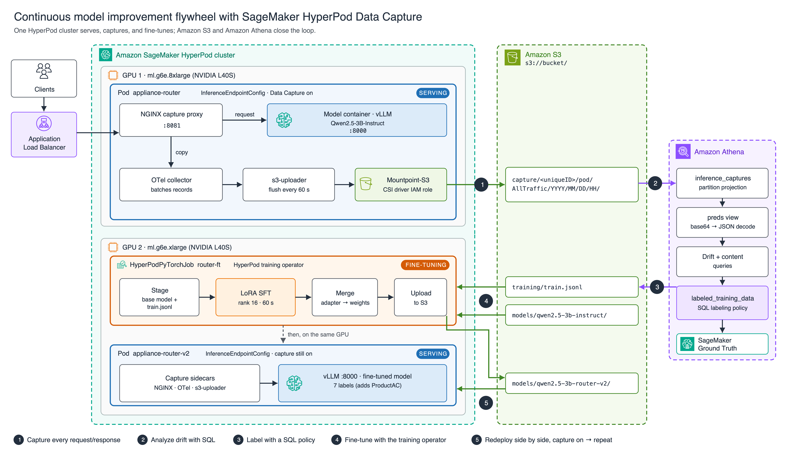

# Continuous model improvement flywheel with SageMaker HyperPod Data Capture

This repository contains the companion code for the AWS Machine Learning Blog post *Enable Data Capture on Amazon SageMaker HyperPod to Build a Continuous Model Improvement Flywheel*.

It runs one full turn of the flywheel on a single SageMaker HyperPod (EKS) cluster:

1. **Serve** a support-ticket router (Qwen2.5-3B-Instruct on vLLM) with Tier 3 Data Capture turned on.
2. **Capture** every request and response to Amazon S3.
3. **Analyze** the captures with Amazon Athena, to find the drift a product launch causes.
4. **Label** the captured traffic with a SQL labeling policy.
5. **Fine-tune** with LoRA using the HyperPod training operator, on a second GPU in the same cluster.
6. **Redeploy** the fine-tuned model side by side, with capture still on, and evaluate it.



> **All data is synthetic.** `scripts/gen_dataset.py` generates the support tickets deterministically (it is seeded), and no customer data is involved. The model is `Qwen2.5-3B-Instruct`, which is released under the Qwen Research License (non-commercial). For production use, choose a model whose license fits your use case.

## Repository layout

| Path | What it is |
|---|---|
| `env.sh.example` | Variables used by every step. Copy it to `env.sh` |
| `manifests/endpoint.yaml` | `InferenceEndpointConfig` with `dataCapture.modelPod` enabled |
| `manifests/finetune-job.yaml` | `HyperPodPyTorchJob` for the LoRA fine-tune |
| `scripts/gen_dataset.py` | Generates `data/tickets_traffic.jsonl` (900) and `data/tickets_eval.jsonl` (280) |
| `scripts/router_client.py` | Router client: `drive` (replay traffic), `eval` (labeled accuracy), `bench` (latency) |
| `scripts/pod.sh` | Runs `router_client.py` inside the model container |
| `scripts/build_training_file.py` | Converts labeled rows to chat-format JSONL |
| `scripts/train.py` | LoRA SFT, adapter merge, and upload. Mounted into the job from a ConfigMap |
| `scripts/drift_chart.py` | Draws `images/drift_other_share.png` from the Athena output |
| `athena/run_athena.sh` | `run_athena` and `run_sql` helpers |
| `athena/sql/*.sql` | Every Athena statement from the post, numbered in run order |
| `athena/export_training_data.sh` | Exports labeled rows, builds `train.jsonl`, and uploads it |
| `data/` | The generated tickets, plus 24 hand-written probe tickets (`tickets_probe.jsonl`) |
| `results/` | Outputs from the reference run, so you can compare your results with ours |
| `images/` | Architecture diagram (SVG and PNG) and the drift chart |

## Prerequisites

- **A SageMaker HyperPod cluster orchestrated by Amazon EKS.** It needs the HyperPod inference operator and the `amazon-sagemaker-hyperpod-training-operator` EKS add-on.
- **Two free NVIDIA GPUs.** We used `ml.g6e.8xlarge` for serving and `ml.g6e.xlarge` for training.
- **Local tools:** `kubectl`, the AWS CLI, and Python 3.
- **An S3 bucket** in the same Region.
- **IAM permissions for three identities:**
  - **The Mountpoint-S3 CSI driver role** needs `s3:PutObject`, `s3:AbortMultipartUpload`, and `s3:DeleteObject` on the bucket, plus `kms:GenerateDataKey` if you set `kmsKeyId`. If this role can't write, the endpoint stays healthy but no captures ever appear.
  - **The training service account (`$TRAIN_SA`)** needs read and write access to the bucket, through EKS Pod Identity.
  - **Your identity for Athena** needs read access to `capture/` and write access to `athena-results/`.

## Walkthrough

```bash
cp env.sh.example env.sh && vi env.sh && source env.sh
aws eks update-kubeconfig --name "$EKS_CLUSTER_NAME" --region "$AWS_REGION"
kubectl get crd | grep -E 'inferenceendpointconfigs|hyperpodpytorchjobs'     # expect two rows
```

**1. Stage the base model.**

```bash
pip install -q huggingface_hub
python3 -c "from huggingface_hub import snapshot_download; snapshot_download('Qwen/Qwen2.5-3B-Instruct', local_dir='qwen2.5-3b-instruct')"
aws s3 sync qwen2.5-3b-instruct "s3://${BUCKET}/${MODEL_LOCATION}/" --exclude ".cache/*"
```

**2. Deploy with capture on, and wait for 4/4 containers.**

```bash
render < manifests/endpoint.yaml | kubectl apply -f -
kubectl get pods -l app=$ENDPOINT_NAME -o custom-columns='NAME:.metadata.name,READY:.status.containerStatuses[*].ready'
```

**3. (Optional) Regenerate the data.** The committed files in `data/` are already the output of this command.

```bash
(cd data && python3 ../scripts/gen_dataset.py)
```

**4. Measure the capture overhead.** Port 8000 goes straight to vLLM; port 8081 goes through the capture proxy.

```bash
for p in 8000 8081; do scripts/pod.sh $ENDPOINT_NAME bench /tmp/tickets_traffic.jsonl --port $p; done
```

**5. Replay production traffic through the capture proxy** (15 minutes), then export the timestamps it prints.

```bash
scripts/pod.sh $ENDPOINT_NAME drive /tmp/tickets_traffic.jsonl --seconds 900
export RUN_START="..." LAUNCH_TS="..." RUN_END="..."
sleep 75    # one flush interval
```

**6. Analyze with Athena.**

```bash
export CAPTURE_LOCATION="$(aws s3 ls s3://${BUCKET}/capture/ | awk '/PRE/{print "s3://'"${BUCKET}"'/capture/" $2 "pod/AllTraffic/"; exit}')"
source athena/run_athena.sh
for f in athena/sql/0*.sql athena/sql/10_*.sql; do echo "== $f"; run_sql "$f"; done
```

**7. Label and build the training file.**

```bash
run_sql athena/sql/11_create_view_labeled_training_data.sql
run_sql athena/sql/12_label_distribution.sql
bash athena/export_training_data.sh
```

**8. Fine-tune with the HyperPod training operator.**

```bash
kubectl create configmap router-train --from-file=scripts/train.py
render < manifests/finetune-job.yaml | kubectl apply -f -
kubectl logs -l app=router-ft -f
kubectl get hyperpodpytorchjob router-ft -o jsonpath='{range .status.conditions[*]}{.type}={.status}  {end}'
```

**9. Deploy the fine-tuned model side by side, then evaluate both endpoints.** Requests to port 8000 are not captured.

```bash
( export ENDPOINT_NAME="appliance-router-v2" MODEL_LOCATION="$MODEL_V2_LOCATION" SERVE_INSTANCE_TYPE="$TRAIN_INSTANCE_TYPE"
  render < manifests/endpoint.yaml | kubectl apply -f - )
scripts/pod.sh appliance-router    eval /tmp/tickets_eval.jsonl  --port 8000 --labels v1   # before
scripts/pod.sh appliance-router-v2 eval /tmp/tickets_eval.jsonl  --port 8000 --labels v2   # after
scripts/pod.sh appliance-router-v2 eval /tmp/tickets_probe.jsonl --port 8000 --labels v2   # hand-written probe
```

When you move clients to the new endpoint, update the label set and the guided-JSON enum in the same release. With the old six-value enum, the model can't return `ProductAC`.

## Reference results

These come from a run on 2026-09-28. The full outputs are in `results/`.

| Metric | Before fine-tuning | After fine-tuning |
|---|---|---|
| Held-out accuracy (280) | 235 (83.9%) | 280 (100%) |
| `ProductAC` (40) | 0/40 | 40/40 |
| `Other` (40) | 35/40 | 40/40 |
| Five established classes (200) | 200/200 | 200/200 |
| Hand-written probe (24) | 16/24 | 20/24 |

In the same run, capture overhead was within noise: p50 200.0 ms vs. 200.7 ms, and 39.1 req/s on both paths, at concurrency 8.

## Clean up

```bash
kubectl delete inferenceendpointconfig appliance-router appliance-router-v2
kubectl delete hyperpodpytorchjob router-ft
kubectl delete configmap router-train
source athena/run_athena.sh
run_athena "DROP VIEW IF EXISTS labeled_training_data"; run_athena "DROP VIEW IF EXISTS preds"
run_athena "DROP TABLE IF EXISTS inference_captures"; run_athena "DROP DATABASE IF EXISTS ${ATHENA_DB}"
for p in capture athena-results training "${MODEL_V2_LOCATION}"; do aws s3 rm "s3://${BUCKET}/${p}/" --recursive; done
```

Also remove the IAM permissions you granted for this walkthrough.

## Security

See [CONTRIBUTING](../../../CONTRIBUTING.md#security-issue-notifications) for more information.

## License

This library is licensed under the MIT-0 License. See the [LICENSE](../../../LICENSE) file.
