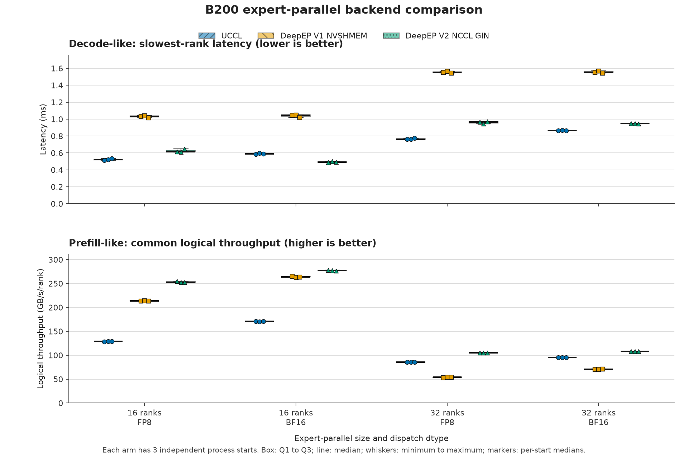

# EP Backend Comparison Results on B200

Status: `PASS`

> **Methodology superseded.** These tables were measured with the FP8 host-side cast inside the timed region, `EP_BUFFER_DEBUG=1` on the DeepEP V2 arm, 3 independent starts, and logical GB/s/rank as the prefill primary metric. The harness has since moved the cast outside the boundary, disabled the debug printfs on scored runs, raised the start count to 20, and made slowest-rank latency the primary metric for both profiles. Re-measurement is pending; treat cross-dtype decode comparisons and cross-EP-size scale-out throughput comparisons here with caution.

The previous Decode-only result has been discarded. It must not be combined with this two-profile matrix because Prefill-like uses the normal high-throughput API and a different timing boundary.

This is a synthetic expert-parallel communication microbenchmark.

## Campaign configuration

| Control | Value |
|---|---|
| Hardware | 4 `p6-b200.48xlarge` nodes, each with 8 NVIDIA B200 GPUs and 8 EFA devices |
| EP sizes | 16 GPU ranks on 2 nodes and 32 GPU ranks on 4 nodes |
| Model shape | Hidden size 7,168 dimensions, 256 experts, top-k 8 experts/token |
| Decode-like profile | 128 tokens/rank, low-latency dispatch and combine |
| Prefill-like profile | 4,096 tokens/rank, normal dispatch and combine with required layout |
| Data types | FP8 or BF16 dispatch, BF16 combine |
| Sampling | 20 warmup iterations and 100 measured iterations per dtype/start |
| Replication | 3 independent process starts per backend/profile/EP-size cell |
| Runtime | PyTorch 2.13.0+cu130, CUDA 13.0, NCCL 2.29.7 |
| Region and cluster | `ap-south-1c`, EKS `ml-clusters-shared-ap-south-1` |
| Campaign | `ep-b200-profiles-20260825t023933z`, commit `97c93ee33535ffb41b7635befc4a97617ab8acef` |

Each backend receives the same deterministic BF16 input, exact top-k route, and weights for a given profile and EP size. SHA-256 input and route hashes must agree across every backend and process start. One external CUDA event boundary measures from input readiness through required conversion/layout, dispatch, and combine completion. Each iteration uses the maximum elapsed time across ranks.

Decode-like reports slowest-rank latency. Prefill-like reports logical GB/s/rank using one payload numerator: useful dispatch data, required FP8 scales, and BF16 combine data per valid expert assignment. Backend metadata is excluded. These values are logical efficiency metrics, not observed wire bandwidth.

## Results

Each cell has 3 independent process starts. Values are medians across independent starts. Decode-like results use slowest-rank latency as the primary metric; prefill-like results use common logical throughput. These are synthetic communication workloads, not end-to-end training or serving results.

Each box contains the 3 independent process-start medians for one backend arm and workload cell. The box spans Q1 to Q3, the center line is the median, the whiskers are the minimum and maximum, and the markers show all 3 values. The individual markers are the primary evidence because each box contains only 3 independent starts.

## Decode-like latency, 128 tokens/rank

| EP size | Dispatch dtype | Backend | Latency (ms) | 95% bootstrap CI (ms) | Run-to-run CV (%) | Input throughput (tokens/s) | Logical throughput (GB/s/rank) | Scale-out logical throughput (GB/s/rank) |
|---:|:---:|:---|---:|:---:|---:|---:|---:|---:|
| 16 ranks | FP8 | UCCL | 0.5215 ms | [0.5124, 0.5321] ms | 1.89% | 3,926,862.25 tokens/s | 42.66 GB/s/rank | 21.33 GB/s/rank |
| 16 ranks | FP8 | DeepEP V1 NVSHMEM | 1.0319 ms | [1.0148, 1.0429] ms | 1.38% | 1,984,619.22 tokens/s | 21.56 GB/s/rank | 10.78 GB/s/rank |
| 16 ranks | FP8 | DeepEP V2 NCCL GIN | 0.6151 ms | [0.6112, 0.6488] ms | 3.31% | 3,329,691.42 tokens/s | 36.17 GB/s/rank | 18.09 GB/s/rank |
| 16 ranks | BF16 | UCCL | 0.5895 ms | [0.5859, 0.5971] ms | 0.97% | 3,474,201.34 tokens/s | 49.81 GB/s/rank | 24.90 GB/s/rank |
| 16 ranks | BF16 | DeepEP V1 NVSHMEM | 1.0438 ms | [1.0214, 1.0520] ms | 1.52% | 1,962,016.67 tokens/s | 28.13 GB/s/rank | 14.06 GB/s/rank |
| 16 ranks | BF16 | DeepEP V2 NCCL GIN | 0.4921 ms | [0.4858, 0.5009] ms | 1.54% | 4,161,789.51 tokens/s | 59.66 GB/s/rank | 29.83 GB/s/rank |
| 32 ranks | FP8 | UCCL | 0.7633 ms | [0.7614, 0.7741] ms | 0.89% | 5,366,426.29 tokens/s | 29.15 GB/s/rank | 21.86 GB/s/rank |
| 32 ranks | FP8 | DeepEP V1 NVSHMEM | 1.5522 ms | [1.5435, 1.5657] ms | 0.72% | 2,638,821.59 tokens/s | 14.33 GB/s/rank | 10.75 GB/s/rank |
| 32 ranks | FP8 | DeepEP V2 NCCL GIN | 0.9642 ms | [0.9454, 0.9716] ms | 1.41% | 4,248,046.17 tokens/s | 23.08 GB/s/rank | 17.31 GB/s/rank |
| 32 ranks | BF16 | UCCL | 0.8653 ms | [0.8620, 0.8686] ms | 0.38% | 4,733,640.25 tokens/s | 33.93 GB/s/rank | 25.45 GB/s/rank |
| 32 ranks | BF16 | DeepEP V1 NVSHMEM | 1.5551 ms | [1.5467, 1.5694] ms | 0.74% | 2,633,988.78 tokens/s | 18.88 GB/s/rank | 14.16 GB/s/rank |
| 32 ranks | BF16 | DeepEP V2 NCCL GIN | 0.9477 ms | [0.9448, 0.9491] ms | 0.23% | 4,322,061.08 tokens/s | 30.98 GB/s/rank | 23.24 GB/s/rank |

## Prefill-like throughput, 4,096 tokens/rank

| EP size | Dispatch dtype | Backend | Logical throughput (GB/s/rank) | 95% bootstrap CI (GB/s/rank) | Run-to-run CV (%) | Latency (ms) | Input throughput (tokens/s) | Scale-out logical throughput (GB/s/rank) |
|---:|:---:|:---|---:|:---:|---:|---:|---:|---:|
| 16 ranks | FP8 | UCCL | 128.77 GB/s/rank | [128.60, 129.14] GB/s/rank | 0.22% | 5.5289 ms | 11,853,360.76 tokens/s | 64.39 GB/s/rank |
| 16 ranks | FP8 | DeepEP V1 NVSHMEM | 213.89 GB/s/rank | [213.23, 214.41] GB/s/rank | 0.28% | 3.3287 ms | 19,687,953.23 tokens/s | 106.94 GB/s/rank |
| 16 ranks | FP8 | DeepEP V2 NCCL GIN | 252.84 GB/s/rank | [252.42, 254.65] GB/s/rank | 0.47% | 2.8160 ms | 23,272,859.42 tokens/s | 126.42 GB/s/rank |
| 16 ranks | BF16 | UCCL | 170.98 GB/s/rank | [170.42, 171.27] GB/s/rank | 0.26% | 5.4950 ms | 11,926,565.80 tokens/s | 85.49 GB/s/rank |
| 16 ranks | BF16 | DeepEP V1 NVSHMEM | 263.71 GB/s/rank | [262.95, 265.06] GB/s/rank | 0.40% | 3.5627 ms | 18,395,265.04 tokens/s | 131.86 GB/s/rank |
| 16 ranks | BF16 | DeepEP V2 NCCL GIN | 277.37 GB/s/rank | [276.15, 277.75] GB/s/rank | 0.30% | 3.3873 ms | 19,347,586.02 tokens/s | 138.68 GB/s/rank |
| 32 ranks | FP8 | UCCL | 85.46 GB/s/rank | [85.41, 85.49] GB/s/rank | 0.05% | 8.3311 ms | 15,732,818.61 tokens/s | 64.10 GB/s/rank |
| 32 ranks | FP8 | DeepEP V1 NVSHMEM | 54.07 GB/s/rank | [53.40, 54.41] GB/s/rank | 0.95% | 13.1683 ms | 9,953,621.84 tokens/s | 40.55 GB/s/rank |
| 32 ranks | FP8 | DeepEP V2 NCCL GIN | 105.21 GB/s/rank | [105.11, 105.36] GB/s/rank | 0.12% | 6.7672 ms | 19,368,582.57 tokens/s | 78.91 GB/s/rank |
| 32 ranks | BF16 | UCCL | 95.31 GB/s/rank | [95.26, 95.38] GB/s/rank | 0.06% | 9.8578 ms | 13,296,240.83 tokens/s | 71.48 GB/s/rank |
| 32 ranks | BF16 | DeepEP V1 NVSHMEM | 70.95 GB/s/rank | [70.48, 71.07] GB/s/rank | 0.44% | 13.2417 ms | 9,898,441.78 tokens/s | 53.21 GB/s/rank |
| 32 ranks | BF16 | DeepEP V2 NCCL GIN | 108.20 GB/s/rank | [108.14, 108.36] GB/s/rank | 0.11% | 8.6835 ms | 15,094,422.79 tokens/s | 81.15 GB/s/rank |

## Paired DeepEP V2 improvements

Positive values mean DeepEP V2 had lower latency for Decode-like cells or higher logical throughput for Prefill-like cells. A direction is supported only when the paired bootstrap interval excludes 0% and both arms have at most 5% run-to-run CV.

| Profile | EP size | Dispatch dtype | Baseline | Primary metric | Median improvement (%) | 95% bootstrap CI (%) | Direction supported |
|:---|---:|:---:|:---|:---|---:|:---:|:---:|
| decode | 16 ranks | FP8 | UCCL | slowest-rank latency in milliseconds | -20.05% | [-21.94, -17.19]% | yes |
| decode | 16 ranks | FP8 | DeepEP V1 NVSHMEM | slowest-rank latency in milliseconds | 40.40% | [36.06, 41.40]% | yes |
| decode | 16 ranks | BF16 | UCCL | slowest-rank latency in milliseconds | 16.52% | [16.12, 17.08]% | yes |
| decode | 16 ranks | BF16 | DeepEP V1 NVSHMEM | slowest-rank latency in milliseconds | 52.39% | [51.82, 53.46]% | yes |
| decode | 32 ranks | FP8 | UCCL | slowest-rank latency in milliseconds | -25.51% | [-26.33, -24.16]% | yes |
| decode | 32 ranks | FP8 | DeepEP V1 NVSHMEM | slowest-rank latency in milliseconds | 37.88% | [37.06, 39.62]% | yes |
| decode | 32 ranks | BF16 | UCCL | slowest-rank latency in milliseconds | -9.18% | [-10.10, -9.10]% | yes |
| decode | 32 ranks | BF16 | DeepEP V1 NVSHMEM | slowest-rank latency in milliseconds | 38.97% | [38.92, 39.61]% | yes |
| prefill | 16 ranks | FP8 | UCCL | effective logical gigabytes per second per rank | 96.02% | [95.78, 98.02]% | yes |
| prefill | 16 ranks | FP8 | DeepEP V1 NVSHMEM | effective logical gigabytes per second per rank | 18.57% | [17.73, 19.06]% | yes |
| prefill | 16 ranks | BF16 | UCCL | effective logical gigabytes per second per rank | 62.45% | [61.23, 62.76]% | yes |
| prefill | 16 ranks | BF16 | DeepEP V1 NVSHMEM | effective logical gigabytes per second per rank | 4.79% | [4.72, 5.48]% | yes |
| prefill | 32 ranks | FP8 | UCCL | effective logical gigabytes per second per rank | 23.19% | [22.99, 23.23]% | yes |
| prefill | 32 ranks | FP8 | DeepEP V1 NVSHMEM | effective logical gigabytes per second per rank | 94.40% | [93.36, 97.30]% | yes |
| prefill | 32 ranks | BF16 | UCCL | effective logical gigabytes per second per rank | 13.58% | [13.47, 13.61]% | yes |
| prefill | 32 ranks | BF16 | DeepEP V1 NVSHMEM | effective logical gigabytes per second per rank | 52.73% | [52.23, 53.43]% | yes |

## Qualification and custody

- All 4 admission cases and all 36 scored distributed starts passed.
- All 8 admission records and all 72 scored records passed the common correctness check.
- The report uses the median of 100 iterations within each start, followed by the median across 3 independent starts. The displayed 95 percent intervals are paired bootstrap intervals across starts.
- Backend, profile, and dtype order rotated across starts. Every arm at a given EP size used the same named nodes.
- All 3 container images were pinned by SHA-256 digest. Runtime, input hash, route hash, payload accounting, and derived metrics were validated during aggregation.
- The durable checksum manifest contains 573 entries, and all 573 entries passed independent verification.
- The owned namespace is absent, the shared Lease holder is empty, remaining owned resources are 0 resources, and active GPU Pods on the 4 selected nodes are 0 Pods.
- The selected node set was disjoint from 12 protected ap-south-1 nodes. No protected node appears in any rendered Pod record.
- With the pinned UCCL image, normal-mode explicit proxy destruction invalidated the CUDA context after result emission. Prefill-like UCCL workers therefore synchronize, flush their results, and exit the worker process. This cleanup happens after all timed iterations and does not change the timing boundary.
- The [machine-readable summary](results/b200-ap-south-1-2026-08-25.json) has SHA-256 `16f12a0bfbbc0c9c9f93eeb19d410cc8843ed6cbc836115df851cd97996a9603`.

## Interpretation limits

Prefill-like does not measure time to first token, and Decode-like does not measure time per output token. Neither profile measures expert computation, communication/computation overlap, end-to-end training, end-to-end serving throughput, or end-to-end latency. Conclusions apply only to the reported payload, routing distribution, EP size, B200 hardware, and runtime stack.
