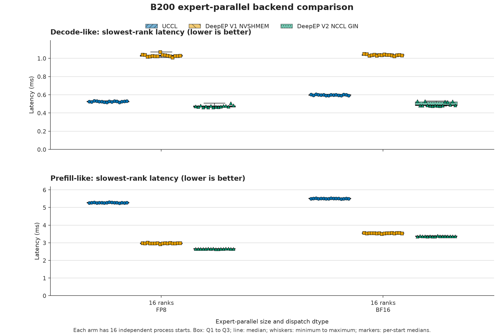

# EP Backend Comparison Results on B200

Status: `PASS`

This is a synthetic expert-parallel communication microbenchmark. It measures one dispatch followed by one combine under a single external CUDA timing boundary, with the same deterministic input and route for every backend.

Two campaigns are reported. The primary campaign covers EP16 with 16 independent process starts, which is the replication level at which the bootstrap intervals below carry information. The companion campaign covers EP16 and EP32 with 4 starts and exists to show the EP-size axis; its intervals are weak and its EP32 rows should be read as a direction, not a measurement.

## Campaigns

| | Primary | Companion |
|---|---|---|
| EP sizes | 16 ranks on 2 nodes | 16 ranks on 2 nodes, 32 ranks on 4 nodes |
| Independent starts per cell | 16 | 4 |
| Scored records | 192 | 96 |
| Campaign ID | `ep-b200-use1-n16-20260901054057` | `ep-b200-use1-20260901023226` |
| Harness commit | `40990df2` | `df6d2943` |
| Machine-readable summary | [`b200-us-east-1-2026-09-01-ep16-n16.json`](results/b200-us-east-1-2026-09-01-ep16-n16.json) | [`b200-us-east-1-2026-09-01-ep16-ep32-n4.json`](results/b200-us-east-1-2026-09-01-ep16-ep32-n4.json) |

Both campaigns ran on the same 4 `p6-b200.48xlarge` nodes in EKS cluster `ml-clusters-shared-us-east-1`, `us-east-1c`, each node with 8 NVIDIA B200 GPUs and 8 allocatable EFA devices. Both used the same three digest-pinned images, hidden size 7,168 dimensions, 256 experts, top-k 8 experts/token, 20 warmup and 100 measured iterations per dtype and start, and PyTorch 2.13.0+cu130 with CUDA 13.0. Every arm loaded NCCL 2.31.2; the PyTorch build constant reports 2.29.7, which is why the summaries record both.

Each process start contributes the median of its 100 slowest-rank iteration measurements, and each cell reports the median across independent starts. Iterations inside one process are not treated as independent replicates.

## Relationship to the earlier ap-south-1 tables

The previous report measured a different harness on a different cluster, so its numbers are not comparable row by row with the tables below and have been retired to [`b200-ap-south-1-2026-08-25.json`](results/b200-ap-south-1-2026-08-25.json) as a dated historical artifact. Three harness changes affect what the boundary contains: the host-side FP8 cast now runs once before the timed region instead of inside it, `EP_BUFFER_DEBUG` is off for scored runs instead of enabled on the DeepEP V2 arm only, and slowest-rank latency is the primary metric for both profiles. The FP8-slower-than-BF16 decode pattern visible in the earlier tables does not appear in these measurements.

## Primary results: EP16, 16 independent starts

Each box spans Q1 to Q3, the center line is the median, the whiskers are the minimum and maximum, and the markers are the 16 per-start medians.

DeepEP V2 has the lowest slowest-rank latency in all four cells. Against UCCL its margin is about 10% for FP8 decode and about 19% for BF16 decode, and roughly 39% to 50% for prefill; against DeepEP V1 it ranges from about 5% for BF16 prefill to about 54% for FP8 decode. Every direction is supported at the 5% run-to-run CV gate. DeepEP V2 is also faster with FP8 than with BF16 in both profiles, which is the expected ordering because FP8 puts fewer bytes on the wire.

### Decode-like latency, 128 tokens/rank

| EP size | Dispatch dtype | Backend | Latency (ms) | 95% bootstrap CI (ms) | Run-to-run CV (%) | Input throughput (tokens/s) | Logical throughput (GB/s/rank) | Scale-out logical throughput (GB/s/rank) |
|---:|:---:|:---|---:|:---:|---:|---:|---:|---:|
| 16 ranks | FP8 | UCCL | 0.5258 ms | [0.5237, 0.5284] ms | 0.93% | 3,895,017.08 tokens/s | 42.32 GB/s/rank | 21.16 GB/s/rank |
| 16 ranks | FP8 | DeepEP V1 NVSHMEM | 1.0264 ms | [1.0243, 1.0346] ms | 1.30% | 1,995,323.99 tokens/s | 21.68 GB/s/rank | 10.84 GB/s/rank |
| 16 ranks | FP8 | DeepEP V2 NCCL GIN | 0.4712 ms | [0.4664, 0.4792] ms | 2.45% | 4,346,582.46 tokens/s | 47.22 GB/s/rank | 23.61 GB/s/rank |
| 16 ranks | BF16 | UCCL | 0.5986 ms | [0.5943, 0.6012] ms | 0.73% | 3,421,595.90 tokens/s | 49.05 GB/s/rank | 24.53 GB/s/rank |
| 16 ranks | BF16 | DeepEP V1 NVSHMEM | 1.0358 ms | [1.0327, 1.0392] ms | 0.66% | 1,977,201.79 tokens/s | 28.35 GB/s/rank | 14.17 GB/s/rank |
| 16 ranks | BF16 | DeepEP V2 NCCL GIN | 0.4839 ms | [0.4810, 0.5229] ms | 4.47% | 4,231,973.48 tokens/s | 60.67 GB/s/rank | 30.33 GB/s/rank |

### Prefill-like latency, 4,096 tokens/rank

| EP size | Dispatch dtype | Backend | Latency (ms) | 95% bootstrap CI (ms) | Run-to-run CV (%) | Input throughput (tokens/s) | Logical throughput (GB/s/rank) | Scale-out logical throughput (GB/s/rank) |
|---:|:---:|:---|---:|:---:|---:|---:|---:|---:|
| 16 ranks | FP8 | UCCL | 5.2691 ms | [5.2664, 5.2789] ms | 0.24% | 12,437,731.75 tokens/s | 135.12 GB/s/rank | 67.56 GB/s/rank |
| 16 ranks | FP8 | DeepEP V1 NVSHMEM | 2.9742 ms | [2.9700, 2.9863] ms | 0.58% | 22,034,892.87 tokens/s | 239.39 GB/s/rank | 119.69 GB/s/rank |
| 16 ranks | FP8 | DeepEP V2 NCCL GIN | 2.6578 ms | [2.6517, 2.6614] ms | 0.25% | 24,657,617.21 tokens/s | 267.88 GB/s/rank | 133.94 GB/s/rank |
| 16 ranks | BF16 | UCCL | 5.5088 ms | [5.5038, 5.5136] ms | 0.17% | 11,896,550.74 tokens/s | 170.55 GB/s/rank | 85.27 GB/s/rank |
| 16 ranks | BF16 | DeepEP V1 NVSHMEM | 3.5448 ms | [3.5397, 3.5513] ms | 0.39% | 18,487,721.74 tokens/s | 265.04 GB/s/rank | 132.52 GB/s/rank |
| 16 ranks | BF16 | DeepEP V2 NCCL GIN | 3.3709 ms | [3.3659, 3.3740] ms | 0.28% | 19,441,899.67 tokens/s | 278.72 GB/s/rank | 139.36 GB/s/rank |

### Paired DeepEP V2 improvements

Positive values mean DeepEP V2 had lower slowest-rank latency. A direction is supported only when the paired bootstrap interval excludes 0% and both arms have at most 5% run-to-run CV.

| Profile | EP size | Dispatch dtype | Baseline | Median improvement (%) | 95% bootstrap CI (%) | Direction supported |
|:---|---:|:---:|:---|---:|:---:|:---:|
| decode | 16 ranks | FP8 | UCCL | 10.28% | [9.08, 11.28]% | yes |
| decode | 16 ranks | FP8 | DeepEP V1 NVSHMEM | 54.24% | [53.07, 55.00]% | yes |
| decode | 16 ranks | BF16 | UCCL | 18.78% | [12.02, 19.87]% | yes |
| decode | 16 ranks | BF16 | DeepEP V1 NVSHMEM | 53.25% | [49.48, 53.62]% | yes |
| prefill | 16 ranks | FP8 | UCCL | 49.58% | [49.44, 49.65]% | yes |
| prefill | 16 ranks | FP8 | DeepEP V1 NVSHMEM | 10.77% | [10.45, 11.04]% | yes |
| prefill | 16 ranks | BF16 | UCCL | 38.81% | [38.75, 38.92]% | yes |
| prefill | 16 ranks | BF16 | DeepEP V1 NVSHMEM | 4.95% | [4.76, 5.15]% | yes |

## Companion campaign: the EP-size axis at 4 starts

The companion campaign repeats EP16 and adds EP32. Its EP16 medians agree with the primary campaign to within 1.3% in every arm and cell except BF16 decode for DeepEP V2, which differs by 2.5% and is also the cell with the highest run-to-run variability in both campaigns. That agreement is the available evidence that the two campaigns measured the same thing. The EP32 rows come from 4 starts, so they indicate a direction rather than establishing a margin.

At EP32 the decode ranking differs from EP16: UCCL leads both decode cells, at 0.7758 ms against 0.8361 ms for DeepEP V2 in FP8 and 0.8718 ms against 0.9423 ms in BF16. DeepEP V2 leads both prefill cells, at 6.6226 ms against 8.0894 ms for UCCL in FP8 and 8.7098 ms against 9.8898 ms in BF16. An EP16 decode result therefore does not carry to EP32 for these backends.

| Profile | EP size | Dispatch dtype | Backend | Latency (ms) | 95% bootstrap CI (ms) | Run-to-run CV (%) | Input throughput (tokens/s) |
|:---|---:|:---:|:---|---:|:---:|---:|---:|
| decode | 32 ranks | FP8 | UCCL | 0.7758 ms | [0.7701, 0.7799] ms | 0.55% | 5,279,730.97 tokens/s |
| decode | 32 ranks | FP8 | DeepEP V1 NVSHMEM | 1.5568 ms | [1.5428, 1.5656] ms | 0.62% | 2,631,129.46 tokens/s |
| decode | 32 ranks | FP8 | DeepEP V2 NCCL GIN | 0.8361 ms | [0.8296, 0.8670] ms | 2.00% | 4,898,703.91 tokens/s |
| decode | 32 ranks | BF16 | UCCL | 0.8718 ms | [0.8695, 0.8757] ms | 0.30% | 4,698,111.16 tokens/s |
| decode | 32 ranks | BF16 | DeepEP V1 NVSHMEM | 1.5598 ms | [1.5465, 1.5696] ms | 0.69% | 2,626,007.14 tokens/s |
| decode | 32 ranks | BF16 | DeepEP V2 NCCL GIN | 0.9423 ms | [0.9300, 0.9612] ms | 1.54% | 4,347,061.52 tokens/s |
| prefill | 32 ranks | FP8 | UCCL | 8.0894 ms | [8.0691, 8.1183] ms | 0.26% | 16,202,922.98 tokens/s |
| prefill | 32 ranks | FP8 | DeepEP V1 NVSHMEM | 12.7493 ms | [12.6702, 12.8505] ms | 0.59% | 10,280,762.55 tokens/s |
| prefill | 32 ranks | FP8 | DeepEP V2 NCCL GIN | 6.6226 ms | [6.6190, 6.6343] ms | 0.11% | 19,791,699.50 tokens/s |
| prefill | 32 ranks | BF16 | UCCL | 9.8898 ms | [9.8781, 9.9021] ms | 0.10% | 13,253,295.68 tokens/s |
| prefill | 32 ranks | BF16 | DeepEP V1 NVSHMEM | 13.1769 ms | [13.1605, 13.2159] ms | 0.18% | 9,947,071.17 tokens/s |
| prefill | 32 ranks | BF16 | DeepEP V2 NCCL GIN | 8.7098 ms | [8.7034, 8.7265] ms | 0.11% | 15,048,865.63 tokens/s |

Compare EP16 against EP32 through aggregate input tokens/s rather than through the logical throughput columns. Those columns are logical efficiency metrics, not observed wire bandwidth: the scale-out numerator counts every remote assignment as a full tensor, while a backend may send one copy per destination node and forward locally, so its over-count factor changes with node count and the column is comparable only inside one EP size.

## Controls that differ across arms

Each result now records the communication-kernel SM count where the backend exposes one, and the recorded values are not equal across arms. In the prefill cells DeepEP V2 resolved 64 SMs from its own bandwidth heuristic, while the normal-mode UCCL and DeepEP V1 buffers report 20. The prefill comparison is therefore not SM-matched, and part of the margin may be a consequence of that difference rather than of the transport. In the decode cells the low-latency UCCL and DeepEP V1 APIs take no SM count and record none, while DeepEP V2 again resolved 64. Pin the count with `EP_NUM_SMS` to measure the arms at equal SM budgets.

The decode profile is also not API-symmetric. UCCL and DeepEP V1 use purpose-built low-latency kernels that quantize FP8 internally, inside the timed boundary, while DeepEP V2 has only `ElasticBuffer` on EFA and receives input that was quantized once before the boundary. Each backend is measured from its own API's dispatch-ready entry point.

The heuristic input is also recorded: `detected_rdma_gigabytes_per_second` is 50.0 on these nodes, which is one 400 Gb/s EFA device and matches the one device per GPU that `p6-b200.48xlarge` provides.

## Qualification and custody

- Primary campaign: 4 admission cases and 96 scored distributed starts passed; 192 scored records passed the common correctness check; the durable checksum manifest holds 1,124 entries.
- Companion campaign: 4 admission cases and 48 scored distributed starts passed; 96 scored records passed the common correctness check; the durable checksum manifest holds 740 entries.
- Backend, profile, and dtype order rotated across starts. Every arm at a given EP size used the same named nodes.
- All three container images were pinned by SHA-256 digest and are the same images used for the retired ap-south-1 campaign. The DeepEP and UCCL source commits inside those images are not recorded, so a reader can establish that both campaigns used identical backend builds but cannot establish which upstream commit each contains.
- Runtime stack, input hash, route hash, payload accounting, and derived metrics were validated during aggregation. The loaded NCCL version is required to agree within each arm, not across arms, because each image carries its own build.
- With the pinned UCCL image, normal-mode explicit proxy destruction invalidates the CUDA context after result emission. Prefill-like UCCL workers therefore synchronize, flush their results, and exit the worker process. This cleanup happens after all timed iterations and does not change the timing boundary.
- The machine-readable summaries have SHA-256 `60d2917ad4fb1f4662b4c522c740927d1403ba6a6f23c762937562e524a6b7c1` (primary) and `f4edd9a172d9b93e0903fbb3d43b499bf17aaee62e4dd3db3d212bab440173ff` (companion).
- Both campaigns reported a teardown failure. Every owned Pod, StatefulSet, and Service was removed and the shared Lease was released, but the owned namespace stayed in `Terminating` because two stale `visibility.kueue.x-k8s.io` APIServices in this cluster fail namespace deletion discovery. The condition is a property of the cluster, not of a campaign, and no scored record depends on it.

## Interpretation limits

Prefill-like does not measure time to first token, and Decode-like does not measure time per output token. Neither profile measures expert computation, communication and computation overlap, end-to-end training, end-to-end serving throughput, or end-to-end latency.

The route is balanced by construction: every token reaches 8 distinct experts and every expert carries identical load. Rankings under a skewed or group-limited gate are untested here.

Every iteration synchronizes and reduces across ranks before the next one starts, so these are single-shot latencies rather than pipelined steady-state figures. They are not comparable against kernel-time figures from a profiler-based benchmark.

Conclusions apply only to the reported payload, routing distribution, EP size, B200 hardware, and runtime stack.
